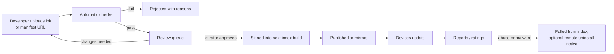

# App store: web apps, legacy apps and the catalog

> **Decisions (28 September 2026, from the project owner).** The web is the
> platform, so the catalog leads with **a curated list of popular websites
> that already ship a PWA**, each presented as an app you install from the
> catalog, instead of the usual "visit the site and add it to the home
> screen" (which still works). Next to it: an **Android catalog** (see
> [ANDROID.md](ANDROID.md)), and the **App Museum / Preware archives as
> add-on catalogs** a user can switch on. The catalog's name and where the
> PHP backend is hosted are still open.

How people will find, install and update apps on Phoenix: installable web
apps (PWAs) as first-class cards, the original webOS `.ipk` apps from the
community archives, and a catalog app with a backend behind it.

This is a plan. Nothing here has run on a device yet (see
[ROADMAP.md](ROADMAP.md), Milestone 1). Facts are as of **28 September
2026**. Where we read source code rather than documentation, it says so;
where something is unverified, it says that too. The row in
[APP-GAPS.md](APP-GAPS.md#store-setup-backup-and-updates) that asks for "one
catalog app with three sources" is the starting point.

## Summary

- **One catalog app, three kinds of app.** Phoenix web apps and other
  packaged `.ipk` apps; installable web apps (PWAs) from any HTTPS site;
  legacy Mojo and Enyo apps from the webOS Archive's App Museum II.
- **PWAs become real webOS apps.** For each installed PWA the device writes
  an `appinfo.json` and icons and installs them through OSE's own installer,
  which has had a path for exactly this since OSE 2.26. The PWA then has its
  own launcher icon, its own cards, its own notifications and its own
  Just Type entries, like any other app.
- **The device reads a static, signed catalog.** A JSON index signed with
  an Ed25519 key, served from any web host or mirror. Installing and
  updating never depend on a live API.
- **A small PHP + MySQL service writes that index.** Developer accounts,
  submissions, review, ratings and moderation live in a LAMP app that
  publishes the static index. This fits the stack you prefer and is the
  same shape as the App Museum's own backend (PHP, MySQL), which is the
  obvious partner.
- **Payments are deferred.** Listings can carry donation links; nothing is
  sold through the store in the first year.
- **Web apps only at first.** Packages that contain native code or
  background services wait until there is a sandbox for them (phase A5).

## Contents

1. [PWAs as webOS apps](#1-pwas-as-webos-apps)
2. [Legacy webOS apps](#2-legacy-webos-apps)
3. [The store](#3-the-store)
   - [3.11 Streaming apps and DRM](#311-streaming-apps-and-drm)
4. [Roadmap](#4-roadmap)
5. [Risks](#5-risks)
6. [Open questions](#6-open-questions)
7. [Sources](#7-sources)

---

## 1. PWAs as webOS apps

### 1.1 What OSE already does

OSE's installer daemon, **appinstalld2** (`com.webos.appInstallService`),
gained "Progressive Web App installation" in OSE 2.26.0 (June 2024,
[release notes](https://www.webosose.org/about/release-notes/webos-ose-2-26-0-release-notes/)).
The release notes say nothing more, so we read the source
([webosose/appinstalld2](https://github.com/webosose/appinstalld2), last
commit 21 January 2025):

- `install {id, ipkUrl}` accepts `ipkUrl: "pwa://<directory>"` as well as a
  path to an `.ipk` (`src/base/Utils.cpp`, `isPWA`, `getPWAPath`).
- For a `pwa://` URL it runs `UnpackagedInstallStep` instead of opkg: it
  checks that `<directory>/appinfo.json` parses and that its `id` matches,
  makes `/media/cryptofs/apps/usr/palm/applications/<id>/`, and copies
  `appinfo.json` and every `icon*` file into it. Nothing else is copied.
- So OSE does **not** fetch a manifest, download icons or cache pages. Some
  other component is expected to prepare that directory. We found no such
  component in OSE's public repositories (*unverified*: OSE's browser may
  do it in a version we did not find). **Phoenix writes it.**
- `install`, `remove` and `status` are in the ACG group
  `applicationinstall.management`, granted to the `oem` trust level only
  (`files/sysbus/appinstalld.groups.json`). The store therefore needs a
  small trusted service; an ordinary app cannot install anything.
- There is **no signature check** anywhere in appinstalld2. Its `verify`
  flag only chooses the install root (`/media/cryptofs` or
  `/media/developer`). Trust has to be enforced before the call (see
  [3.6](#36-security)).

### 1.2 From manifest to webOS app

```
 web page ── <link rel=manifest> ──┐
                                   ▼
 ┌──────────────────────── org.webosphoenix.service.packages ─────────────────────┐
 │ 1 fetch manifest (HTTPS only), resolve against the page URL                   │
 │ 2 check it: name, start_url and scope on the same origin, at least one icon   │
 │ 3 pick an app id: org.webosphoenix.pwa.<hash of manifest id>                  │
 │ 4 download icons, render the launcher sizes (1.3), write appinfo.json         │
 │ 5 write a launch stub index.html (1.4) - kept in the app's data, see below    │
 │ 6 luna://com.webos.appInstallService/install {id, ipkUrl: "pwa://<dir>"}      │
 │ 7 record origin, manifest URL, manifest hash, install source in db8           │
 └───────────────────────────────────────────────────────────────────────────────┘
                                   ▼
 SAM sees a new app ── launcher icon (Downloads tab), Just Type, cards
```

The service is Node.js on `run-js-service`, like the Files and Voice Memos
services already in `apps/`. The manifest parsing and `appinfo.json`
generation are a TypeScript library shared by the service, the catalog
backend's validator and the tests.

**Mapping the manifest to `appinfo.json`:**

| Web app manifest | `appinfo.json` | Notes |
| --- | --- | --- |
| `id` (or `start_url` when absent) | `id` = `org.webosphoenix.pwa.` + first 16 hex digits of SHA-256 of the resolved manifest id | Stable across updates, as the manifest spec intends. The origin is kept in `phoenix.pwa.origin` |
| `name` | `title` | |
| `short_name` | launcher label (`phoenix.launcherTitle`) | Legacy launcher labels were short |
| `icons` | `icon`, `largeIcon`, `phoenix.icons` | See [1.3](#13-icons-at-every-density) |
| `start_url` | `phoenix.pwa.startUrl`; `main` is the stub | See [1.4](#14-which-web-runtime) |
| `scope` | `phoenix.pwa.scope` | Navigations outside the scope open in the browser card, as installed PWAs do on Android |
| `display` | `phoenix.pwa.display` | `fullscreen` hides the status bar; the rest look the same in a card |
| `orientation` | the runtime's orientation lock | Same mechanism Phoenix apps use (`setWindowOrientation`) |
| `theme_color`, `background_color` | `iconColor`, `splashColor` | The launch card's colour while loading |
| `description`, `categories` | catalog listing and Just Type keywords | |
| `shortcuts` | `universalSearch.action` entries and app menu items | See [1.5](#15-the-rest-of-the-webos-experience) |
| `share_target` | `phoenix.shareTarget` | Phoenix's share sheet lists it |
| `file_handlers` | `phoenix.fileHandlers` (MIME types and extensions) | Files' "Open with" (`listAllHandlersForMime`) lists it |
| `protocol_handlers` | `phoenix.protocolHandlers` | Only `web+` schemes and the safelist Chromium allows |
| `launch_handler` | ignored at first | Phoenix focuses the existing card, which is `focus-existing` |
| (none) | `type: "web"`, `vendor` = origin host, `version` = `0.0.<manifest hash prefix as a number>` | The version changes whenever the manifest does, so the installer treats a re-install as an update |
| (none) | `requiredPermissions: ["org.webosphoenix.pwa"]` | One narrow ACG; see [3.6](#36-security) |

`appinfo.json` keys that OSE does not know are ignored by SAM (the Phoenix
apps already carry a `phoenix` block this way).

### 1.3 Icons at every density

Legacy webOS drew launcher icons at 64 legacy pixels
(`Theme.launcherIconSize`, `images/launcher3/launcher-icon-64.png`), quick
launch icons at 48 on phones and 64 on tablets, and the launch splash at
128 (192 on tablets). `Theme.px()` scales them from 1.0 (Pre) to about 3.4
(a 1080-pixel-wide phone). The service renders, from the largest suitable
manifest icon:

| File | Size (px) | Used for |
| --- | --- | --- |
| `icon.png` | 64 | Legacy-pixel icon, the size OSE's own launcher expects in `icon` |
| `icon-96.png`, `icon-128.png`, `icon-160.png`, `icon-256.png` | 96, 128, 160, 256 | Pre 3 (1.5x), 2x, 2.5x, and 3.4x screens (downscaled at draw time) |
| `largeIcon.png` | 256 | `largeIcon` |
| `icon-splash.png` | 384 | The launch card (192 legacy px at 2x) |

Rules: prefer an icon with `purpose: "any"`; if only `maskable` exists,
crop to its safe zone (the inner 80%) and put it on a rounded webOS icon
plate; draw a letter icon on `theme_color` if no icon can be fetched.
Classic webOS icons were free-form shapes with a drop shadow, not squircles,
so `any` icons are drawn as they are with the legacy shadow. SVG icons are
rasterised with `resvg` (MPL-2.0, run as a program) or Chromium itself.
appinstalld2 copies only files named `icon*`, so every picture the app
needs must be named that way.

### 1.4 Which web runtime

| Option | What it means | Verdict |
| --- | --- | --- |
| **OSE's WebAppMgr (WAM) on Chromium 120** | The PWA is an ordinary `type: web` app; WAM makes the window, the shell makes the card | **Use this.** One engine, one GPU process, one memory budget; the same path every Phoenix app takes |
| OSE's browser (Enact browser) in an app window | Open the site in a browser tab without browser chrome | No per-app identity: one app, one card stack, one set of notifications for every PWA |
| A separate Chromium or Firefox build | A full browser with its own PWA support | Hundreds of MB more, a second GPU stack, and its PWA install targets desktops, not webOS |
| `phoenix-runtime.js` | The PalmSystem shim | Not a runtime: it runs inside WAM and the simulator. PWAs get none of it except the small PWA shim below |

How the page gets loaded: `main` is a local `index.html` stub that
navigates to `start_url` (`location.replace`). Whether WAM also accepts an
absolute `https://` URL in `main` is *unverified*; OSE's
[appinfo.json documentation](https://www.webosose.org/docs/guides/development/configuration-files/appinfo-json/)
only describes local files. The stub works either way, and appinstalld2's
`pwa://` step only copies `appinfo.json` and `icon*`, so the stub has to be
provided another way: either the `pwa://` install is followed by a write
of the stub into the app directory by the (oem) service, or every PWA
points `main` at one shared stub in `/usr/share/phoenix/pwa/launch.html`
that reads the target from its launch parameters (*decide in A1*).

What a web app gets from WAM and what Phoenix has to add. Chromium splits
PWA support in two: the engine parts (service workers, Cache Storage,
IndexedDB, Notifications from pages) live in Blink and `content/`, which
WAM embeds; the "installed app" parts (install prompts, manifest
application, share target, file handling, badging on an OS icon,
web-app shortcuts) live in Chrome's `chrome/browser/web_applications`
layer, which an embedder like WAM does not include. This is our reading of
how Chromium is layered, *to be confirmed on the device in A1*.

| Feature | In WAM (Chromium 120) | Phoenix work |
| --- | --- | --- |
| Service worker, Cache Storage, offline | Engine feature; needs a secure origin, which a real `https://` PWA has. Packaged `file://` apps cannot use it | Check that WAM enables it for `type: web` apps (*unverified*) |
| IndexedDB, localStorage, OPFS | Yes, per origin | Per-app "Clear data" = clear that origin |
| `beforeinstallprompt` / install from the browser | Chrome layer: not in WAM | The browser card offers "Add to Launcher" when the page has a manifest (Isis browser menu, later the modern browser) |
| `Notification` from a page | The embedder must supply a platform notification service (*unverified whether Neva/WAM routes it anywhere*) | Route to `com.webos.notification` with the app id as source; see [1.5](#15-the-rest-of-the-webos-experience) |
| `showNotification` from a service worker | Same service, with the page possibly closed | Same bridge; tapping launches the app with the notification's data |
| Push API | Needs a push service. Chrome uses Google's FCM, which needs Google API keys; builds without them cannot subscribe ([ungoogled-chromium #1020](https://github.com/ungoogled-software/ungoogled-chromium/issues/1020)) | Phase A4: an RFC 8030 Web Push server (Mozilla's autopush, or a UnifiedPush distributor) and a push daemon that wakes WAM. Until then, `PushManager.subscribe` fails and apps fall back as they do in Firefox private mode |
| Badging (`navigator.setAppBadge`) | Chrome layer | Small shim → a count on the launcher icon and the card title |
| Web Share (`navigator.share`) | Shipped on ChromeOS, Windows and macOS; on Linux desktop *unverified* | Shim → Phoenix share sheet (the one Photos and Voice Memos use) |
| Web Share Target | Chrome layer; Android, ChromeOS and Windows ([Chrome docs](https://developer.chrome.com/docs/capabilities/web-apis/web-share-target)) | The share sheet lists `phoenix.shareTarget` apps and launches them with the form data (GET), or a local page that POSTs it (POST) |
| File Handling | Chrome layer | Files' "Open with" launches the app; the runtime fills `window.launchQueue` |
| Geolocation, camera, microphone | Engine; the embedder decides permission | Prompt in the shell (see [3.6](#36-security)); OSE's static `allowVideoCapture` / `allowAudioCapture` are set to true for PWAs and the prompt decides |
| Storage quota | Chromium's shared pool, best effort, evicted under pressure unless `navigator.storage.persist()` is granted | Grant `persist()` to installed PWAs automatically, as Chrome does for installed apps; show usage in App info |
| Periodic Background Sync, Background Fetch | Chrome layer / needs embedder | Not in the first phases |

The **PWA shim** is a few hundred lines injected into PWA windows only
(`phoenix-pwa-shim.js`, the way `phoenix-runtime.js` is injected into
webOS apps): badging, `navigator.share`, `launchQueue`, the app menu hook
and the back gesture. It does **not** expose `PalmServiceBridge` or any
Luna service to the page.

### 1.5 The rest of the webOS experience

| webOS feature | For a PWA |
| --- | --- |
| **Launcher** | The icon appears in the **Downloads** tab (`launcherTab: 1`), where legacy webOS put installed apps; the user can move it to the dock like any icon |
| **Cards** | One card per window. `window.open()` and links with `target=_blank` inside the scope make a new card in the app's stack, as enyo windows do today; outside the scope they go to the browser |
| **Back gesture** | `history.back()` when the page has history; otherwise minimise the card (legacy behaviour at the top of an app) |
| **App menu** (tap the app name) | Reload, Share page, Open in browser, App info (origin, storage, permissions), Uninstall; manifest `shortcuts` listed above them |
| **Just Type** | Title, `short_name` and `categories` as keywords; each manifest shortcut becomes a Just Type action ("New note in Notes") through `universalSearch.action`. Searching inside the app is not possible without an API; leave it out |
| **Notifications** | Banner and dashboard item attributed to the app's id, with its icon; tapping focuses or launches the app and passes the notification's `data` |
| **Badges** | A count on the launcher icon and the card title |
| **Sharing** | The Phoenix share sheet offers PWAs with a share target |
| **Files** | "Open with" offers PWAs with file handlers |
| **Updates** | The site updates its own code through the service worker. The service re-reads the manifest when the app is launched and at most once a day (Chrome does the same); a new name or icon is a re-install with the same id. A changed origin is a different app |
| **Uninstall** | `com.webos.appInstallService/remove`, then clear the origin's data (asking first) |

---

## 2. Legacy webOS apps

### 2.1 What exists (September 2026)

| Source | What it is | State | Licence / terms |
| --- | --- | --- | --- |
| **App Museum II** ([appcatalog.webosarchive.org](https://appcatalog.webosarchive.org/)) | The recovered HP/Palm App Catalog plus apps made after the shutdown. Browsable on the web, and an Enyo catalog app for the TouchPad and Pre 3 | Active. Backend [webOSArchive/webos-catalog-service](https://github.com/webOSArchive/webos-catalog-service): PHP, MySQL/MariaDB, nginx; last commit 28 September 2026. IPKs backed up at archive.org ([webosappcatalog](https://archive.org/details/webosappcatalog)) | Offered "without profit and under Fair Use provisions … for the purposes of historical preservation". The apps are mostly proprietary freeware and ex-paid apps; the archive has no redistribution licence from their authors. The backend repository has **no licence file** |
| App Museum API | `WebService/getMuseumMaster.php`, `getSearchResults.php`, `getMuseumDetails.php`, `getMuseumReviews.php`, an RSS feed | Live: a search for "calculator" returned JSON with per-device flags (`Pre`, `Pre3`, `TouchPad`, ..., **`LuneOS`**) on 28 September 2026 | Same as above; no published terms for third-party clients |
| **Preware feeds** | Homebrew package feeds in ipkg `Packages` format; the webOS Archive runs one ([modernize](http://stacks.webosarchive.org/feeds/modernize/ipkgs/), updated July 2026) and [weboslives.eu](http://weboslives.eu/feeds/precentral) mirrors the old PreCentral feed | Active, small | Per package. Many are GPL or open homebrew; many are `armv7` native |
| **Preware 2** ([webOS-ports/preware](https://github.com/webOS-ports/preware)) | The package manager, now one app for legacy webOS and LuneOS | GPL-2.0. PR #55, merged 28 September 2026, stops installing the App Museum feed by default because that feed "is no longer maintained" | GPL-2.0: fine to read; do not copy into Apache-2.0 code |
| **Mojo framework** ([webOS-ports/mojo-framework](https://github.com/webOS-ports/mojo-framework)) | Palm's Mojo 1 and 2 frameworks, "extracted from a webOS 3.0.5 TouchPad doctor image", patched to run on Chromium | Active in LuneOS | **Proprietary Palm code**; never released under an open licence. Phoenix cannot ship it |

The App Museum's backend is already a store backend: `accounts`, `roles`
(`developer`, `curator`, `admin`, ...), app ownership and claims, an IPK
manager, download and update-check logs, and review and rating tables
([docs/ACCOUNTS_ROADMAP.md](https://github.com/webOSArchive/webos-catalog-service/blob/main/docs/ACCOUNTS_ROADMAP.md):
submission is "partial - trusted submission + claims live; moderation queue
planned"; device logins and review writes "planned").

### 2.2 The package format

An `.ipk` is an `ar` archive, like a `.deb`:

```
app.ipk (ar)
├── debian-binary          "2.0"
├── control.tar.gz         control (Package, Version, Architecture, Depends, ...),
│                          optional postinst / prerm scripts
└── data.tar.gz            usr/palm/applications/<id>/appinfo.json, index.html, ...
                           usr/palm/services/<id>/...   (JS services, optional)
                           usr/palm/packages/<id>/packageinfo.json (OSE packages)
```

| | Legacy webOS (1.x–3.x) | webOS OSE | Phoenix |
| --- | --- | --- | --- |
| App manifest | `appinfo.json` (`type: web` for Mojo/Enyo, `pdk` for native SDL apps, `game`) | `appinfo.json` (`web`, `qml`, `native`), `packageinfo.json` for packages with services | `appinfo.json` + `phoenix` block |
| Install root | `/media/cryptofs/apps/usr/palm/applications` | The same (`WEBOS_INSTALL_CRYPTOFSDIR` + `/apps/usr/palm/applications`, appinstalld2 `Settings.cpp`) | The same |
| Installer | `com.palm.appinstaller` (`install`, `installNoVerify`) | `com.webos.appInstallService` (`install`, `remove`, `status`) | appInstallService on the device; the simulator keeps simulating `com.palm.appinstaller` for Files |
| Signing | HP App Catalog packages carried a Palm signature checked by the installer; homebrew used `installNoVerify` (*details unverified*) | None (read in the source) | The signed index (see [3.6](#36-security)) |
| Scripts | Preware used `pmPostInstall.script`, run as root | opkg runs `postinst` | **Refused** from the catalog: packages with maintainer scripts are rejected at review |

Preware feed metadata is a normal `Packages` file whose `Source:` field
holds JSON (fetched on 28 September 2026):

```
Package: com.nizovn.openssl
Version: 1.0.2p
Architecture: armv7
Filename: com.nizovn.openssl_1.0.2p_armv7.ipk
MD5Sum: 3154d1de6b77db31463c15204e498352
Source: { "Feed":"WOSA Modernize", "Type":"Linux Application", "Category":"Modernize",
          "Title":"Shared OpenSSL libs", "Icon":"http://…", "MinWebOSVersion":"2.2.0",
          "DeviceCompatibility":["Pre3","TouchPad","Touchpad Go"] }
```

Phoenix's own index (section 3.4) is a superset of this, so a Preware
feed can be converted into it mechanically and a Phoenix feed can be
exported as a Preware `Packages` file for LuneOS users.

### 2.3 What will run

| Kind of legacy app | Runs on Phoenix? |
| --- | --- |
| **Enyo 1.0** web apps (`type: web`, `enyo.depends`) | Yes, to the extent `phoenix-runtime.js` covers their services, like the core apps today. The best-supported group |
| **Mojo** web apps | Only with a Mojo framework at `/usr/palm/frameworks/mojo`. Palm's is proprietary, so Phoenix cannot ship it. Options: the user installs it from LuneOS's repository (legal position unclear), or a clean-room Mojo reimplementation (very large). *Open question* |
| **Enyo 2 / Bootplate** apps | Usually self-contained; likely to work |
| **PDK / hybrid** (SDL, `armv7` binaries) | No: 32-bit ARM binaries against legacy libraries; Phoenix targets arm64 and x86-64 |
| **JS services** (`usr/palm/services`) | Legacy `mojoservice` services need the Foundations service runtime; OSE's `run-js-service` runs Node services. Case by case; not in the first phases |
| **Patches** (Preware system patches) | No: they patch files of a system that is not there |

The catalog shows a **compatibility badge** per app: "Works", "Works with
problems", "Doesn't start", "Untested", based on (1) static checks (type,
architecture, framework, services used, compared with what the runtime
simulates) and (2) reports from users ("Did it work?" after the first
launch, anonymous, one per device). The App Museum already records a
`LuneOS` flag per app; we would ask to add a `Phoenix` one rather than keep
a separate list.

---

## 3. The store

### 3.1 Architecture

```
                         ┌──────────── on the device ────────────────────────────┐
                         │                                                       │
  ┌──────────────┐ HTTPS │  ┌─────────────────────────┐    luna     ┌──────────┐ │
  │ Static index │──────►│  │ org.webosphoenix.       │────────────►│ appinstalld2
  │ + ipk files  │ (any  │  │ service.packages (oem)  │  install,   │ (OSE)    │ │
  │ on CDN and   │mirror)│  │ sources, signatures,    │  remove     └──────────┘ │
  │ mirrors      │       │  │ downloads, PWA builder, │                          │
  └──────▲───────┘       │  │ updates, compat reports │◄──┐                      │
         │ publish       │  └──────────▲──────────────┘   │ luna (ACG            │
  ┌──────┴───────┐       │             │                  │ catalog.client)      │
  │ Catalog      │ HTTPS │  ┌──────────┴──────────────┐   │                      │
  │ service      │◄─────►│  │ Catalog app (React/TS)  │───┘                      │
  │ PHP + MySQL  │reviews│  │ classic App Catalog look│                          │
  │ (submit,     │ratings│  └─────────────────────────┘                          │
  │ review, rate)│       │                                                       │
  └──────────────┘       │  App Museum II API ──► read-only legacy source        │
                         └───────────────────────────────────────────────────────┘
```

### 3.2 Client app

`apps/catalog` (`org.webosphoenix.catalog`, Apps tab), a React +
TypeScript app with `@phoenix/ui`, drawn in the style of the webOS 2.x App
Catalog: the blue header with the search field, a featured banner, category
and "Top free / New" lists with the rounded list rows, the app page with
icon, rating stars, screenshots in a filmstrip, description, "Download"
button with a progress bar in the button, then "Open". Palm's App Catalog
artwork was never open-sourced, so it is redrawn after the originals'
layout, as the other Phoenix apps are.

| Screen | Contents |
| --- | --- |
| Home | Featured, New, Top, categories; a source switch: **Apps**, **Web apps**, **Classics** (App Museum) |
| Search | All sources at once, source shown on each row; also answers Just Type ("Search the catalog for …") |
| App page | Screenshots, description, version, size, permissions in plain words, compatibility badge (Classics), rating and reviews, developer, licence, donation link, "Report" |
| Updates | Installed apps with updates; "Update all"; auto-update toggle (Wi-Fi only, charging) |
| Installed | Everything installed from any source, with App info and Uninstall |
| Settings | Sources (add a mirror or third-party index by URL, shows its key fingerprint), "Show adult apps" (the App Museum flags them), compatibility reports on/off |

The launcher's own "Add to Launcher" for PWAs and Files' `.ipk` install
sheet go through the same device service, so there is one list of
installed apps and one set of rules.

### 3.3 Backend options

| | **A. PHP + MySQL API** | **B. Static signed JSON on a CDN** | **C. Hybrid (recommended)** |
| --- | --- | --- | --- |
| What devices call | `GET /api/apps?...` on our server | `GET /v1/index.json` + `index.json.sig` from any host | B for browsing, installing and updating; A only for writing reviews and ratings and for compatibility reports |
| Hosting | A LAMP host; must be up for installs | Any static host (GitHub Pages, a CDN, an nginx box, IPFS); mirrors are copies | Static host + one small LAMP host |
| Search | Server-side (MySQL full-text) | On the device over the downloaded index (a few thousand apps is under 2 MB gzip) | On the device; server search only on the web front end |
| Trust | TLS to our server | Index signature, independent of the host | Signature for everything that installs code |
| Ratings, reviews, submissions | Natural | Impossible without a server | In the PHP app; rating averages are baked into each index build |
| Offline / outage | Store is down when the server is | Works from any mirror or cache | Installs and updates work; only reviews are down |
| Cost | A VPS | Nearly free | A VPS + static hosting |
| Precedent | App Museum II, HP's App Catalog | F-Droid (signed `index-v2.json`), Flathub's OSTree summaries, apt `InRelease` | F-Droid's website + repo split |

**Recommendation: C.** The PHP + MySQL service is the source of truth and
the place people log in; a publish job (PHP CLI, cron or on approval)
writes the index, signs it with a key that lives offline or on a separate
signing host, and pushes it to the static hosts. Devices never trust the
PHP server with code: a compromised web server can deface reviews but
cannot push an app.

Why not just use the App Museum's backend? It is the closest existing
thing, and we should ask its maintainers (see [open questions](#6-open-questions)).
But it has no licence file, so we cannot fork it without permission; it is
built around a preservation archive of other people's apps; and its
device protocol is the 2011 HP catalog's. The realistic shape is: Phoenix
reads the App Museum as a **source**, and runs its own small catalog for
new apps, with the same stack, so that merging later is possible.

### 3.4 Catalog service design (PHP + MySQL)

Plain PHP 8.3 with PDO and no framework, or Slim/Laravel if contributors
prefer; MariaDB 11 or MySQL 8; nginx or Apache. Tables:

| Table | Holds |
| --- | --- |
| `developers` | Account, display name, verified email, optional verified domain (DNS TXT or `/.well-known/phoenix-developer.txt`), public signing key (Ed25519) |
| `apps` | App id (reverse DNS; `org.webosphoenix.pwa.*` reserved), owner, kind (`ipk-web`, `ipk-native`, `pwa`, `legacy-ref`), categories, licence (SPDX), homepage, source URL, donation URL, content flags |
| `releases` | App, version, channel (`stable`, `beta`), file URL, size, SHA-256, developer signature, `appinfo.json` as submitted, requested ACGs, review state, reviewer, notes |
| `pwa_listings` | Manifest URL, manifest id, origin, last fetched manifest and its hash, checked icon URLs |
| `reviews`, `ratings` | One per (app, reviewer account); text, stars, app version, `hidden` flag, moderator |
| `reports` | Abuse, malware, legal (DMCA / trademark), broken; state and actions |
| `compat_reports` | Legacy app id, Phoenix version, device class, worked / partly / no; anonymous device token |
| `index_builds` | Build number, time, SHA-256 of the index, signing key id |

**Index format** (`/v1/index.json`, signed detached with minisign or plain
Ed25519, key id in the signature):

```json
{
  "version": 1, "build": 1234, "generated": "2026-09-28T12:00:00Z",
  "expires": "2026-10-12T12:00:00Z",
  "source": {"id": "phoenix-main", "name": "Phoenix Catalog", "mirrors": ["https://…"]},
  "apps": [{
    "id": "org.example.notes", "kind": "ipk-web", "title": "Notes",
    "developer": {"id": "d42", "name": "Example", "key": "ed25519:…"},
    "categories": ["Productivity"], "license": "GPL-3.0-or-later",
    "rating": {"stars": 4.5, "count": 12},
    "icon": {"64": "…", "256": "…"}, "screenshots": ["…"],
    "releases": [{"version": "1.2.0", "channel": "stable", "url": "…/org.example.notes_1.2.0_all.ipk",
                  "size": 812345, "sha256": "…", "devsig": "…",
                  "acgs": ["org.webosphoenix.pwa"], "minPhoenix": "0.3"}]
  }, {
    "id": "org.webosphoenix.pwa.3f9a…", "kind": "pwa", "title": "Example Weather",
    "manifest": "https://weather.example/manifest.webmanifest", "origin": "https://weather.example"
  }]
}
```

`expires` stops a mirror from replaying an old index forever (the "freeze
attack" in [TUF](https://theupdateframework.io/)); the device refuses an
index older than one it has already seen (`build`). Full TUF (separate
root, targets, snapshot and timestamp keys) is the upgrade path if the
catalog grows; the single-key design above is what F-Droid ran for years.

**Submission and review flow:**



Automatic checks: `ar` layout, `appinfo.json` schema, id matches owner's
namespace, no maintainer scripts, no files outside the app directory, no
native binaries (until A5), requested ACGs within the allowed set, the
upload signed by the developer's registered key, size limit, ClamAV scan,
licence field present. For PWAs: manifest reachable over HTTPS, valid,
start URL in scope, icons fetch, the site's content policy fits. Review is
human for a first release and for any release that asks for new ACGs;
later releases of an app that asks for nothing new can go through
automatically once the developer has a history (as the App Museum's
"trusted submission" does).

**Developer accounts:** email with a magic link, or GitHub/GitLab/Codeberg
OAuth; no government ID and no fee. The developer's Ed25519 key signs each
upload; the store keeps it and every update must carry the same key
(trust on first use, like Android APK signing). A lost key goes through a
manual transfer by an admin.

**Ratings and reviews:** reviews need a catalog account (not a device
token), one per app, editable; stars only from accounts older than a day;
rate-limited per IP and account; curators hide abuse; developers can reply
once per review. Averages are computed at index build time.

### 3.5 Update channel

- The device service registers a daily activity with
  `com.webos.service.activitymanager` (Wi-Fi, not low battery) that fetches
  the index from the first reachable mirror, checks the signature and
  `expires`, and compares versions (Debian version ordering, as opkg does).
- Updates are listed in the catalog and as one dashboard notification
  ("3 app updates"). Auto-update, when on, installs updates that ask for no
  new ACGs; anything asking for more waits for the user.
- `beta` channel per app, opt-in from the app page.
- System updates are not the store's job: they are RAUC bundles (see
  [HARDWARE.md](HARDWARE.md#ota-with-ab-updates)); the core Phoenix apps
  update with the system image.

### 3.6 Security

**Signatures.** Two layers, as apt and F-Droid do:

1. The **index signature** (store key) says "the store vouches for these
   files": each release's SHA-256 is in the signed index, so a download
   from any mirror is checked against it before appinstalld2 sees it.
2. The **developer signature** on each release says "the same person made
   this update"; the device keeps the first key it saw for an app id and
   refuses updates signed by another (unless the store's index marks an
   approved key change).

A package opened from Files that is in no signed index gets a warning
sheet ("From an unknown source"), as `installNoVerify` did, and can be
turned off in Settings (developer mode).

**Sandboxing.** Web apps run in Chromium's renderer sandbox. What protects
the device from a web app is the **LS2 ACG** check on each Luna call:
appinstalld2 generates an app's role from its `requiredPermissions`
(`ServiceInstallStep.cpp`, the `WebApp.json` role template). Our reading of
the source is that it grants whatever the package asks for (*to verify*),
so the device service enforces an **allowlist** before calling install:

| Tier | Who | ACGs allowed |
| --- | --- | --- |
| PWA | Any installed web app from a website | `org.webosphoenix.pwa` only: post notifications, badge, share sheet, open the browser. No `PalmServiceBridge` access beyond that |
| Catalog web app | Reviewed `ipk-web` | A published list: notifications, media library read, location (with prompt), camera (with prompt), db8 on the app's own kinds |
| Legacy app | App Museum ipk | What the Enyo/Mojo apps expect (db8, application manager, system service read), nothing that changes system settings |
| System | Phoenix and OSE apps in the image | Everything they declare; never installable from the catalog |

Native code and JS services are held back until there is a sandbox for them
(OSE's `jailer` for native apps, and bubblewrap or systemd sandboxing for
services); that is phase A5.

**Permission prompts.** At install, the sheet lists what the app may do in
plain words, derived from the ACGs ("Read your photos and music"). At run
time, camera, microphone, location and notifications ask once per app in a
webOS-style dialog, remembered in App info; this needs WAM's permission
requests routed to the shell (*unverified how WAM handles them today*).

**Other rules:** HTTPS only for PWAs and indexes; certificate errors are
fatal; no mixed content; `scope` escapes open the browser; the catalog app
itself has no install rights, only the `catalog.client` ACG on the device
service, so a bug in its web page cannot install silently.

### 3.7 Payments

**Decision: defer.** Selling apps means a merchant of record, VAT/sales tax
in every country, refunds, fraud handling, PCI scope, payouts and receipts
the device must check, and legal terms. None of that helps a community OS
reach its first thousand users. Until then:

- Listings may carry a **donation link** (Liberapay, Open Collective,
  GitHub Sponsors, Ko-fi, Patreon) shown on the app page, as F-Droid does.
- Apps may sell things on their own websites; the store takes no cut and
  imposes no rules on it beyond honesty.
- Revisit when there are paying users asking for it. If ever, use a
  merchant-of-record service (Paddle, Lemon Squeezy, or Stripe with a tax
  service) and licence keys checked by the app, not DRM in the store.

### 3.8 Federation and mirrors

- **Mirrors:** any HTTPS host can mirror `/v1/` byte for byte; the
  signature makes the host irrelevant. The index lists the known mirrors;
  the device tries them in order and remembers the fastest. A `rsync`
  endpoint and a script for mirror operators.
- **Third-party sources:** Settings > Sources adds another index by URL
  and shows its key fingerprint to confirm (like adding an F-Droid repo or
  a Preware feed). Apps from other sources are labelled with their source;
  an app id already owned by another source cannot be replaced by it.
- **App Museum II:** a built-in, read-only **Classics** source that calls
  its public API (with the maintainers' agreement), downloads IPKs from
  where it points (its download proxy or archive.org) and checks them
  against its MD5/size where available (no signature exists for these).
- **Preware feeds:** a converter turns a `Packages` feed into the Phoenix
  index format (dropping native, patch and service packages), so a feed
  can be added as a source.
- **LuneOS:** the index can be exported as a Preware `Packages` feed for
  Preware 2 on LuneOS, so web apps written for Phoenix reach LuneOS users
  too, and LuneOS apps can be listed here. Worth proposing to webOS-ports.

### 3.9 Moderation

- A published content policy (no malware, no spyware, no impersonation,
  no illegal content, adult content flagged and hidden by default, no
  undisclosed tracking) and a code of conduct for reviews.
- **Report** on every app page and review; reports go to a curator queue
  with a target response time (a week).
- Roles: `admin`, `curator` (review queue, hide reviews, pull apps),
  `developer`, following the App Museum's role model so accounts could be
  shared later.
- Pulling an app removes it from the next index build (within an hour); a
  `revoked` list in the index lets devices warn users who have it. No
  silent remote uninstall.
- A public transparency log of removals (app, date, reason category).

### 3.10 Legal

- **Our code:** Apache-2.0 like the rest of the repository; the backend
  too (a separate repository, `webos-phoenix-catalog`, is cleaner for
  deployment).
- **Developer agreement:** a short distribution licence: the developer
  grants the store and mirrors the right to distribute the package and
  show its name, icon and screenshots, and warrants they may. Open-source
  apps need nothing more than their licence.
- **PWAs:** listing a website links to it; the site owner's name and icon
  are trademarks. List only PWAs whose owner submitted them, or that we
  curate with a clear "not affiliated" note and a one-click opt-out for
  the owner. Prefer the former.
- **Legacy apps:** Phoenix never hosts or mirrors App Museum IPKs. The
  Classics source points to the archive, which takes the fair-use position
  and handles takedowns. Our own catalog honours takedowns for anything it
  lists (a DMCA agent if the host is in the US; a notice-and-action
  contact under the EU DSA).
- **Privacy:** no account needed to browse or install; downloads counted
  without IPs stored beyond the rate limiter's window; compatibility
  reports anonymous; a privacy policy before launch. EU DSA obligations
  for small platforms (contact point, notice-and-action, statement of
  reasons for removals) apply once we have EU users.
- **Names:** "App Catalog" was HP's product name and "webOS" is LG's
  trademark (see [LEGAL.md](LEGAL.md#name-and-trademarks)). Call it the
  "Phoenix Catalog" or similar; the look can be classic without the name.

---

### 3.11 Streaming apps and DRM

Netflix, Prime Video, Disney+, Max, Spotify and most other paid media
services only play on devices with Google's **Widevine** DRM, in the
browser and in their web apps alike. That, not the catalog, decides whether
Phoenix users can watch them.

**LG's own store is not a route.** LG licenses webOS to other TV makers as
**webOS Hub** (more than 300 brands by 2026), and that is how those TVs
get the LG Content Store with Netflix, Prime Video, Disney+ and YouTube.
But the licensee ships LG's closed TV build of webOS on its own TVs (and,
since 2025, monitors) with its logo and colours; there is no certification
of another OS, the program is not for phones or tablets, and the apps are
TV apps for a remote. It would only matter for a Phoenix-branded TV, which
would then run LG's software, not Phoenix.

**What gets these services onto Phoenix devices:**

| Route | What it takes | Gives |
| --- | --- | --- |
| **Widevine on the device** | A contract with Google by the company that ships the devices (an open-source project cannot redistribute Google's CDM binary); certification itself is free and takes about 8 to 12 weeks. **L1** needs a hardware trusted execution environment on the device (Qualcomm/MediaTek TEEs on Halium phones); **L3** is software only | Web versions and installed web apps (section 1) of the DRM services. L1: HD; L3: usually SD on Netflix and Prime Video |
| **The Chromium browser** (task #32) | A current Chromium web runtime with Widevine enabled (Encrypted Media Extensions) | Where the web versions and PWAs run |
| **Direct deals** | Per service (e.g. Netflix's partner programme); realistic only once a device sells | Native apps, higher quality tiers |
| **Android apps** ([ANDROID.md](ANDROID.md)) | Many run under Waydroid, but streaming apps usually check Play Integrity, which a non-Google-certified device cannot pass | Not a dependable route for DRM services |

**Order:** the Chromium browser first; then a Widevine application once
there is a reference device with a suitable TEE and a company to hold the
contract (L3 on the simulator and development devices in the meantime,
where Google allows it); direct deals after the device sells. Services
without DRM (YouTube's free tier, most news and social sites, podcasts)
work as PWAs today.

## 4. Roadmap

Effort: **S** up to a week, **M** two to four weeks, **L** one to three
months, for one developer working part-time-ish on it.

| Phase | Milestone | Contents | Effort | Depends on |
| --- | --- | --- | --- | --- |
| **A0** | Store in the simulator (can start now) | Index format and JSON Schema; Ed25519 signing and verifying in TypeScript; `packages` service simulated in `phoenix-runtime.js` (install, remove, list, update check, PWA builder writing an app directory into the simulated rootfs); the catalog app (home, search, app page, installed, updates); manifest → `appinfo.json` library with tests; icon renderer; `tools/test-catalog.cjs` | **M** | None |
| **A1** | Installs on OSE | Device service on `run-js-service` with `oem` role; install `.ipk` and `pwa://` through appinstalld2; confirm WAM loads the stub and a real `https://` PWA with service worker and offline; `launcherTab`, uninstall, data clearing; Files' `.ipk` sheet moved to it | **M** | ROADMAP M1 (Phoenix boots on OSE); OSE `appinstalld2` behaviour confirmed on the device |
| **A2** | Classics | App Museum source (with permission), compatibility checks and badges, "Did it work?" reports, Preware feed converter; decision on Mojo | **M** | A1; agreement with webOS Archive |
| **A3** | Catalog service | PHP + MySQL app: accounts, submission, automatic checks, review queue, ratings and reviews, reports, index publisher with offline signing, two mirrors, web front end | **L** | A0 format; hosting; content policy and developer agreement written |
| **A4** | Deep PWA integration | Notifications from pages and service workers into the dashboard (WAM change); permission prompts in the shell; badging, Web Share, share target, file handlers, shortcuts; "Add to Launcher" in the browser; Web Push with a self-hosted push server and a push daemon | **L** | A1; WAM patch capacity in `meta-phoenix` |
| **A5** | Native and services | Sandboxed native apps (jailer) and JS services; per-ACG review; update of ACG allowlist | **L** | A3; a sandbox design |
| later | Payments | Only if needed | — | — |

Dependencies on OSE features, in one place:

| OSE feature | Used for | Risk |
| --- | --- | --- |
| appinstalld2 `pwa://` path | PWA install | Low: in the source since 2.26, untested by us |
| appinstalld2 role generation from `requiredPermissions` | ACGs per app | Medium: must confirm it does what the source suggests |
| SAM noticing installs | Launcher updates without restart | Low for appinstalld2 installs (it is how OSE installs apps); LuneOS found SAM does **not** rescan for apps written to disk by hand |
| WAM: service workers for `https://` apps; notification and permission hooks | PWAs offline, notifications, prompts | Medium to high: *unverified*; may need WAM/Chromium patches |
| Activity manager | Daily update checks | Low: already used by Tasks in the simulator |

---

## 5. Risks

| Risk | Likelihood | Impact | Mitigation |
| --- | --- | --- | --- |
| WAM lacks service worker, notification or permission plumbing for remote origins | Medium | PWAs work only online, with no notifications | Find out in A1 on the emulator image; carry WAM patches; worst case, run PWAs in OSE's browser engine instance with per-app profiles |
| OSE stays quiet (no release since March 2025, see [HARDWARE.md](HARDWARE.md#a-webos-ose-targets)) | High | We maintain appinstalld2 and WAM changes ourselves | Keep changes small, as `.bbappend` patches; LuneOS carries the same components |
| Too few apps for a store to matter | High | Store looks empty | Lead with PWAs (thousands of good ones exist) and Classics; F-Droid-style "every open-source app welcome" policy |
| Legal challenge over legacy apps | Low | Classics source removed | Never host them; link to the archive; honour takedowns |
| Signing key compromise | Low | Malicious updates | Offline signing key, `expires`, key rotation procedure, developer signatures as a second check |
| Moderation load | Medium (if it succeeds) | Slow reviews, abuse | Automatic checks first; trusted-developer fast path; more curators |
| Push service costs and privacy | Medium | Push cannot be offered | Self-host autopush or use UnifiedPush distributors the user picks; push is optional |

---

## 6. Open questions

1. **App Museum partnership.** May Phoenix call the App Museum API from
   devices, and would its maintainers add a `Phoenix` compatibility flag?
   Would they consider one shared developer-account system (their
   `developer` role) instead of two?
2. **Mojo apps.** Ship no Mojo (Enyo-only Classics), let users fetch
   LuneOS's extracted framework themselves, or fund a clean-room Mojo? The
   first is the safe default.
3. **Backend stack.** Plain PHP, or a framework (Laravel, Slim)? MariaDB or
   MySQL? Where would you host it (shared hosting, a VPS, your own
   server)?
4. **Curated PWAs.** List popular PWAs we pick ourselves (with an opt-out),
   or only PWAs their owners submit?
5. **Name.** "Phoenix Catalog", "Catalog", something else?
6. **Web Push.** Is a push server we run acceptable (privacy, cost), or
   should Phoenix support only UnifiedPush distributors the user chooses?
7. **Developer identity.** Is email or forge OAuth enough, or do you want
   verified domains for anyone publishing a PWA?
8. **Payments.** Agree to defer? Any interest in paid apps at all?
9. **Android apps in the catalog.** Should the catalog also list F-Droid
   apps once Android support exists (see [ANDROID.md](ANDROID.md#7-app-sources))?

---

## 7. Sources

Accessed 28 September 2026 unless noted.

- webOS OSE 2.26.0 release notes (PWA installation in appinstalld2, June 2024): <https://www.webosose.org/about/release-notes/webos-ose-2-26-0-release-notes/>
- appinstalld2 source (read at commit of 21 January 2025): <https://github.com/webosose/appinstalld2>; files cited: `src/base/Utils.cpp`, `src/installer/Task.cpp`, `src/step/UnpackagedInstallStep.cpp`, `src/settings/Settings.cpp`, `src/service/AppInstallService.cpp`, `files/sysbus/appinstalld.groups.json`, `files/sysbus/com.webos.appinstalld.api.json`
- OSE `appinfo.json` reference: <https://www.webosose.org/docs/guides/development/configuration-files/appinfo-json/>
- App Museum II: <https://appcatalog.webosarchive.org/>; backend <https://github.com/webOSArchive/webos-catalog-service> (README and `docs/ACCOUNTS_ROADMAP.md`, commit of 28 September 2026); earlier backend (archived January 2026) <https://github.com/webOSArchive/webos-catalog-backend>; IPK archive <https://archive.org/details/webosappcatalog>
- Preware 2 and PR #55 (merged 28 September 2026): <https://github.com/webOS-ports/preware/pull/55>
- webOS Archive modernize feed (Packages file fetched): <http://stacks.webosarchive.org/feeds/modernize/ipkgs/Packages>; <https://github.com/webOSArchive/preware-modernize-feed>
- LuneOS Mojo framework: <https://github.com/webOS-ports/mojo-framework>
- Web app manifest: <https://developer.mozilla.org/en-US/docs/Web/Progressive_web_apps/Manifest>
- Web Share Target platforms: <https://developer.chrome.com/docs/capabilities/web-apis/web-share-target>
- Push API without Google keys: <https://github.com/ungoogled-software/ungoogled-chromium/issues/1020>
- The Update Framework: <https://theupdateframework.io/>
- LuneOS finding that SAM does not rescan (Waydroid patch, September 2026): <https://github.com/webOS-ports/meta-webos-ports/pull/810>
- LG, "LG Advances Its Smart TV Platform Business With webOS Hub": <https://www.lg.com/global/newsroom/news/media-entertainment-solution/lg-advances-its-smart-tv-platform-business-with-webos-hub/>; HDTVTest on webOS Hub for monitors: <https://www.hdtvtest.co.uk/news/LG-to-expand-webOS-Hub-platform-to-3rd-party-smart-monitors>
- Widevine certification for device makers (castlabs): <https://castlabs.com/security/widevine-certification/>; Widevine in Chromium and redistribution: <https://chromiumbuilds.org/docs/widevine-drm/> *(third-party sources; check Google's current terms before applying)*
