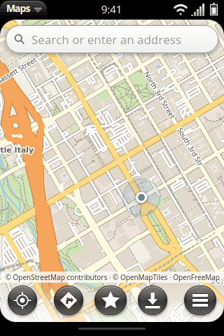
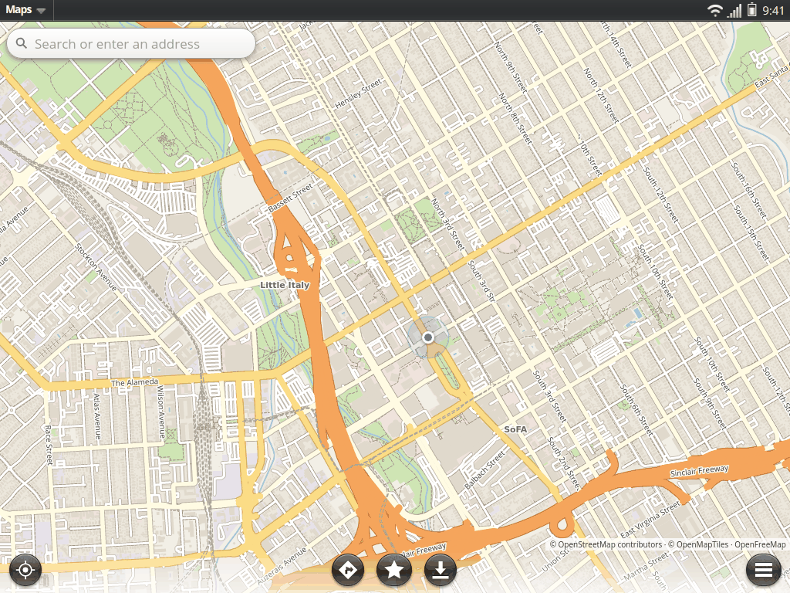

# Maps

Phoenix Maps (`apps/maps`) shows OpenStreetMap maps, finds places, gives
directions for driving, walking and cycling, navigates turn by turn, and
works offline in areas the user saves. Legacy webOS had Google Maps (1.x)
and Bing Maps (2.x and later); both depended on servers that are gone and
on keys Phoenix cannot ship. Everything here uses open data and servers
that anyone can run.

This page records what was chosen and why (as of September 2026), what
works, and how to host every piece yourself.

## What it does

- **Map**: pinch to zoom, two fingers to rotate and tilt, a compass to turn
  north up again. A long press drops a pin ("what is here").
- **My location**: from webOS OSE's `com.webos.service.location`
  (`getLocationUpdates`, subscribed). The simulator simulates it
  (`runtime/phoenix-runtime.js`, "First use, emergency information, location and help"), starting in
  downtown San Jose; `mock/setLocation` moves the device, and so does
  phoenix-sim's **Simulate > Location** (`shell/qml/Phoenix/Sim/SimLocation.qml`):
  a few cities, Custom... (latitude and longitude, or a place's name),
  This Computer's Location (Qt Positioning: CoreLocation on a Mac, GeoClue
  on Linux when it runs), and Moving Along the Route, which walks, cycles
  or drives the device along the route Maps shows, a fix a second, for
  testing navigation.
- **Search**: when the user submits (never as-you-type), with Photon or
  Nominatim, cached; coordinates typed in are understood. When the server
  fails or search is set to offline, the offline index answers.
- **Places nearby** (`src/lib/nearby.ts`): "coffee", "pharmacy near me",
  "the nearest gas station", typed or from the Assistant's `{nearby}`: the
  places of that kind around the user, closest first, as a list with a pin
  each, the map fitted around the user and the closest five. A kind of
  place is asked for by its OpenStreetMap tag inside a box around the user
  (Photon `include=osm.amenity.cafe&bbox=...`, Nominatim's `[cafe]`
  special phrase with a bounded `viewbox`), the box growing (2, 8, 30 km)
  until three are found; a name ("Starbucks near me") by its words inside
  the same boxes. Asking Photon for the words "coffee shops" instead finds
  places *named* like them anywhere (from San Jose: a Peet's in Berkeley;
  with no location: Iraq and Kenya), which was the owner's "foreign map".
- **A place's card**: name, kind and address, how far it is, and, when the
  OSM element is known, its opening hours ("Open now" from `opening_hours`
  in its common forms, `src/lib/details.ts`), phone and website from the
  [Overpass API](https://wiki.openstreetmap.org/wiki/Overpass_API) (one
  request for the place shown, never for a list; `details` in
  `providers.json`, `"kind": "none"` turns it off). Directions, and Start
  (directions and the guidance at once). A tap on a point of interest the
  map draws (a café's dot or name) opens its card too: MapLibre's
  features, or what the canvas renderer's tiles drew.
- **Directions**: drive, walk or cycle, with a turn list, time and distance,
  from Valhalla or OSRM; once the route is there, each other mode's time on
  its button (one small request each, online routing only); offline
  routing when the server fails or routing is set to offline.
- **Turn by turn**: the next turn in a banner, the turn list with the
  coming turn highlighted and the ones done dimmed (beside the map on a
  tablet; Steps on a phone), the arrival time, the map
  following the user and turned to their heading, announcements ahead of
  each turn, rerouting when the user leaves the route.
  **Voice** goes to OSE's `com.webos.service.tts` (`speak`); if that does
  not answer, to the web runtime's `speechSynthesis`; else it stays silent.
  *Not done*: OSE's TTS engine is Google Cloud Text-to-Speech and needs
  credentials on the device, so on a stock device there is no voice yet.
  An on-device engine (Piper or eSpeak NG) behind the same service is future
  work. In the simulator the TTS service records what was said
  (`__phoenixRuntime.tts.spoken`), which the tests check.
- **Saved places**: db8 kind `org.webosphoenix.maps.place:1`; Just Type
  finds them (appinfo.json `dbsearch`) and has a "Search Maps" action.
- **Share a location**: to Messaging (`{messageText}`, which Messaging now
  accepts, as webOS 2.x Messaging did) or Email (`{summary, text}`), or copy
  an openstreetmap.org link.
- **Opening places from other apps** (`src/lib/launch.ts`):
  - `geo:` URIs (RFC 5870, with Android's `q=` and `z=`), and `maploc:` and
    `mapto:` (webOS's own schemes for "show" and "directions to"): the
    system hands these to Maps
    (`compat/rootfs/usr/palm/command-resource-handlers.json`), so links in
    the browser and `applicationManager/open {target}` reach it.
  - Contacts and Calendar launch `com.palm.app.maps` with `{address}` or
    `{route: {endAddress}}`. The runtime maps that id to Maps
    (`APP_ALIASES` in `runtime/phoenix-runtime.js`); on a device the same
    alias belongs in the application manager (or an alias app
    `com.palm.app.maps` that relaunches Maps).
  - `{query}`, `{location: {lat, lon}}`, `{placeId}`, and openstreetmap.org
    or Google Maps links.
  - The Assistant's (`apps/assistant/service/lib/commands.js`): `{nearby:
    "coffee shops"}` (the list), `{place: {id, name, lat, lon, detail,
    category}}` (one place's card), `{destination: place | "words",
    travelMode, navigate}` (directions; with `navigate`, the guidance
    started). Opened with `returnToCaller` (`$caller` in the params), Back
    on the view the caller opened goes back to it (the runtime closes the
    card); Back on anything the user went to from there stays in Maps.
- **Labels in the device's language** where the tiles have it
  (OpenMapTiles' `name:xx`), else in Latin letters, else as written there.
- **Offline maps**: "Save Area" stores every tile of the area on screen,
  zooms 0-14, in IndexedDB (at most 2,500 tiles per area). A **PMTiles**
  file in the OpenMapTiles schema, on the device or on a web server, can be
  added as an area of any size. Saved areas also give offline search (named
  places, streets, house numbers from the tiles) and offline directions (a
  road graph built from the tiles' transportation layer, A\*). The app
  ships a demo area, downtown San Jose (15 tiles, 1.8 MB).
- **Two renderers**: MapLibre GL JS 6 (WebGL 2) normally; where the web
  runtime has no WebGL 2, Leaflet with the same vector tiles drawn on a 2D
  canvas (`src/canvasmap.ts`), or raster tiles if Preferences give a URL.
- **Preferences**: distances (Automatic: the device's units, Settings >
  Language & Region > Units, which Weather and the Assistant follow too;
  `@phoenix/luna` `units`), voice, and every server (tiles, search,
  routing, renderer), with "Reset to Defaults". An image or organisation
  sets the defaults for all devices by replacing `providers.json` in the app.

## Decisions

### Renderer: MapLibre GL JS, with a canvas fallback

[MapLibre GL JS](https://github.com/maplibre/maplibre-gl-js) is the
open-source (BSD-3-Clause) continuation of Mapbox GL JS 1.x: vector tiles,
smooth zoom and rotation, labels placed on the device. Version 6 is
ESM-only and **requires WebGL 2**
([v6.0.0 release notes](https://github.com/maplibre/maplibre-gl-js/releases);
version 5 still had WebGL 1 but has a critical XSS advisory,
[GHSA-jrc7-96c5-q579](https://github.com/advisories/GHSA-jrc7-96c5-q579),
fixed only in 6.x), so Maps uses 6.x.

- webOS OSE 2.27 moved its web engine to Chromium 120
  ([release](https://www.webosose.org/blog/2024/11/05/webos-ose-2-27-0-release/)),
  which has WebGL 2; OSE web apps already use WebGL (for example
  [three.js on OSE](https://www.webosose.org/blog/2021/02/10/smart-window-implemented-with-webos-ose/)).
  Whether a given device's GPU driver gives WebGL 2 in WAM is *unverified*
  (a Raspberry Pi 4's V3D does OpenGL ES 3.1, which is enough).
- phoenix-sim's Qt WebEngine under Xvfb reports "WebGL2 blocklisted", so the
  simulator (and the sim screenshots) show the **canvas renderer**. Headless
  Chromium (Playwright, SwiftShader) has WebGL 2, so `tools/test-maps.cjs`
  tests MapLibre and then the canvas renderer.
- MapLibre's worker is started from a `blob:` URL made from the bundled
  script, because a worker cannot start from `file://` (a webOS web app) or
  `phoenix://` (the simulator). App files are read with XHR, not `fetch`,
  for the same reason.

| Simulator, phone (canvas renderer) | Simulator, tablet |
| --- | --- |
|  |  |

The fallback uses [Leaflet](https://leafletjs.com/) (BSD-2-Clause) because
it is small and handles touch well; it draws the same vector tiles, so no
raster tile server is needed. It has no rotation.

### Map tiles: OpenFreeMap

| Option | Terms | Verdict |
| --- | --- | --- |
| tile.openstreetmap.org | [Tile usage policy](https://operations.osmfoundation.org/policies/tiles/): no heavy use by apps, apps must send an identifying User-Agent, "Offline use is not permitted", may block without notice | **Not usable** by an OS |
| [OpenFreeMap](https://openfreemap.org/) | No key, no registration, no limits on views or requests, commercial use allowed; attribution "OpenFreeMap © OpenMapTiles Data from OpenStreetMap"; MIT software, self-hostable | **Default** |
| [Protomaps](https://docs.protomaps.com/basemaps/downloads) PMTiles | ODbL produced work; daily planet builds, but "hotlinking to these downloads is discouraged": copy the file to your own storage | For self-hosting (another schema: use its own style via "Custom map style") |
| MapTiler, Stadia Maps | Keyed, free tiers with limits | Possible via "Custom map style" with the user's own key |

OpenFreeMap serves the OpenMapTiles schema, which the Phoenix style
(`src/lib/style.ts`, original) draws. Label glyphs for Latin text are
bundled (Noto Sans); other scripts come from the tile provider's glyph
server when online.

### Search: Photon, with Nominatim as the alternative

- [Nominatim's usage policy](https://operations.osmfoundation.org/policies/nominatim/):
  at most 1 request per second **across all users of an app**, a
  User-Agent or Referer that identifies the app, results cached, **no
  autocomplete**, and end-user apps are fine only "provided that your
  number of users is moderate".
- [Photon](https://photon.komoot.io/) (komoot): "You can use the API for
  your project, but please be fair - extensive usage will be throttled";
  no guarantee of availability.

Neither public service is made for every phone of an OS. Photon is the
default because its terms have no per-app rate ceiling; Maps searches only
when the user submits, caches answers, and keeps Nominatim to one request
a second when chosen. **Organisations shipping Phoenix to many users should
run their own** (below) and set it in `providers.json`.

### Directions: Valhalla on the FOSSGIS server

- The [OSRM demo server](https://github.com/Project-OSRM/osrm-backend/wiki/Demo-server)
  (`router.project-osrm.org`, `routing.openstreetmap.de`) is for
  "reasonable, non-commercial use-cases" at 1 request per second: not a
  default for an OS that anyone may sell.
- FOSSGIS's [Valhalla server](https://valhalla.openstreetmap.de/) follows
  the same fair-use policy, and asks apps published to end users to
  announce themselves (GitHub Discussions) and send an identifying
  `X-Client-Id` header ([Valhalla README](https://github.com/valhalla/valhalla)).
  Its CORS rules allow that header. Valhalla also writes the English
  instructions and spoken phrases navigation needs.
- [GraphHopper's](https://www.graphhopper.com/pricing/) free plan is
  "for non-commercial use only".

So the default is Valhalla (FOSSGIS) with `X-Client-Id: webos-phoenix-maps`.
**To do before a release:** announce the app to the Valhalla maintainers as
they ask. OSRM is supported for self-hosted servers.

### Offline

- Tiles: IndexedDB for small saved areas; PMTiles for big ones. PMTiles is
  one file read with HTTP range requests, so any static web server
  (Apache) can serve it, and a device can read it from storage.
- Search and routing: from the tiles themselves (`src/lib/offline.ts`), so
  any saved area works offline with no extra download. This is simpler and
  weaker than a real offline router: no turn restrictions, access tags or
  traffic rules beyond one-way streets, and tile simplification. The next
  step for serious offline navigation would be
  [OSM Scout Server](https://rinigus.github.io/osmscout-server/) (Valhalla
  and geocoding on the device, already used by Sailfish OS and Ubuntu
  Touch) as an optional service with the same HTTP APIs.

### Attribution

The map always shows "© OpenStreetMap contributors · © OpenMapTiles" (and
"OpenFreeMap" when used), not behind a toggle, as the OSMF policies ask;
tapping it opens About Maps with every source, service and licence. See
[LEGAL.md](LEGAL.md#map-data-openstreetmap).

## Hosting your own map servers

Every endpoint is a URL in Preferences, or in `providers.json` for all
devices of an image:

```json
{
    "tiles":   { "kind": "openmaptiles", "url": "pmtiles://https://maps.example.org/region.pmtiles",
                 "glyphsUrl": "https://maps.example.org/fonts/{fontstack}/{range}.pbf" },
    "search":  { "kind": "nominatim", "url": "https://maps.example.org/nominatim" },
    "routing": { "kind": "valhalla", "url": "https://maps.example.org/valhalla", "clientId": "" },
    "details": { "kind": "overpass", "url": "https://maps.example.org/overpass/api/interpreter" }
}
```

A LAMP-style host works for all three: Apache serves the tiles as a static
file and proxies the two services, which are Python (Nominatim) and a C++
server with Python bindings (Valhalla).

**Tiles (static files, Apache).** Make a PMTiles file in the OpenMapTiles
schema with [Planetiler](https://github.com/onthegomap/planetiler) (Java,
one command, from a Geofabrik extract), and put it on the web server:

```sh
java -jar planetiler.jar --download --area=california --output=region.pmtiles
```

Apache answers range requests for static files out of the box; add CORS
so the app can read it:

```apache
<Directory /var/www/maps>
    Header set Access-Control-Allow-Origin "*"
    Header set Access-Control-Allow-Headers "Range"
    Header set Access-Control-Expose-Headers "Content-Length, Content-Range, ETag"
</Directory>
```

Copy `apps/maps/public/fonts` to `/var/www/maps/fonts` for the glyphs. The
same file works as an offline area on a device (Offline Maps > PMTiles
file). OpenFreeMap's own server setup is also open source if you want the
whole planet with `{z}/{x}/{y}` URLs.

**Search (Nominatim, Python).** [Nominatim](https://nominatim.org/) is
Python on PostgreSQL/PostGIS; import an extract, run its Python frontend
(gunicorn or uvicorn) and proxy it:

```apache
ProxyPass        /nominatim/ http://127.0.0.1:8088/
ProxyPassReverse /nominatim/ http://127.0.0.1:8088/
Header set Access-Control-Allow-Origin "*"
```

A city or a region needs a few GB of disk; the planet needs about 1 TB.
[Photon](https://github.com/komoot/photon) (Java) is the alternative if you
want Photon's API.

**Directions (Valhalla).** Build tiles from the same extract
(`valhalla_build_tiles`), then run `valhalla_service` (or a small Python
WSGI app on the `pyvalhalla` bindings) and proxy it the same way to
`/valhalla/`. For OSRM, run `osrm-routed` per profile and choose OSRM in
Preferences.

## Tests

- `apps/maps/src/lib/*.test.ts` (vitest): geometry, launch params and
  `geo:` URIs, providers, Photon/Nominatim/Valhalla/OSRM replies,
  navigation progress and announcements, and the offline index and router
  over the demo region's real tiles.
- `tools/test-maps.cjs [--tablet]`: the app in headless Chromium, without
  live servers (the demo region's tiles; Photon, Valhalla and the tile
  server answered by the script; any other request fails the test).
- `tools/test-assistant-maps.cjs [--tablet]`: the Assistant and Maps end
  to end ("find coffee shops near me": the cards, Maps' list, a card
  tapped, the place, Directions, Start, the turn list following the
  device, Back to the Assistant; "directions to the nearest coffee shop":
  Start Navigation), against replies recorded from Photon, Valhalla and
  Overpass (`tools/fixtures/maps`).

## Not done yet

- Voice on a stock OSE device (see above); lane guidance; speed limits.
- Public transit directions (no keyless public router has them).
- Ratings and reviews of places (OpenStreetMap has none).
- Contact and calendar addresses searched from inside Maps (they open Maps,
  but Maps does not list them).
- Downloading the demo region's missing zoom levels 1-9 (it jumps from the
  world tile to zoom 10).
- A settings pane for location services (`APP-GAPS.md`); GPS on hardware
  (GeoClue behind `com.webos.service.location`, see
  [HARDWARE.md](HARDWARE.md)).
