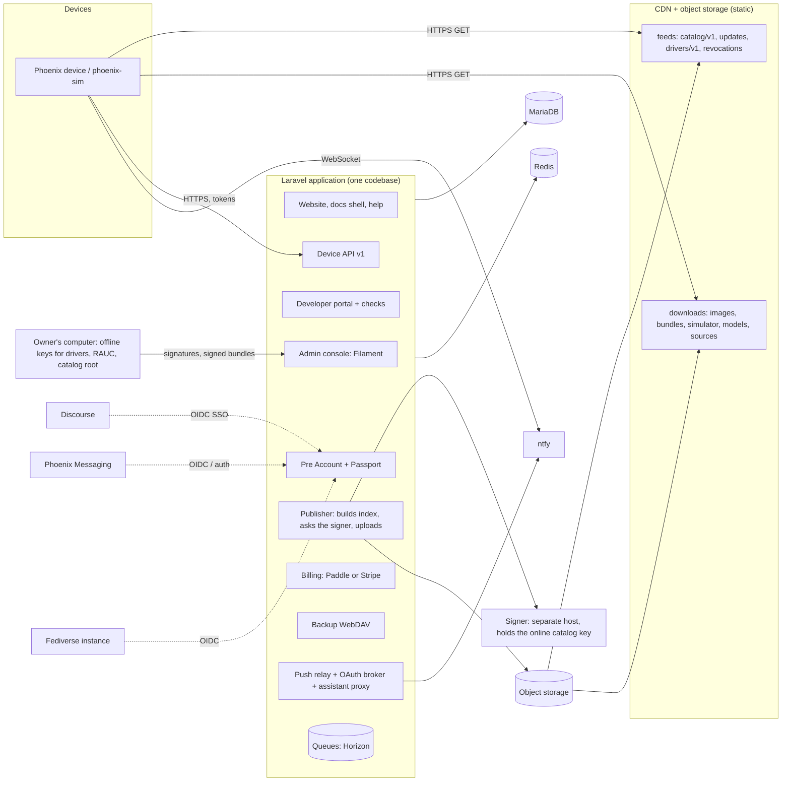
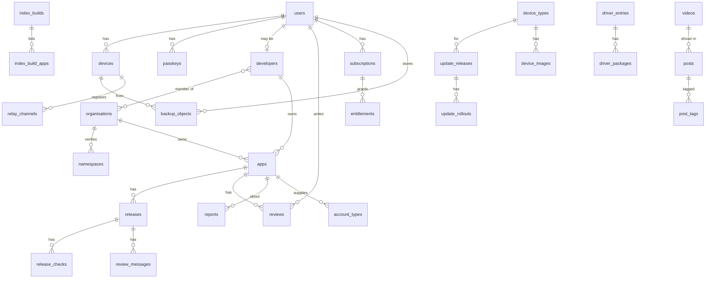

# The Phoenix platform: plan and spec

The servers webOS Phoenix needs once it leaves this computer: the website,
the account (working name **Pre Account**), the developer portal and its
submissions, the signed feeds devices read (catalog, system updates,
drivers), downloads, docs, community and support, and a few small paid
cloud services. Written 10 October 2026 for the owner ("I am going to need
to host a platform for this ... I am going to build it in Laravel"), to be
built by another agent from [PLATFORM-BUILD-PROMPT.md](PLATFORM-BUILD-PROMPT.md).

This is a plan, not a decision record. What the owner still has to decide
is in [Open questions](#14-open-questions) (also rows Q40 to Q57 of
[OPEN-QUESTIONS.md](OPEN-QUESTIONS.md)); every place this page assumes
something, it says so. Prices are rough launch-time ranges from memory of
public price lists, to be checked before buying.

## Contents

1. [Overview](#1-overview)
2. [What devices and the simulator expect today](#2-what-devices-and-the-simulator-expect-today)
3. [Domains and hosts](#3-domains-and-hosts)
4. [Architecture and stack](#4-architecture-and-stack)
5. [API conventions](#5-api-conventions)
6. [Components](#6-components)
7. [Signing keys and the release pipeline](#7-signing-keys-and-the-release-pipeline)
8. [Data model](#8-data-model)
9. [Operations](#9-operations)
10. [Legal and trust](#10-legal-and-trust)
11. [Migration from server/marketplace](#11-migration-from-servermarketplace)
12. [Changes the devices need](#12-changes-the-devices-need)
13. [Phases](#13-phases)
14. [Open questions](#14-open-questions)
15. [Sources](#15-sources)

---

## 1. Overview

**What it is.** "The Phoenix cloud": everything Phoenix runs on the
internet so that a device, the simulator, a developer and a visitor have
somewhere to go. Palm had the Palm Profile servers (backup, the account),
the App Catalog and its developer portal, the update servers, and
palm.com / developer.palm.com; HP turned them all off, which is why legacy
webOS devices broke. Phoenix's version is built so that the same thing
cannot happen to it:

- **Devices trust signatures, not hosts.** Code and data that devices
  install (apps, drivers, system updates) are signed with keys held offline
  or on a separate signer; the web servers only carry the files. Any
  mirror can serve them ([APP-STORE.md](APP-STORE.md) 3.3, option C, is the
  model and is already built that way).
- **Static first.** Everything a device must have to install and update is
  static files (a signed index and its packages, a feed per device and
  channel). They work from a CDN, a mirror, or a USB stick; the dynamic
  Laravel application is needed only to write them and for accounts,
  reviews and the paid services.
- **Nothing required.** No account is needed to browse, install or update
  (APP-STORE.md 3.10, "Privacy"). The account adds cloud backup, reviews,
  subscriptions and the community; a device without one is a full device.
- **Self-hostable and open.** The platform's code is open source
  (assumption: Apache-2.0, a separate repository; Q57), so the community
  can run it if the project stops, and device settings name the hosts in
  plain JSON files a user (Developer Mode) or an image maker can change.

**Who uses it.**

| Who | What they come for |
| --- | --- |
| People with a Phoenix device | Updates, the Marketplace, drivers (all without an account); their Pre Account for backups, reviews, the subscription; help and status |
| People with the simulator | Downloads (macOS, Linux), the public catalog, news, the forum |
| Developers | Developer account, submissions and their review, the SDK, connector kit and docs, sample code, the simulator, stats on their apps |
| Device porters and makers | The device table, porting guide, hardware reports, the driver catalog's submission path, "Phoenix Ready" ([HARDWARE.md](HARDWARE.md#install-it-like-a-linux-distro)) |
| Reviewers, moderators, support, admins | The review queue, reports, takedowns, the release console, the account desk, the audit log |
| The owner | All of the above, plus the signing keys and the release approval |
| The press and fans | Keynotes, trailers, announcements, the press kit, screenshots |

---

## 2. What devices and the simulator expect today

These are **contracts**: a device already built reads them, so the
platform serves them as they are (same paths below a base URL, same JSON
fields, same signature bytes) or adds a new version beside the old one. All
of it is served today by `server/marketplace` (PHP 8, no framework) and
`server/drivers` on this computer.

**Since 11 October 2026 the device side is ready for the platform:**
[PLATFORM-CLIENT.md](PLATFORM-CLIENT.md) lists every request a device
makes, how it verifies and caches it, and the mismatches with this page
that were fixed (here and on the device). The contract both sides build
to is [platform-api/](platform-api/) (OpenAPI and JSON Schemas), and
`tools/test-platform-client.cjs` checks a server against it. Every address
and key now comes from one file, `/etc/palm/phoenix/servers.json` (written
from meta-phoenix's `PHOENIX_*` settings; the simulator's points at this
computer): where 2.1-2.4 below say `sources.json`, `updates.json` or
`catalog.json` gives a URL or key, read servers.json. Done on the device
since: the catalog key's root delegation (7.1 step 2, Q45), the signed
revocation list (6.7), the `dev` channel, staged rollout and a signed
update feed (format 2, 6.9, Q56), app rollouts, the account service, First
Use's account step, Phoenix Cloud backup, push channel registration, the
token relay client and the assistant provider (12).

### 2.1 The Marketplace catalog (signed static index)

Read by `org.webosphoenix.service.packages`
(`apps/marketplace/service/packagesservice.js`), from the sources in
`apps/marketplace/service/etc/palm/marketplace/sources.json:4`
(`"url": "http://127.0.0.1:8088/v1/", "key": null`).

| Path (below the source URL) | What | Written by | Read by |
| --- | --- | --- | --- |
| `key.json` | `{"key": base64 Ed25519 public key, "name", "fingerprint"}` | `Catalog::publish`, `server/marketplace/src/Catalog.php:659-660` | `keyInfo`, `packagesservice.js:160-170` (key must be 32 bytes) |
| `index.json` | `{"version": 1, "build", "generated", "expires", "source": {id, name}, "categories", "apps": [...], "accounts": [...]}` | `Catalog.php:637-643` | `verifyIndex`, `apps/marketplace/service/lib/catalog.js:81-107` |
| `index.json.sig` | base64 of the Ed25519 detached signature of `index.json`'s exact bytes, then a newline | `Catalog.php:655-658` (signature written before the index) | same |
| `packages/<id>_<version>_all.ipk` | approved packages | `Catalog::decideRelease`, `Catalog.php:165-166` | install, checked against `release.sha256`/`size` |
| `icons/<id>.svg`, `icons/accounts/<templateId>.png`, `icons/copy/<id>-<hash>`, `screenshots/copy/<id>-<hash>` | generated icons, account type icons, the catalog's copies of pictures on other sites | `Catalog.php:290-450`, `public/router.php:20-37` | the Marketplace's pages |

Device rules (`catalog.js:81-93`): the signature must verify with the key
the user trusted (first use, after seeing the fingerprint:
`Signer::fingerprint`, `Signer.php:41-45`, the first 16 bytes of SHA-256 of
the key in hex, groups of 4); `version` must be `1`; `expires` must be in
the future (the server writes 14 days, `Catalog::EXPIRES_DAYS`,
`Catalog.php:26`); `build` must not be lower than the last build taken
(no rollback). An app entry (`catalog.js:14-17, 52-76`): `id` (reverse DNS),
`kind` `pwa` or `ipk`, `title`, `developer {name, url?}`, `summary`,
`description`, `categories`, `icon` (URL), `screenshots`, `license`,
`homepage`, `donation`, `featured`, `rating {stars, count} | null`,
`version`, and `pwa {manifest, origin}` or `release {url, size, sha256,
minPhoenix?}`. Unknown keys are ignored, so new fields can be added inside
version 1. Account types (`accounts[]`, Connections) are specified in
`server/marketplace/README.md` "Account types" and checked against
`Catalog::ACCOUNT_ENUMS` (`Catalog.php:458-467`), which already has
`privacy.phoenixServers: none | push-relay | token-relay` (the relay and
token broker of 6.5 below).

Revocation: the runtime's `com.palm.appinstaller/revoke` removes apps whose
ids a trusted catalog key signed (`runtime/phoenix-runtime.js` around
12597-12620, LunaSysMgr's `cbRevoke`); no feed delivers such a signature
yet (6.7).

### 2.2 The catalog service's JSON API (developers and admins)

`server/marketplace/src/Api.php:7-29`, below `/api/`. The device does not
call it today (no `/api/` request in `apps/marketplace`); developers, admins
and the tests do. Errors are `{"error": "text"}` with the HTTP status
(`Api.php:47-53`: 400 for a failed check, 401 not signed in, 403 wrong role,
404). Auth is `Authorization: Bearer <token>`, only a SHA-256 of the token
stored (`Api.php:65-78`).

| Method and path | Auth | Body / reply |
| --- | --- | --- |
| `POST /api/accounts` | none (no email check yet: README "On a server") | `{name, email, role: developer\|user}` -> `{id, token, role}` |
| `GET /api/apps`, `GET /api/apps/{id}` | none | `{apps: [...]}`, `{app}` (with `releases`, `rating`) |
| `POST /api/apps` | developer | `{kind: "pwa", id, manifest, title, ...}` -> `{app}` |
| `POST /api/apps/packages` | developer | the `.ipk` as the body -> `{app, release}`; checks in `Ipk::check` (`Ipk.php:5-11`) |
| `GET/POST /api/apps/{id}/reviews` | POST: any account | `{stars 1-5, text}` -> `{rating}` |
| `POST /api/reports`, `POST /api/optout` | none | `{appId, kind, text, contact}`, `{origin, contact, text}` -> `{id}` |
| `GET /api/admin/queue`; `POST /api/admin/apps/{id}/list\|pull`; `POST /api/admin/releases/{n}/approve\|reject`; `POST /api/admin/optouts/{n}/accept`; `POST /api/admin/publish` | admin | each decision publishes a new build |
| `GET /api/updates`; `POST /api/admin/updates?compatible=&version=&build=&channel=&note=...` (bundle as body); `POST /api/admin/updates/withdraw {compatible, channel}` | admin for POST | the update feed (2.3) |
| `GET /api/health` | none | `{ok: true}` |

### 2.3 System updates

Read by `com.palm.update` (`services/updates/updatesservice.js`) from
`services/updates/etc/palm/updates.json` (`{"feed":
"http://127.0.0.1:8088/updates/", "channel": "stable"}`).

- URL: `<feed>/<compatible>/<channel>.json` (`updatesservice.js:155-160`);
  channels `stable` and `beta` only (`updatesservice.js:81`,
  `server/updates/src/UpdateFeed.php:25`).
- Body (`UpdateFeed.php:9-12`, checked by `parseFeed`,
  `updatesservice.js:96-118`): `{"format": 1, "compatible", "channel",
  "release": {name, version, build (integer >= 1), date, notes: [lines], url
  (relative to the feed file), size, sha256} | null}`.
- The feed is **not signed**; the RAUC bundle is, checked by RAUC against
  the keyring in the running system, and the device installs only a bundle
  for its `compatible` with a higher build (`updatesservice.js:31-36`).
  A channel's JSON is served `no-cache`, a bundle `immutable`
  (`server/marketplace/public/router.php:74`).
- The simulator's feed is the same server; `compatible=phoenix-sim` with no
  body makes a stand-in bundle (`Api.php:179-186`).

### 2.4 The driver catalog and the hardware report

Read by `org.webosphoenix.hardware` (`services/hardware`), configured in
`services/hardware/etc/palm/hardware/catalog.json:4-6`:
`"url": "https://drivers.webosphoenix.org/v1/"` (a placeholder host,
HARDWARE.md "Decided, and still open" 3), `"key": null` (to be the owner's
offline key, **pinned**, never trusted on first use), `"revoked": []`,
`"reportUrl": "https://drivers.webosphoenix.org/v1/report"`.

- `drivers.json` (`{"format": 1, "build", "generated", "expires" (30 days),
  "source", "drivers": [...]}`, `server/drivers/src/Catalog.php:343-363`),
  `drivers.json.sig`, `key.json`, `packages/*.ipk`, and after a key change
  `key-handover.json` and `.sig` (`services/hardware/lib/drivers.js:210-225`).
  Format and review rules: [DRIVERS.md](DRIVERS.md).
- `POST <reportUrl>`: the opt-in report, `{"format": 1, arch, kernel
  ("6.6.23"), devices: [{bus, ids: [...], firmwareMissing: [...]}]}`
  (`services/hardware/hardwareservice.js:581-592`); 201 `{"ok": true}`, 400
  `{"error"}` (`server/drivers/public/router.php:21-37`); kept with the day
  only (`server/drivers/src/Catalog.php:417-460`).
- Releases are signed on the owner's computer and published by an approval
  gate ([DRIVERS.md](DRIVERS.md) "Releasing the catalog";
  `.github/workflows/drivers-catalog.yml`). The platform takes over that
  gate (7.3).

### 2.5 Other things that name a server

| What | Today | Platform need |
| --- | --- | --- |
| OAuth sign-ins (`services/oauth`) | Device-side PKCE, tokens in the key store; client registrations per server (`oauthservice.js:10-28`); on hardware a placeholder answering `UNSUPPORTED`, redirect `http://127.0.0.1/oauth/callback` (`services/oauth/service.js:1-17, 58`; Q29) | A token broker for providers whose client secret cannot ship (6.5.4); the Bluesky client metadata file (6.5.6) |
| Backup (`apps/settings/service`) | `.pbak` files, AES-256-GCM under a PBKDF2 key, to a USB drive or **WebDAV** (MKCOL, PROPFIND, PUT, GET, DELETE, Basic auth); newest five kept ([APP-RUNTIME.md](APP-RUNTIME.md#backup)) | Phoenix Cloud Backup as a WebDAV folder per account (6.5.1): no new device protocol |
| The Assistant (`apps/assistant`) | Cloud models only with the user's key: Anthropic, OpenAI, Google, any OpenAI-compatible URL ([AI-AND-MCP.md](AI-AND-MCP.md) "Cloud models"); the owner wants a first-party paid provider beside them (AI-AND-MCP.md, decisions of 28 September 2026) | An OpenAI-compatible proxy (6.5.5) |
| Model downloads (`apps/assistant/service/lib/models.js:41, 45`) | Hugging Face, and Phoenix's converted models as GitHub release assets of `thebestbradley/webos-phoenix` | A mirror on the downloads host, if GitHub is to leave the path (6.11) |
| Push (Synergy C6) | Not built; designed as UnifiedPush to ntfy plus the Phoenix Relay ([SYNERGY-MODERN.md](SYNERGY-MODERN.md) 4.8, 4.9) | ntfy and the relay (6.5.3) |
| The Palm Profile | The open-source `com.palm.palmprofile` account template is mounted (`runtime/rootfs.json:39`) and the simulator's sample data has a profile account named "Phoenix Account" (`runtime/sample-data.js:37-52`, `:228`) | The Pre Account is its successor (6.2) |
| First Use | Steps welcome, wifi, hardware, restore, datetime, accounts, passcode, privacy, tutorial, done (`apps/firstuse/src/lib/flow.ts:22-33`); no account step | A "Pre Account" step (6.3) |
| Connectivity check | OSE's; webOS CE had to fix a probe that hit dead HP servers ([COMMUNITY-FEATURES.md](COMMUNITY-FEATURES.md), "make sure the probe URL is Phoenix-controlled") | A probe endpoint we control (6.18) |
| Contacts in manifests | `drivers@webosphoenix.org` in driver manifests (`meta-phoenix/recipes-phoenix/phoenix-driver-feed/files/drivers/*.json`) | Mail for the domain |
| The simulator | `phoenix-sim --marketplace` and Services > Marketplace Catalog start `server/marketplace/bin/serve.sh` on 127.0.0.1:8088 (`shell/sim/simmarketplace.h:52`); the driver report goes to 127.0.0.1:8090 (`server/drivers/sample/public/catalog-sim.json`) | Unchanged for development (11.3) |
| Developer Mode | Local: OSE's `com.webos.service.devmode` and the `devModeUnlocked` preference ([APP-RUNTIME.md](APP-RUNTIME.md#developer-mode)) | **None.** LG's TV developer mode needs a server session; Phoenix's must not |
| App Museum II, PreCentral | Third-party catalogs, off by default (`sources.json:5-6`) | None: Phoenix never hosts or mirrors their packages (APP-STORE.md 3.10) |

---

## 3. Domains and hosts

OPEN-QUESTIONS **Q1** (where and under which address) is still open; this
is the proposal for it. The examples use `webosphoenix.org`, which the
driver catalog's placeholder already uses; the name may change with the
branding ([BRANDING.md](BRANDING.md)), which is one more reason to keep what
devices hard-code small.

**What devices hard-code: two hostnames, versioned paths.**

| Host | Serves | Kind | Devices name it in |
| --- | --- | --- | --- |
| `feeds.webosphoenix.org` | `/catalog/v1/` (2.1), `/updates/` (2.3), `/drivers/v1/` (2.4), `/revocations/v1/` (6.7) | Static files on object storage behind a CDN; written only by the platform's publisher | `/etc/palm/phoenix/servers.json` (`feeds`; [PLATFORM-CLIENT.md](PLATFORM-CLIENT.md)) |
| `api.webosphoenix.org` | `/v1/...` the device and account API (5, 6), `POST /drivers/v1/report`, `/oauth/...` (Passport), `/relay/...` (provider webhooks), WebDAV for backups at `/dav/` | Laravel | `/etc/palm/phoenix/servers.json` (`api`, `account.issuer`): the account service, backup, push, OAuth broker, assistant provider, the hardware report |

Everything else is for people and can move freely:

| Host | What |
| --- | --- |
| `webosphoenix.org` (`www.` redirects) | The website: home, features, gallery, keynotes, news, press, downloads page |
| `account.webosphoenix.org` | The Pre Account: sign-up, sign-in, the device link page (`/link`), devices, privacy, billing |
| `developer.webosphoenix.org` | The developer portal: submissions, the review conversation, stats |
| `docs.webosphoenix.org` | Developer docs, versioned per release; the help center at `/help/` |
| `downloads.webosphoenix.org` | Big files on the CDN: simulator builds, device images, RAUC bundles' origin, models, SDK, GPL sources (or `source.` for those) |
| `devices.webosphoenix.org` | The device table, install guides, porting guide, driver status |
| `community.webosphoenix.org` | The forum (6.14) |
| `status.webosphoenix.org` | The status page, hosted with another provider (9.6) |
| `chat.`, `social.`, `push.` | Phoenix Messaging (6.5.7), the Fediverse instance (6.5.8), ntfy (6.5.3): separate services |
| `connect.webosphoenix.org` | The connectivity probe (6.18) |

Why two device hosts and not one: the static feeds can sit on a CDN with
no PHP behind them (the cheapest, most available thing to run, and
mirrorable), while the API needs the application. Why not more: every
hostname baked into an image is a promise for the life of that image.
Paths carry the version (`/catalog/v1/`, `/v1/`), so a `v2` can be served
beside `v1` on the same host.

**The account's name.** "Pre Account" is the owner's working name. Pre is
a Palm product name whose trademark status is unconfirmed
([BRANDING.md](BRANDING.md) "Risks" 1), so the code and URLs should say
`account`, not `pre`, and the user-visible name should be one string to
change (Q40). This page writes "Pre Account".

---

## 4. Architecture and stack



### 4.1 Laravel version

**Laravel 13** (released 17 March 2026; bug fixes until Q3 2027, security
fixes until Q1 2028), on **PHP 8.4** (Laravel 13 needs 8.3 or later and
supports 8.3 to 8.5). Laravel has had no long-term-support releases since
6.x: every major gets 18 months of bug fixes and two years of security
fixes, and a new major comes each year. So "the LTS-era Laravel" means the
current major; plan a major upgrade each spring (Laravel 14 is expected in
Q1 2027), which Laravel Shift or the upgrade guide makes a day's work for an
application of this size. Laravel 12's security support ends 24 February
2027, too soon to start on. *(Dates from Laravel's support table as reported
by Laravel News; check laravel.com/docs/13.x/releases.)*

### 4.2 The stack

| Part | Choice | Why / alternatives |
| --- | --- | --- |
| Language, framework | PHP 8.4, Laravel 13 | The owner's choice; LAMP |
| Database | **MariaDB 11.4 LTS** (or MySQL 8.4 LTS) | LAMP; the current server already runs on either (`Db.php:5-6`) |
| Cache, queues, rate limits, sessions | Redis 7 (or Valkey 8, its BSD-licensed fork) | Horizon needs Redis |
| Queues | **Laravel Horizon** | Package checks, malware scans, media copies, publishing, video transcodes, emails |
| Scheduler | Laravel's scheduler (one cron entry) | Re-publish before `expires`, renew relay channels, purge, backups |
| Web server | nginx + PHP-FPM (Apache works the same: one front controller) | The current server is "every request to `public/router.php`" either way |
| OAuth 2 server, tokens | **Laravel Passport 13** (decided below) | Device authorization grant (RFC 8628), authorization code + PKCE, refresh tokens, scopes, personal access tokens |
| Web sign-in | Laravel Fortify (sessions, email verification, TOTP 2FA, password reset) + passkeys (`spatie/laravel-passkeys` or `web-auth/webauthn-lib`, both MIT) | Passkeys first, TOTP second |
| Admin console | **Filament 4** (MIT, free) (decided below) | Nova is paid and closed |
| Front end for portals | Blade + Livewire inside Filament for admin; **Inertia + React + TypeScript** for the account and developer portals | The owner is at home with React + TS; the device apps' `@phoenix/ui` look can be reused for familiarity |
| Website | Blade pages with a small amount of React where needed; static pages cached at the CDN | Fast and simple; the website must not depend on JavaScript to read |
| Docs | A static site built from the Phoenix repo's Markdown (6.12): Docusaurus (MIT, React) or Astro Starlight (MIT); search with Pagefind (MIT) | Built in CI, uploaded as static files; Laravel only links to it |
| Search in the portals | Laravel Scout, database driver first; Meilisearch (MIT) when the catalog grows | |
| Billing | Laravel Cashier (Paddle) or Cashier (Stripe) (6.4) | |
| Realtime | Laravel Reverb only if a live review queue or live install counts are wanted; not needed for launch | |
| Mail | A transactional provider through Laravel's mailers (9.5) | |
| Files | Laravel's filesystem on S3-compatible storage (Cloudflare R2, Backblaze B2, Hetzner, Wasabi) | No egress fees matter for downloads |
| WebDAV | `sabre/dav` (BSD-3-Clause) mounted on a Laravel route | The backup service already speaks WebDAV |
| Tests | **Pest** (MIT) with Laravel's HTTP tests; Larastan; Pint | |
| Errors, logs | Sentry or Flare; logs to a central store (9.7) | |
| Roles | `spatie/laravel-permission` (MIT); audit with `spatie/laravel-activitylog` (MIT) plus an append-only table for key operations | |

**Passport, not Sanctum** (decided here; say if not): Sanctum issues
opaque API tokens and SPA cookies, but it is not an OAuth server. The
platform needs exactly OAuth's pieces: the device authorization grant
(RFC 8628) for signing a device in, authorization code with PKCE for the
device's browser sheet and later for "Sign in with Pre Account" in the
forum, the chat server and third-party apps (OpenID Connect, through a
package on top of Passport such as `jeremy379/laravel-openid-connect` or
an identity provider in front, to check), refresh tokens and scopes.
Passport 13 has the device authorization grant (from
`league/oauth2-server` 9; the Laravel 13 docs show `Passport::useDeviceCodeModel`;
confirm the routes when building). The websites use ordinary session
cookies; Sanctum is not needed at all.

**Filament, not Nova**: free and MIT, under active development, builds
the review queue, the release console and the account desk from Eloquent
models with policies; Nova would cost a licence per project and is
closed source, which sits badly with an open-source platform others may
self-host.

**One Laravel application, several services beside it.** The website,
account, developer portal, admin, device API, publisher, billing, WebDAV,
relay, broker and assistant proxy are modules of one codebase (one deploy,
one database, shared auth); the forum, chat, Fediverse instance, ntfy, the
status page and the signer are separate programs on their own small hosts,
each signing users in through the Pre Account (OIDC) where they have users.

---

## 5. API conventions

**Versions.** The device API is `https://api.<domain>/v1/`. A breaking
change is a new path (`/v2/`) served beside the old one for as long as
devices that use the old one are supported (at least the life of the
release that shipped it: "a device with stable updates turned off for a
year still works"). The static feeds carry their version in the path
(`/catalog/v1/`) and in the file (`"version": 1`, `"format": 1`); new
optional fields are added inside a version, never changed or removed.
The legacy `/api/*` paths of 2.2 are kept as they are on the API host for
the scripts and tests that use them, frozen.

**Errors.** Every JSON error is

```json
{"error": "A sentence a person can read", "code": "MACHINE_CODE", "details": {"field": "problem"}}
```

with the HTTP status (400 check failed, 401 not signed in, 403 not allowed,
404, 409 conflict, 413 too large, 422 validation, 429 rate limited with
`Retry-After`, 5xx). `error` is what the current server sends
(`Api.php:47-53`), so a client written against it keeps working; `code`
and `details` are additions. Device services map `code` onto their own
`errorCode` (as `packagesservice.js` and `updatesservice.js` do with
`CONNECTION_FAILED`, `BAD_INDEX`, and so on).

**Auth.** `Authorization: Bearer <access token>` (Passport). Tokens carry
scopes: `account` (profile, devices), `backup`, `push`, `assistant`,
`reviews`, `developer`, `admin` (admin tokens only from the console, short
lived, after a passkey step-up). Device tokens are bound to a device record
(6.3). Refresh tokens rotate on use.

**Other rules.** JSON in UTF-8, field names in lowerCamelCase as the
current index uses; times in UTC ISO 8601 (`2026-10-10T12:00:00Z`, as
`Db::now()`); lists paginated with `?cursor=` and `{"items": [...],
"next": cursor | null}`; `Idempotency-Key` honoured on POSTs that create
or charge; rate limits per token and per IP (Laravel's limiter in Redis);
CORS only where a browser page calls (the feeds send
`Access-Control-Allow-Origin: *` today, `router.php`); HTTPS only, HSTS on
every host.

---

## 6. Components

Each component: purpose, users, data, endpoints, admin screens, and what
the device or simulator calls today. Endpoints below are on
`api.<domain>` unless a host is named.

### 6.1 The marketing website

**Purpose.** Say what Phoenix is, show it, let people get it. **Users:**
everyone. **Data:** pages, posts, videos, screenshots, press kit files,
download records (from 6.11).

| Page | Contents |
| --- | --- |
| Home | What it is, a short video, screenshots, "Try the simulator" and "Install on a device" |
| Features | Cards, gestures, Just Type, notifications, Synergy, the Assistant, privacy; 1.x and 2.0 ([ROADMAP.md](ROADMAP.md#two-lines-1x-and-20)) |
| Gallery | Screenshots from `docs/screenshots` and per-device photos |
| Keynotes and trailers | Video pages with chapters, transcripts and captions |
| News | Announcements and the blog, with RSS 2.0, Atom and JSON Feed at `/news/feed.xml`, `/news/atom.xml`, `/news/feed.json`; per-tag feeds |
| Press | Press kit (logos with usage rules, screenshots, fact sheet, team contacts), press releases |
| Download | The simulator per platform, device images (from the device table), checksums and signatures, release notes, the GPL sources link |
| Developers, Devices, Community, Help | Links into 6.6, 6.13, 6.14, 6.15 |
| Legal | 10 |

**Video hosting.** Options: (a) self-host: upload the master to object
storage, a Horizon job transcodes with ffmpeg (LGPL build) to HLS renditions
and captions, served from the CDN, played by a small open player (Video.js
or hls.js, Apache-2.0); costs only storage and egress, private, but
transcoding takes a worker with CPU; (b) a video service (Bunny Stream,
Cloudflare Stream: per-minute storage and delivery pricing, a few dollars a
month at this scale), the same privacy, no transcoding to run; (c) YouTube:
free and where the audience is, but its embed sets cookies and tracks.
**Recommended:** (b) for the site's player, and the same video also posted
to YouTube and to a PeerTube channel for reach; YouTube links rather than
embeds, or a click-to-load embed (no cookie before the click). Q52.

**Endpoints** (website host): `GET /`, `/features`, `/gallery`,
`/keynotes/{slug}`, `/news`, `/news/{slug}`, the feeds above, `/press`,
`/download`, `/legal/...`. A device-facing `GET
https://api.<domain>/v1/announcements?locale=&since=` (JSON list of `{id,
title, summary, url, published, image?}`) only if the owner wants a "What's
new" card on devices; not needed for 1.0.

**Admin:** posts (Markdown with preview, schedule, tags, hero image),
videos (upload, captions, chapters, publish), pages, press kit files,
redirects.

### 6.2 The Pre Account

**Purpose.** One identity for a person across the website, devices, the
forum, chat, the Fediverse instance and the developer portal: the Palm
Profile's successor (Palm's profile held the backup and the account on the
device; its template, `com.palm.palmprofile`, is part of the open-source
release, `runtime/rootfs.json:39`). **Users:** device owners, simulator
users, developers, staff.

**Data:** `users` (name, email, email verified at, password hash or none,
locale, country for tax, created, deleted at), passkeys, TOTP secrets
(encrypted), recovery codes (hashed), sessions, OAuth clients and tokens
(Passport), devices (6.3), consents (terms version, marketing yes/no),
privacy requests.

**Flows.**

- **Sign up**: name, email, password or a passkey; age confirmation (13 or
  older; up to 16 in EU countries that set the GDPR's age of consent higher,
  unless a parent consents); terms and privacy accepted with their
  version recorded; a verification email (signed link, 24 hours). Unverified
  accounts can sign in but not review, submit, subscribe or use cloud
  services. Rate limited, with a privacy-respecting challenge (Cloudflare
  Turnstile or the open-source ALTCHA, MIT) only when abuse is seen.
- **Sign in**: passkey first (WebAuthn, discoverable credentials), or email
  and password with TOTP if enabled; "email me a sign-in link" as a
  fallback. Lockouts and alerts on new sign-ins (email: "a new sign-in from
  Firefox on Linux").
- **2FA**: TOTP (Phoenix's own Authenticator app can hold it), passkeys
  count as a second factor; required for developers who publish and for
  staff.
- **Profile**: name, avatar (cropped and re-encoded server-side), locale,
  email change (verify the new one, notify the old one).
- **Privacy**: download my data (a ZIP of JSON: profile, devices, reviews,
  subscriptions, backup list without contents, consents, sign-in history;
  a Horizon job, emailed link, 7 days); delete my account (re-auth, a
  30-day grace with "undo", then the rows are deleted or anonymised:
  reviews deleted (or kept as "a former user" if the owner prefers); backups deleted from storage; subscription cancelled; Discourse and
  chat accounts deactivated through their APIs; an audit entry with no
  personal data). GDPR (articles 15-17, 20) and CCPA/CPRA (know, delete,
  correct; no selling of data at all).
- **Sessions**: list and sign out others; device tokens listed under
  Devices.

**Endpoints** (device and API clients):

| Method, path | Auth | Request -> reply |
| --- | --- | --- |
| `GET /v1/me` | `account` | -> `{"id": "u_…", "name", "email", "emailVerified": true, "avatar": url\|null, "locale", "created", "plan": "free"\|"cloud", "deleting": null\|date}` |
| `PATCH /v1/me` | `account` | `{name?, locale?}` -> `/v1/me` |
| `GET /v1/me/entitlements` | any device token | -> 6.4 |
| `POST /v1/me/export`, `DELETE /v1/me` | session only (website), not device tokens | -> `202 {"status": "queued"}` |

Web pages (account host): `/signup`, `/login`, `/verify`, `/link` (device
code entry, 6.3), `/devices`, `/security` (passkeys, 2FA, sessions),
`/privacy` (export, delete), `/billing` (6.4).

**Admin:** the account desk: find a user, see verification, devices,
subscription, sign-in history; resend verification, disable, force sign-out,
start a deletion; every action audited with the staff member and a reason.
Support staff cannot see backup contents (no one can: 6.5.1) or passwords.

### 6.3 Devices and the account on the device

**Signing a device in.** Two ways, both ending in a Passport token pair
for that device:

1. **Device authorization grant (RFC 8628)**, as TVs and consoles do: the
   device asks `POST /oauth/device/code {client_id: "phoenix-device",
   scope: "account backup push reviews"}` -> `{device_code, user_code:
   "WDJB-MJHT", verification_uri: "https://account.<domain>/link",
   verification_uri_complete, expires_in: 600, interval: 5}`; the device
   shows the code and a QR code of `verification_uri_complete`; the person
   signs in on any phone or computer and approves "Sign in your Phoenix
   TouchPad"; the device polls `POST /oauth/token {grant_type:
   "urn:ietf:params:oauth:grant-type:device_code", device_code, client_id}`
   (`authorization_pending`, `slow_down`, `access_denied`, `expired_token`
   per the RFC). Works on every device, with no browser on the device, and
   no password is typed on it. **Default for First Use.**
2. **Authorization code with PKCE in the system browser sheet**, through
   `org.webosphoenix.service.oauth` as the Fediverse does
   ([APP-RUNTIME.md](APP-RUNTIME.md#synergy-connectors-and-the-fediverse)),
   once the sheet exists on devices (Q29). "Sign in on this device" as the
   second choice.

Then the device registers itself:

`POST /v1/devices` (`account`) `{"publicKey": base64 Ed25519 (made on the
device, kept in the key store), "name": "Bradley's TouchPad", "model":
"PinePhone Pro", "compatible": "phoenix-pinephonepro", "osVersion":
"1.0.0", "build": 100}` -> `201 {"id": "d_…", "name", "created"}`. The
device key lets later requests be signed (backup uploads, push channel
registration) so a stolen bearer token alone is not enough for those
(optional for v1, recommended). `GET /v1/me/devices` -> `{"items": [{id,
name, model, compatible, osVersion, build, lastSeen, current: bool}]}`;
`PATCH /v1/devices/{id} {name}`; `DELETE /v1/devices/{id}` signs it out
(revokes its tokens and its WebDAV password, unregisters its push channels).
`lastSeen` is the day only.

**On the device** (Phoenix repo work, not the platform; 12):

- A small service, `org.webosphoenix.service.account` (proposed), owns the
  tokens (in the key store) and exposes `getAccount`, `signIn` (starts the
  device flow and reports the code), `signOut`, `entitlements`. It creates
  a `com.palm.palmprofile`-style account in Accounts, shown as the Pre
  Account, whose capabilities are what the subscription gives (backup;
  later sync).
- **First Use**: a "Pre Account" step after Wi-Fi and before Restore
  (`flow.ts:22-33`): "Sign in to your Pre Account (optional)" with the code
  and QR, "Create one" (opens the same page), and **Skip**. Signed in, the
  Restore step lists the account's cloud backups first. The step is hidden
  offline. Nothing else in First Use needs the account.
- **Settings**: Settings > Pre Account (name, email, plan, devices link,
  Sign Out, "Manage on the web"); Settings > Backup gains "Phoenix Cloud" as
  a place (6.5.1).

**Admin:** a user's devices (model, build, last seen day), revoke one.

### 6.4 Subscriptions (small, optional)

**Purpose.** Pay for what costs money to run: storage, relay traffic,
assistant tokens. Everything a device needs to work stays free.

**Provider: Paddle or Stripe.**

| | Paddle (merchant of record) | Stripe (+ Stripe Tax), Phoenix is the merchant |
| --- | --- | --- |
| Laravel | Cashier (Paddle) | Cashier (Stripe) |
| VAT, GST, US sales tax | Paddle is the seller: it registers, collects and remits in every country | Phoenix must register where thresholds are passed (EU OSS VAT from the first euro for digital services to consumers, UK VAT, US states' economic nexus); Stripe Tax calculates and reports (about 0.5% per transaction), filing is Phoenix's |
| Fees (approx.) | About 5% + $0.50 per transaction, everything included | About 2.9% + $0.30 (US cards) + international and currency fees + Stripe Tax |
| Invoices, refunds, chargebacks, fraud | Paddle's | Phoenix's (with Stripe's tools) |
| Paid apps later (payouts to developers) | Not a marketplace payout service | Stripe Connect handles payouts and KYC |

**Recommended: Paddle** for subscriptions, because a one-person project
should not register for VAT in dozens of places; revisit Stripe (with
Connect) only if paid apps come (APP-STORE.md 3.7 defers them). Either way
the platform keeps its own `subscriptions` and `entitlements` tables, so
the provider can change. Both need a legal entity and a bank account
(Q51). Q41.

**Plans** (proposal; Q42):

| Plan | Price (idea) | Unlocks |
| --- | --- | --- |
| Free | 0 | Pre Account, reviews, devices list, the forum, push relay for notifications (it is what makes Google and Microsoft accounts feel live), the catalog, updates |
| Phoenix Cloud | about $2-3 a month or $20-30 a year | Encrypted cloud backup (50 GB, all devices), settings sync (later), a Phoenix Messaging account (6.5.7) and a Fediverse account on the Phoenix instance (6.5.8) if those run |
| Assistant add-on | about $5 a month, or prepaid credits | The Phoenix assistant provider (6.5.5), with a monthly token allowance |

**Entitlements, as devices check them.** `GET /v1/me/entitlements` (any
device token) ->

```json
{
  "plan": "cloud",
  "features": {
    "backup": {"quotaBytes": 53687091200, "usedBytes": 1234567},
    "pushRelay": {"channels": 50},
    "assistant": {"monthlyTokens": 2000000, "usedTokens": 120345},
    "messaging": true, "fediverse": true
  },
  "validUntil": "2026-11-10T00:00:00Z",
  "graceDays": 7,
  "issued": "2026-10-10T12:00:00Z"
}
```

Signed in the header `X-Phoenix-Signature`: base64 Ed25519 over the
body's exact bytes, by the API key (`GET /v1/key.json`, pinned in the
image as servers.json's `account.key`). *(This page first had a
`signature` field "over the JSON without this field"; that needs a
canonical JSON form PHP and JavaScript do not share, so the device checks
the header instead: [PLATFORM-CLIENT.md](PLATFORM-CLIENT.md).)*

The device caches it and keeps working through `graceDays` past
`validUntil` when offline. The server enforces every limit itself (quota on
PUT, tokens on the proxy); the device's copy only decides what to show. A
lapsed subscription keeps backups readable and downloadable for 30 days,
then deletes them after two emails.

**Receipts, refunds, tax:** receipts and invoices come from the provider
(Paddle as the seller); a "Billing" page links to the provider's portal
(change card, cancel, invoices). Refunds within 14 days on request (the
EU right of withdrawal for digital services, waived only with the
customer's express consent at purchase). Webhooks
(`/webhooks/paddle` or `/webhooks/stripe`, signature checked, idempotent
by event id) update `subscriptions` and `entitlements`.

**Admin:** subscriptions and their events, comp a plan (free months for
contributors and testers), refund through the provider, revenue report.

### 6.5 Cloud features

#### 6.5.1 Encrypted cloud backup

What exists: the backup service writes one `.pbak` file per backup, its
parts encrypted with AES-256-GCM under a key derived from the user's
passphrase (PBKDF2-SHA256, 600 000 iterations, random salt), the header
readable and authenticated as additional data; it sends them to a USB drive
or **any WebDAV folder** with Basic auth, keeps the newest five, and
restores in First Use ([APP-RUNTIME.md](APP-RUNTIME.md#backup)). So the
backup is already end-to-end: the passphrase never leaves the device and
the server stores ciphertext.

**Design: Phoenix Cloud Backup is a WebDAV folder per account.**
`https://api.<domain>/dav/backups/<deviceId>/` served by `sabre/dav` in
Laravel, files in object storage (`backups/<userId>/<deviceId>/<file>`),
quota enforced on PUT (`507 Insufficient Storage`). The device's
credentials are a WebDAV app password made for that device (scope
`backup`, shown never again, revocable from Devices), so the existing
`lib/webdav.js` works unchanged; the only device change is a preset
("Phoenix Cloud" in Settings > Backup and First Use > Restore, filled in
from the signed-in account: 12; done). A device's app password writes its
own folder and reads (GET, PROPFIND) the account's other devices' folders,
which is how First Use restores another device's backup onto a new one;
`tools/platform-mock/server.cjs` enforces exactly that.

What the server can see: the file names (date and time), sizes, upload
times, and the `.pbak` header (when, which device, which parts, the key
derivation parameters). It cannot read the parts. Say so in the privacy
policy and on the Backup page. Forgotten passphrase = backups unreadable,
by design; the page says so before the first backup.

| Endpoint | Auth | |
| --- | --- | --- |
| `PROPFIND/MKCOL/PUT/GET/DELETE /dav/backups/{deviceId}/...` | Basic: device id + app password | WebDAV as the device uses it; a device sees its own folder and, for restore, the other devices' folders read-only |
| `POST /v1/backup/credentials` | `backup` | -> `{"url", "username", "password"}` for this device (once) |
| `GET /v1/backup/summary` | `backup` | -> `{"usedBytes", "quotaBytes", "devices": [{deviceId, name, files: [{name, size, modified}]}]}` |

Restore in First Use: after the Pre Account step, the Restore step lists
`summary`'s devices and their backups; the person picks one and types the
passphrase. **Settings sync** (later): the same idea at a finer grain, the
`com.webos.service.systemservice` keys and launcher layout as small
encrypted objects (`PUT /v1/sync/{key}` with `If-Match` versions), so a
second device follows the first; not before 1.0.

**Admin:** usage per account and in total, quota changes, a stuck-upload
cleaner; no content access exists to grant.

#### 6.5.2 What else a subscription could carry (later)

Photos and files storage (a WebDAV or S3 folder that Files and Photos treat
as a place: [SYNERGY-CONNECTORS.md](SYNERGY-CONNECTORS.md) 7, "Drives"),
contacts and calendars (a CardDAV/CalDAV server per account, for example
Radicale run as a separate service, or a Sabre-based one in Laravel), mail
(not recommended: deliverability and abuse work dwarfs the rest). Each is a
separate decision; none is needed for 1.0.

#### 6.5.3 Push: ntfy and the Phoenix Relay

Designed in [SYNERGY-MODERN.md](SYNERGY-MODERN.md) 4.8 and 4.9, phase C6
of [SYNERGY-CONNECTORS.md](SYNERGY-CONNECTORS.md) 6; nothing is built on
the device yet. The device's push service holds **one WebSocket to an ntfy
server** (UnifiedPush; ntfy is Apache-2.0 / GPL-2.0 dual licensed, a single
Go binary) and gives each connector a Web Push endpoint; payloads are
encrypted end to end (RFC 8291) and say only "sync now".

- **`push.<domain>`: ntfy**, run by Phoenix, free for every device (users
  may pick another ntfy server). Access: anonymous topics with long random
  names (UnifiedPush's model) and rate limits; or tokens from the Pre
  Account for higher limits.
- **The Phoenix Relay** (a module of the Laravel app, as the spec in
  SYNERGY-MODERN.md 4.9 describes it): receives webhooks from providers
  that can only call a public HTTPS URL and turns them into Web Push to the
  device's ntfy endpoint. It holds no tokens and no content.

| Method, path | Who calls | What |
| --- | --- | --- |
| `POST /v1/push/channels` | device (`push`) | `{"provider": "graph"\|"google-calendar"\|"gmail", "endpoint": UnifiedPush URL, "p256dh", "auth", "clientState"?}` -> `{"channelId", "url": "https://api.<domain>/relay/graph/{channelId}", "expiresAt"}` |
| `POST /v1/push/channels/{id}/renew`, `DELETE /v1/push/channels/{id}` | device | extend or drop |
| `POST /relay/graph/{channel}` | Microsoft Graph | answers the validation echo (`validationToken`), checks `clientState`, sends a Web Push |
| `POST /relay/google/calendar/{channel}` | Google Calendar `watch` | checks the channel token, sends a Web Push |
| `POST /relay/google/pubsub` | Google Cloud Pub/Sub push (Gmail) | verifies the OIDC token Pub/Sub sends, maps the mailbox to a channel |

Table `relay_channels (id, user_id null, device_id null, provider,
ua_endpoint, ua_p256dh, ua_auth, client_state_hash, expires_at,
created_at)`; channels expire unless renewed. Web Push with VAPID through
`minishlink/web-push` (MIT). Google's Calendar `watch` delivers only to a
domain verified in the Cloud project that owns the client id, which is why
this relay must be run by the Phoenix project account that registered the
Google app (OPEN-QUESTIONS Q17), on the platform's domain.

#### 6.5.4 The OAuth broker and app ids (client secrets)

Most providers Phoenix connects to accept **public clients with PKCE**:
the device does everything, no server sees a token
([SYNERGY-MODERN.md](SYNERGY-MODERN.md) 4.4: Google (its desktop "secret"
is not treated as secret), Microsoft (public client), Mastodon (per-device
registration), Dropbox, Box, Spotify). Those need nothing from the
platform but the registration itself, whose **client id is public** and
ships in the connector package.

Some insist on a **confidential client secret** in the token exchange,
which cannot ship in an image (anyone can read it there): Slack
(`oauth.v2.access` needs `client_secret`), LinkedIn, Zoom, Yahoo, and
possibly others as they are checked. For those, a **token broker**:

```
device ──(1) GET /v1/oauth-broker/slack/authorize?code_challenge=…&state=…&redirect_uri=<device loopback>──► broker
broker ──(2) 302 to Slack with Phoenix's client_id and the broker's own redirect─────────────────────────────► Slack
Slack  ──(3) 302 /oauth-broker/slack/callback?code=…──────────────────────────────────────────────────────────► broker
broker ──(4) exchanges the code with the client_secret; keeps the tokens 2 minutes, encrypted, under a one-time handle
broker ──(5) 302 to the device's redirect_uri?handle=…&state=…
device ──(6) POST /v1/oauth-broker/slack/redeem {handle, code_verifier} ──► tokens (deleted on the broker)
device ──(7) POST /v1/oauth-broker/slack/refresh {refresh_token} ──► new tokens (the broker adds the secret; stores nothing)
```

The PKCE pair is between the device and the broker (step 6 needs the
verifier), so a stolen handle is useless. The device's
`org.webosphoenix.service.oauth` gains a `broker` option on `authorize`;
the account type says `privacy.phoenixServers: "token-relay"`, which the
catalog already accepts (`Catalog.php:463`) and Connections shows in
plain words.

**The privacy trade-off, plainly:** for these providers the broker sees
the access and refresh tokens as they pass (steps 4 and 7), and could keep
them; it learns which accounts use which provider, and when tokens are
refreshed (roughly when the device syncs). It never sees the content the
tokens unlock (the device calls the provider directly). Mitigations: no
storage beyond the two-minute handle; request bodies never logged; the
code is open; the broker's hosts and staff limited; refresh only when the
token expires. People who will not accept it can bring their own client
registration where the provider allows (as SYNERGY-MODERN.md 1.2's
"bring your own client id" does for Gmail). Q49.

**Where the app ids and secrets live.** Registered by the Phoenix project
account (OPEN-QUESTIONS Q16, Q17); the owner keeps the developer-console
logins in the password manager. Secrets go into the platform's secret
store (9.8), never the repository, readable only by the broker's code;
rotated yearly or on staff change; each provider's row in the admin shows
the client id, which secret version is live, when it was rotated, and the
redirect URLs registered.

| Provider | Kind | Ships on the device | On the platform |
| --- | --- | --- | --- |
| Google (Drive, Calendar; Gmail later) | Public client, PKCE | client id (and its non-secret desktop secret) | Relay for Calendar/Gmail push; domain verification; OAuth consent screen's homepage and privacy policy on the website |
| Microsoft (Entra app) | Public client | client id | Relay for Graph webhooks |
| Dropbox, Box, Spotify | PKCE | client id | nothing |
| Slack, LinkedIn, Zoom, Yahoo | Confidential | client id | the broker holds the secret |
| Telegram | `api_id` / `api_hash` for TDLib, not OAuth | both, as every open-source Telegram client does; Telegram asks each fork to register its own | nothing; kept out of the public tree as a build setting (SYNERGY-CONNECTORS.md 7), knowing it can be read from an image |
| Bluesky (atproto OAuth) | Client id is a URL | the URL | the metadata JSON at a stable address (6.5.6) |
| Podcast Index (Podcasts app) | API key and secret, HMAC per request | nothing | an optional proxy (`/v1/proxy/podcastindex/...`) that signs requests, if the owner picks Podcast Index ([STATUS.md](STATUS.md), decisions 2) |

#### 6.5.5 The assistant's cloud model proxy

Settings > Assistant already speaks four API shapes, one of them any
**OpenAI-compatible** server with a base URL and key (AI-AND-MCP.md
"Cloud models"). The Phoenix provider is therefore an OpenAI-compatible
endpoint, `https://api.<domain>/v1/assistant/` (`POST
chat/completions`, `GET models`), authenticated by the device's account
token (scope `assistant`) instead of a pasted key; the device adds a
"Phoenix" provider type that fills the URL and uses the token (12).

- **Upstream:** one or two providers chosen by the owner (Q50), with
  zero-data-retention terms where offered; or an open-weights model on a
  rented GPU when volume justifies it.
- **Limits:** per plan, monthly tokens counted from the upstream's `usage`
  fields; 429 with `{"code": "QUOTA"}` when spent; per-minute rate limits;
  maximum request size; tool calls passed through (the device decides what
  a cloud model may do, AI-AND-MCP.md).
- **Privacy:** prompts and answers are not stored or logged; only token
  counts per user per day are. The privacy policy names the upstream.
- **Costs:** pass-through of upstream token prices plus margin; a hard
  monthly cap per account and a global budget alarm, so a leak or abuse
  cannot run up a bill.

#### 6.5.6 Small static files other services need

- **Bluesky OAuth client metadata** (SYNERGY-MODERN.md 4.4, 4.9): a JSON
  document at a URL that is the client id, which must never move:
  `https://webosphoenix.org/oauth/bluesky/client-metadata.json`.
- `/.well-known/security.txt` (10), `/.well-known/apple-app-site-association`
  not needed; `/.well-known/nodeinfo` only on the Fediverse host.

#### 6.5.7 "Our own Telegram messaging service": what is possible

**What cannot be done:** Telegram's servers are closed source and its
network is Telegram's own; its API terms let anyone write a **client**
(with their own `api_id`, not called "Telegram", no official logo, showing
sponsored messages in channels, no use of data for AI training:
SYNERGY-MODERN.md 2, table, [T1]) but not run a second Telegram network or
host Telegram accounts. So there can be no "Phoenix Telegram server".

**What can be done:**

1. **A Telegram client in Phoenix**: the TDLib connector already planned
   (SYNERGY-CONNECTORS.md 7): the person's own Telegram account in
   Messaging. No platform work beyond the app id (Q16).
2. **Phoenix's own messaging network, Telegram-like, hosted by Phoenix**,
   which every Phoenix device can use with its Pre Account, and anyone else
   with an ordinary client, because it is an open standard:
   - **XMPP** with **Prosody** (MIT, Lua, light: a $5-10 server carries
     thousands of users), accounts tied to the Pre Account, modern
     extensions on (stream management, push XEP-0357 through 6.5.3, message
     archive, carbons, HTTP upload, OMEMO end-to-end encryption), at
     `chat.<domain>`; the device's real Jabber connector is already planned
     (SYNERGY-CONNECTORS.md 7, "Jabber (XMPP), a real account"), so this
     needs little device work, and webOS Messaging had Jabber/GTalk built
     in. Groups as MUC rooms; channels as MUC with moderation.
   - **Matrix** (Synapse, AGPL-3.0, Python and PostgreSQL; or the lighter
     Rust servers): heavier to run, richer (bridges, rooms, widgets), and
     the device would need a Matrix connector (SYNERGY-MODERN.md 2 plans
     one later).
   **Recommended: XMPP on Prosody first** (Q43), named "Phoenix Messaging"
   or similar (not "Telegram"), included with Phoenix Cloud or free with
   limits.
3. **A Telegram bridge on Phoenix's servers** (mautrix-telegram, AGPL,
   Matrix): would make Phoenix's servers hold each user's Telegram session,
   and with it their messages. **Not recommended**; the on-device TDLib
   client gives the same result without that.

Duties of running a messaging service: abuse reports and blocking,
retention of nothing beyond what delivery needs, law-enforcement requests
policy, the DSA's notice-and-action for public rooms; end-to-end
encryption (OMEMO) means content in private chats cannot be moderated, only
accounts.

#### 6.5.8 A hosted Fediverse instance

A separate service at `social.<domain>`, not Laravel: **GoToSocial**
(AGPL-3.0, one Go binary, SQLite or PostgreSQL, small) for a small
instance; **Mastodon** (AGPL-3.0, Ruby, PostgreSQL, Redis, Sidekiq) if it
should be big and have Mastodon's web app; Akkoma (AGPL, Elixir) between
the two. The Fediverse connector already accepts any server with the
Mastodon client API, GoToSocial and Akkoma included
(`apps/fediverse/service/connector.js:6-7`). Sign-in through the Pre Account
(OIDC; GoToSocial and Mastodon both support it). **Recommended:** the
project's official account first (an account on an established instance
costs nothing), then GoToSocial for Phoenix Cloud members, invite or
subscription only, so moderation stays manageable (Q44).

Duties: a code of conduct and moderation (reports, suspensions,
defederation of abusive instances, a moderator on call), the DSA (contact
point, notice-and-action, statements of reasons), CSAM handling (report to
NCMEC or the national hotline; hash matching through a service, since
Phoenix would be a host), media storage costs, and the AGPL: modified
source must be offered to the instance's users.

### 6.6 The developer portal

**Purpose.** Developers publish apps, web apps and connectors; reviewers
decide; the catalog publishes. **Users:** developers (individuals and
organisations), reviewers, admins.

**Developer accounts.** Any verified Pre Account turns on "Developer"
(agreeing to the developer agreement, 10). **Free, no fee, no government
ID** (APP-STORE.md 3.4's position; Q48). Required: verified email, 2FA or a
passkey, a public developer name, a support contact. **Organisations:**
several members with roles (owner, developer, read-only), and **verified
reverse-DNS namespaces**: `com.example.*` app ids need `example.com`
verified by a DNS TXT record `phoenix-developer=<token>` or
`https://example.com/.well-known/phoenix-developer.txt` (APP-STORE.md 3.4).
Individuals without a domain get `io.github.<name>.*`-style ids proven by a
file in a repository they own, or ids under a namespace Phoenix gives them
(`org.webosphoenix.community.<name>.*`, to decide). `org.webosphoenix.*`
stays Phoenix's own (`Catalog.php:60, 80`). Payouts and tax forms only if
paid apps come (APP-STORE.md 3.7): then Stripe Connect's onboarding (KYC)
or the store's merchant of record.

**What can be submitted.**

| Kind | Upload | Automatic checks (before a person looks) |
| --- | --- | --- |
| Web app (PWA) | the manifest's https URL (`POST /api/apps` today) | manifest reachable, valid, `start_url` in scope, a name and an icon that loads, the origin's owner verified (domain), the site not on the opt-out list; pictures copied through `SafeFetch` (no private addresses, `README.md` "The curated web apps") |
| Package (`.ipk`, a web app) | the file | `Ipk::check`: an `ar` of `debian-binary`, `control.tar.gz`, `data.tar.gz`; one app under `usr/palm/applications/<id>/`; `appinfo.json` valid and agreeing with the control file; no maintainer scripts, no services, no files elsewhere, no links; 64 MB at most (`Ipk.php:5-11, 19-20`); the id in the developer's namespace; the version new |
| Connector (`.ipk` with a service) | the file | rules **C1-C13** of `Connector.php:13-31` (appinfo, templates and their schema, namespace, icons, the service's role and the services it may call, `ALLOWED_OUTBOUND` `Connector.php:57-59`, kinds and db8 permissions, no native code, the package layout) as the connector kit's `phoenix-connector validate` runs them (`apps/shared/connector-kit/src/tools/checks.ts`); today the catalog refuses connectors until phase C4 |
| Developer Mode package (scripts, services, native) | the file | marked "Developer Mode only" (`NEEDS_DEVMODE` on the device); listed only if the owner allows such listings (APP-STORE.md A5) |
| Driver | the manifest and packages | `server/drivers` checks ([DRIVERS.md](DRIVERS.md) "Checking and publishing"); reviewed by a person; signed by the owner (7.3) |

**New checks the platform adds** (all automatic, all reported with a
code like the C-rules): **M1** malware scan (ClamAV, run as a separate
service: GPL, not shipped to devices) and a known-bad hash list; **M2** the
requested permissions (`requiredPermissions`) within the published
allow-list for catalog web apps (APP-STORE.md 3.6, "Tier"); **M3** a
licence field with an SPDX id; for GPL/LGPL/AGPL apps a source URL or a
source tarball upload (Phoenix distributes the package, so it must be able
to point to its source, as F-Droid does); **M4** icon sizes and the
screenshots' format and count; **M5** title and icon not impersonating
another listed app or a brand (a similarity check that flags for the
reviewer, not a refusal); **M6** remote code: `appinfo.json` "main" on a
remote origin only for kind `pwa`; **M7** the developer signature over the
upload, once developer keys exist (APP-STORE.md 3.6, layer 2: a key per
developer kept by the store; every update signed by the same key unless an
approved change), reported now as a warning.

**Review.** States: `draft` -> `submitted` -> (`checks_failed` |
`in_review`) -> (`changes_requested` | `rejected` | `approved`) ->
`published` (in index build N) -> later `pulled` or `revoked`. The
reviewer sees the checks, the diff from the last approved release
(files, permissions, hosts the code names), the manifest, screenshots, the
developer's notes, and can run the app in a browser-based simulator page
(the web apps run in a browser with `runtime/phoenix-runtime.js`:
[HARDWARE.md](HARDWARE.md#community-and-adoption)); writes notes to the
developer (a thread per release) and internal notes. Human review for a
first release, for new permissions, and for any connector change to auth,
hosts or kinds (SYNERGY-CONNECTORS.md 2.2); later releases asking for
nothing new from developers with a history may go straight through
(APP-STORE.md 3.4). Target: a week; the queue shows each item's age.

**Staged rollout and updates.** An approved release can go to a
percentage of devices only if the device supports it; it does not today
(`catalog.js` takes the release in the index). Plan: an optional
`release.rollout: {"percent": 10, "seed": "…"}` that new devices evaluate
against a random number kept per device, older devices ignoring it (index
version 1 allows new fields; 12). Until then: approve = everyone, at the
next publish. **Takedown:** pull from the next build (minutes, not the
hour APP-STORE.md 3.9 allows), and for malware add the app ids to the
signed revocation list (6.7), which the device's existing `revoke`
handles.

**Endpoints** (developer API, Passport tokens with scope `developer`;
personal access tokens for CI and the CLI):

| Method, path | Request -> reply |
| --- | --- |
| `GET /v1/developer/apps` | -> `{"items": [{id, kind, title, status, version, updated}]}` |
| `POST /v1/developer/apps` | as legacy `POST /api/apps`: `{"kind": "pwa", "id", "manifest", "title", "summary", "description", "categories", "license", "homepage", "donation", "screenshots"}` -> `{"app"}` |
| `POST /v1/developer/packages` | the `.ipk` body (`Content-Type: application/vnd.debian.binary-package`) or multipart with `notes` -> `{"app", "release": {id, version, size, sha256, state}, "checks": {"errors": [], "warnings": ["C1 …"]}}`; 400 with `details.errors` when a check fails |
| `PATCH /v1/developer/apps/{id}` | listing fields -> `{"app"}` (a listing change of a published app is reviewed too) |
| `POST /v1/developer/apps/{id}/releases/{rid}/submit` / `/withdraw` | -> `{"release"}` |
| `GET /v1/developer/apps/{id}/releases/{rid}/thread`, `POST …/thread {text}` | the review conversation |
| `GET /v1/developer/apps/{id}/stats?from=&to=` | -> `{"downloads": [{day, version, count}], "ratings": {stars, count, histogram}, "reports": n}` |
| `POST /v1/developer/namespaces {domain}`, `POST /v1/developer/namespaces/{id}/verify` | -> `{"token", "dns": "phoenix-developer=…", "file": url}`, `{"verified": true}` |

A command-line tool (`phoenix-dev publish app.ipk`, in the connector kit's
`bin/` style) wraps these for CI.

**Analytics for developers, privacy-preserving.** Downloads per day per
version, from the CDN's logs aggregated into counts (no IPs or device ids
kept past the rate limiter's window, APP-STORE.md 3.10); countries only
coarse and only above a threshold (fewer than 10 shown as "<10"); ratings
and reviews; reports. No install pings, no per-user data. Crash reports
later only if opt-in on the device and stripped of personal data.

**Admin:** the review queue (filters: kind, age, first release, new
permissions), a release page with checks, diff, simulator link, decision
with notes; reports; opt-outs (the curated web apps); developers and
namespaces; pull and revoke; the catalog's builds (number, time, SHA-256,
key id, apps).

### 6.7 The catalog and its feeds

**Purpose.** Write the signed static index devices read (2.1) and put it,
the packages and pictures on `feeds.<domain>/catalog/v1/`.

- **The publisher** (a queued job, one at a time, `Cache::lock`): reads the
  listed apps and approved releases, the account types and (later) the
  calendar directory, builds `index.json` exactly as `Catalog::publish`
  does (`Catalog.php:598-664`: same fields, same order, `JSON_PRETTY_PRINT
  | UNESCAPED_SLASHES | UNESCAPED_UNICODE`, a trailing newline, a build one
  higher than any before, `expires` 14 days on), asks the signer (7.1) for
  the signature over those bytes, uploads `index.json.sig` then
  `index.json` (a reader never sees an index without its signature:
  `Catalog.php:654`), copies new packages and pictures, and records the
  build. The scheduler republishes every 7 days even with no change, so
  `expires` never passes (14 days gives a week's margin).
- **Account types** (`accounts[]`): from `catalog/accounts.json` today,
  edited by hand; on the platform an admin form with the same checks
  (`Catalog::ACCOUNT_ENUMS`) and, from phase C4, entries made from approved
  connector packages (SYNERGY-CONNECTORS.md 2.2's `account_types` table).
- **The curated web apps**: the probe stays a Python tool run from a home
  connection (`server/marketplace/bin/probe-pwas.py`, README "Refreshing
  the list"); its output is imported with the same `seed` rules (opt-outs
  and pulled apps stay out, missing ones become `gone`).
- **Pictures**: the catalog's copies of icons and screenshots on other sites
  (`/v1/icons/copy/...`, fetched once through `SafeFetch`'s rules,
  `src/SafeFetch.php`) are made by a job at approval and listed in the
  index as feed URLs, so the CDN serves them; the on-demand first fetch in
  `router.php:20-37` stays as a fallback route on the API host for a copy
  not made yet.
- **Revocations**: `feeds.<domain>/revocations/v1/revoked.json`
  `{"format": 1, "sequence", "generated", "expires", "apps": [{"id", "kind":
  "app" | "connector", "reason": "malware" | "security" | "legal" |
  "developer", "date", "text"?}], "keys": [revoked online keys]}` with a
  detached `revoked.json.sig` by the catalog's key (or a key delegated for
  scope `catalog`), over the whole file; plus the same entries as an
  optional `revoked` field in the index. *(First written as a `signature`
  field over the app ids joined, as the runtime's `com.palm.appinstaller/revoke`
  takes them; that left the reason, which decides between removing and
  warning, unsigned.)* The device reads it at every catalog refresh (done,
  `packagesservice.js`): APP-STORE.md 3.9 promises "no silent remote
  uninstall", so the device warns and offers removal unless the reason is
  malware or a security hole, where it removes and says so (Q56's default);
  a revoked app never installs again. Schema:
  [platform-api/feeds.schema.json](platform-api/feeds.schema.json).
- **Mirrors**: any HTTPS host may mirror `/catalog/v1/` byte for byte
  (APP-STORE.md 3.8); the platform offers an rsync endpoint or an S3 bucket
  listing for mirror operators, and the index may list `source.mirrors`
  (the device does not read it yet).
- **The legacy `/api/apps` reading endpoints** stay for the website's
  listing pages; the website's app pages are built from the same data.

**Endpoints** (static, on the feeds host): those of 2.1, below
`/catalog/v1/`. Dynamic: `GET /v1/catalog/apps/{id}` (website and future
device "app page" extras such as reviews: `{"app", "reviews": [...]}`),
`POST /v1/catalog/apps/{id}/reviews` (`reviews` scope, the Pre Account's
token; replaces the legacy account tokens), `POST /v1/catalog/reports`,
`POST /v1/catalog/optout`, `POST /v1/catalog/compat-reports` (for the
Classics: `{"appId", "source": "appmuseum", "phoenixVersion",
"deviceClass": "phone"|"tablet", "result": "worked"|"partly"|"no"}`,
anonymous, APP-STORE.md 3.4 `compat_reports`).

### 6.8 Signing

The catalog, driver, RAUC and download keys, and the approval gate: section 7.

### 6.9 Software updates

**Purpose.** Ship system updates (RAUC bundles) per device type and
channel. **Users:** every device; the owner and release managers.

- **The feed** stays format 1 (2.3) at
  `feeds.<domain>/updates/<compatible>/<channel>.json`, bundles beside it
  (or on `downloads.` with absolute URLs: the device resolves `url`
  relative to the feed file with `new URL(rel.url, url)`,
  `updatesservice.js:263`, so an absolute URL works the same).
- **Channels**: `stable`, `beta` and `dev` (nightlies; done on the device
  and in `UpdateFeed.php`, Q56); the ones an image offers are servers.json's
  `updates.channels`. Channel switching stays on the device (Settings >
  Updates).
- **Staged rollout** (done): optional `"rollout": {"percent": 0-100,
  "seed": "…"}` in `release`; a device takes the release when its bucket,
  the first four bytes of SHA-256(seed + ":" + its own random rollout id)
  as a big-endian number modulo 100, is below `percent`; older devices
  ignore it. Raising the percentage is a republish of the JSON. **Pausing**
  a release is `percent: 0` or withdrawing it (`POST
  /api/admin/updates/withdraw`, which sets `release: null`, so devices that
  have not downloaded it stop seeing it), and **revoking** a build after
  release is `revoked: [build]` in format 2: devices that downloaded or
  prepared it drop it.
- **Format 2, signed** (done on the device, ahead of "later"): the same
  file with `sequence` (never lower), `generated`, `expires` and `revoked`,
  and `<channel>.json.sig` (detached Ed25519) by the updates key, or an
  online key the offline root delegates to in `updates/key.json` (scope
  `updates`). A device whose servers.json pins the key or root takes only
  format 2; format 1 stays for development feeds. Schema:
  [platform-api/feeds.schema.json](platform-api/feeds.schema.json).
- **The device's checks** stay what they are: size and SHA-256 against the
  feed, RAUC's signature against the keyring in the running image,
  `compatible`, a higher build, plus format 2's signature, `expires` and
  `sequence`: a hostile mirror can withhold a newer feed only until the one
  the device has expires, and cannot replay an older one. After the restart
  into a new system the device marks it good (`rauc status mark-good`) when
  the System UI is up.
- **Mirrors and CDN**: bundles are immutable files (`max-age=31536000,
  immutable`), ideal for a CDN; RAUC's adaptive updates (block hashes,
  HTTP range requests) and the device's resumed downloads (`Range: bytes=n-`)
  need a server that answers ranges, which every CDN does.

The release pipeline (CI, offline signing, approval) is in 7.3.

**Admin (the release console):** per device type and channel: the live
release, its rollout, history; "new release" (upload or point to a CI
build), signature check, notes in Markdown (lines), approve, raise
percentage, pause, withdraw; and a dashboard of downloads per release
(from CDN logs, counts only).

### 6.10 Drivers, the hardware report and the device table

- The **driver catalog** is published to `feeds.<domain>/drivers/v1/`
  through the same release console as system updates: built by the
  platform from reviewed entries (`server/drivers` logic ported, or the PHP
  tool run as a job), signed on the owner's computer, approved, published
  ([DRIVERS.md](DRIVERS.md) "Releasing the catalog" with "GitHub Actions"
  replaced by the console; 7.3). Expires after 30 days: the console warns
  at 21.
- Driver **submissions** come through the developer portal (6.6, kind
  driver) or from `meta-phoenix`'s `phoenix-driver-feed` output (the
  owner's builds).
- The **hardware report** intake: `POST /drivers/v1/report` (2.4's
  contract, on the API host because it needs PHP; the feed host serves only
  static files). Stored as `hardware_reports (day, arch, kernel, bus,
  modalias, firmware_missing)`, no IP. Public page "Hardware people asked
  for" with counts (HARDWARE.md open item 3: whether to publish counts).
- The **device table** at `devices.<domain>`: one page per device from the
  device registry (name, maker, support level from HARDWARE.md "Support
  levels", maintainer, `compatible`, the image downloads, install guide,
  feature grid, known issues, driver status), the data coming from
  `meta-phoenix` machine metadata and `device.json` files (imported by CI)
  plus maintainers' edits in the portal; and, when the fuller opt-in
  "Report hardware" of HARDWARE.md "Install it like a Linux distro" is
  built on the device, a second intake `POST /v1/device-reports`
  (`{"format": 1, "compatible", "model", "build", "results": {"wifi":
  "works"|"partly"|"no", ...}}`, consent shown, no identifiers) whose
  counts appear on the device's page.
- **Install guides** per device and the **porting guide**
  (`docs/PORTING.md`, to write in M3: HARDWARE.md "Community and adoption")
  are docs pages (6.12).

### 6.11 Downloads

| Download | Format | What it needs |
| --- | --- | --- |
| Simulator, macOS | A signed, notarised `.dmg` (Apple silicon and Intel, or universal) | Apple Developer Program ($99 a year; as an organisation it needs a D-U-N-S number); a **Developer ID Application** certificate; `codesign --options runtime` with the entitlements Qt WebEngine needs (JIT: `com.apple.security.cs.allow-jit`, possibly `allow-unsigned-executable-memory`; to test); `xcrun notarytool submit --wait`, then `xcrun stapler staple`. On the owner's Mac or a macOS CI runner; the certificate's key never on the platform |
| Simulator, Linux | AppImage (one file, any distro) and a Flatpak (Flathub, if its review accepts it); `.deb` for Ubuntu 24.04 later | Qt 6.8 bundled; QtWebEngine's sandbox notes; GPG or minisign signature |
| Simulator, Windows | Not planned for 1.0 (the build does not target it); "if ever": an MSIX or installer signed with an Authenticode certificate (OV certificates about $200-400 a year; Azure Trusted Signing about $10 a month, availability by country) | Q53 |
| Device images | `.wic.xz` (Pi, x86, PinePhone family), fastboot images, flashable zips (HARDWARE.md "Images") per supported device | Checksums (SHA-256) and a signature (minisign or GPG with the release key, separate from RAUC's); the installer's metadata |
| RAUC bundles | `.raucb` | Signed by RAUC's key (7.2) |
| Assistant models | GGUF parts | Today from Hugging Face and GitHub releases (`models.js:41, 45`); mirror on `downloads.` (Qwen's weights are Apache-2.0; check each model's licence) when GitHub is to leave the path; large (GBs), so storage with free egress |
| SDK, connector kit, CLI | npm packages (the public npm registry) and tarballs | |
| GPL/LGPL corresponding source | per image release (10.2) | |
| Press kit | ZIP | |

Every download page shows the SHA-256, the signature and how to check it,
the size, and the release notes. Download counts from CDN logs.

The **simulator's default catalog**: a downloaded simulator should read the
public catalog, not `127.0.0.1:8088` (which needs a PHP checkout): a
build-time setting for release builds (12).

### 6.12 Developer docs

`docs.<domain>`, a static site built in CI from the Phoenix repository at
each release tag (versioned: `/1.0/`, `/1.1/`, `/latest/`, `/next/` from
main), with search (Pagefind) and "edit this page" links. From the repo:

| Section | Sources |
| --- | --- |
| Get started | `docs/GETTING-STARTED.md`, `docs/BUILDING-MAC.md`, the simulator's options |
| Write an app | `docs/APP-RUNTIME.md` (the developer parts: runtime, frameworks, Enyo 2, Enact, Ionic and Flutter apps, launch points, links between apps, Developer Mode), `docs/SHARE-AND-FILES.md` (share targets, file picker), `apps/shared/phoenix-ui` and `apps/shared/luna` (API reference generated with TypeDoc, Apache-2.0) |
| Publish | `docs/APP-STORE.md` (PWAs, packages, the checks, review, policies), the developer agreement and content policy |
| Synergy connectors | `docs/SYNERGY-SDK.md`, `docs/SYNERGY-CONNECTORS.md` (rules C1-C13, the feed format), the connector kit's examples |
| Native and legacy | `docs/PDK.md`, the Classics notes |
| Devices and drivers | `docs/HARDWARE.md` (tiers, device configuration), `docs/DRIVERS.md`, the porting guide (to write) |
| Terminal and Developer Mode | `docs/TERMINAL.md` |
| AI | `docs/AI-AND-MCP.md` (the MCP layer for apps, 2.0) |
| Help (for users) | `apps/help/topics/*.md`, rendered the same way the Help app does (6.15) |

Internal plans (ROADMAP, M6-PLAN, GAPS, OPEN-QUESTIONS) are not published
as docs, but stay readable in the code repository.

### 6.13 Device and hardware support site

See 6.10 for the device table; also: "Will it run on my device?" search by
model, the supported list by level, install guides with photos, known
issues per release, driver status (which hardware the catalog covers, from
`drivers.json`), the "Phoenix Ready" specification for makers
(HARDWARE.md), and how to become a device maintainer.

### 6.14 Community

| Need | Proposal |
| --- | --- |
| Forum | **Discourse** (GPL-2.0, Ruby, Docker, PostgreSQL) at `community.<domain>`, signed in with the Pre Account (DiscourseConnect or OIDC). The LAMP alternative is **Flarum** (MIT, PHP and MySQL), lighter and in the owner's stack, with fewer moderation tools. Recommended: Discourse (Q47) |
| Chat | Matrix rooms (on matrix.org or the project's homeserver) bridged to the forum's announcements; or the XMPP service's public rooms (6.5.7) |
| Fediverse | The project's account (6.5.8) |
| Bug tracker | Stays with the code host (GitHub issues today); the website links to it; a "Report a problem" form on the help center for people without an account there. Where the code lives after GitHub is Q46 |
| Feature requests | A forum category with votes; the owner's roadmap links to them |
| Events and keynotes | Event pages on the website (date, time zones, stream link, recording afterwards) |
| Newsletter | Double opt-in list kept in the platform (`newsletter_subscribers`), sent through the mail provider's broadcast stream, or listmonk (AGPL, Go) as a separate service; unsubscribe in one click (RFC 8058 headers) |
| Contributor recognition | Credits pages generated from git history and the forum's badges |

### 6.15 Support

- **Help center**: `docs.<domain>/help/`, the Help app's topics
  (`apps/help/topics`, Markdown with front matter) rendered for the web;
  one source for both.
- **Contact**: a form (category: account, billing, privacy, legal, press,
  security) into a helpdesk: **FreeScout** (AGPL, PHP/Laravel, MySQL: fits
  LAMP) as a separate app, or a shared mailbox to start. Privacy and legal
  requests get their own queues and deadlines (GDPR: one month).
- **Status page**: `status.<domain>` on another provider than the platform
  (so it is up when the platform is not): Uptime Kuma (MIT) on a small VPS
  elsewhere, or a hosted status page; checks for the feeds (index not
  expired, signature valid), the API, account sign-in, WebDAV, ntfy, mail,
  the forum; incident notes with times.

### 6.16 Legal and trust

See 10.

### 6.17 The admin console, roles and the audit log

Filament 4 at `admin.<domain>` (or `/admin` on the account host), only for
staff accounts with a passkey, behind an extra IP allow-list option.

| Role | May |
| --- | --- |
| owner | Everything; the only one who can approve a system update, a driver catalog release or a key change, grant roles, change billing settings |
| admin | Everything but the owner-only actions |
| reviewer | The review queue; approve or reject apps, web apps and connectors; reply to developers; pull an app (not revoke) |
| support | The account desk (read most, a few actions), contact queue, refunds through the provider up to a limit |
| moderator | Reviews and reports (hide, restore), opt-outs, forum and Fediverse links; no account data beyond names |
| release manager | Prepare updates and driver releases for the owner's approval |

**Audit log**: every staff action and every security event (sign-ins,
key operations, publishes, approvals, refunds, data exports, deletions)
with who, when, what, the target, the reason, and the IP; append-only (no
update or delete in the application's database user grants), shipped daily
to object storage with an object lock, kept for two years. Key operations
(publish, sign, approve) also have a hash-chained table so a removed row
shows.

### 6.18 Small device-facing endpoints

| Endpoint | Purpose |
| --- | --- |
| `GET https://connect.<domain>/generate_204` -> `204` (and `/canonical.html` -> a known body) | The connectivity and captive-portal probe Phoenix's network stack uses, so it never depends on another company's server (COMMUNITY-FEATURES.md lesson from HP's dead probe) |
| NTP | No server of our own: request an NTP Pool **vendor zone** (`phoenix.pool.ntp.org`, free) so images use it |
| `GET /v1/time` | not needed (NTP) |
| Optional proxies | Weather (Open-Meteo's terms need a paid plan or our own server for commercial use: STATUS.md decisions 1), Maps (a PMTiles file and fonts on the CDN; Nominatim and Valhalla servers are heavier: MAPS.md "Hosting your own map servers"), Podcast Index signing (6.5.4). Each later and optional; until then the apps use the public services they use now |

---

## 7. Signing keys and the release pipeline

### 7.1 The keys

| Key | Algorithm | Signs | Pinned where | Held |
| --- | --- | --- | --- | --- |
| Catalog key | Ed25519 | `index.json`, revocation lists | Today: trusted on first use (`sources.json` `key: null`); from 1.0: pinned in `sources.json` | Online, on the **signer** (below) |
| Catalog root key (proposed) | Ed25519 | A delegation of the online catalog key, with an expiry | `sources.json` | Offline, the owner |
| Driver catalog key | Ed25519 | `drivers.json`, hand-overs | `catalog.json` (`key: null` until the owner makes it) | Offline, the owner ([DRIVERS.md](DRIVERS.md) 1) |
| RAUC signing key | X.509 / CMS (RAUC's format) | RAUC bundles | The image's RAUC keyring (CA certificate) | Offline: a hardware token (YubiKey PIV or Nitrokey HSM over PKCS#11) on the owner's computer |
| Download signatures | minisign (Ed25519) or GPG | Images, simulator builds, source archives | Published on the website and in the docs | Offline, the owner |
| Apple Developer ID | Apple's | The macOS simulator | Apple | The owner's Mac keychain |
| Entitlements key | Ed25519 | `/v1/me/entitlements` | `api.<domain>/v1/key.json`, and in the image | Online, the API |
| Passport keys | RSA | Access tokens (JWT) | Not on devices | Online, the API's secret store |
| VAPID key | P-256 | Web Push from the relay | Not on devices | Online |

**The catalog key is the hard case.** The catalog is published on every
approval, so its signature cannot wait for the owner's USB drive, while a
key on the web server means a hacked web server can sign an index with a
malicious package (it also holds the packages' SHA-256s). Two steps:

1. **For the first device image: a separate signer.** A small service on
   its own host (or at least its own VM and Unix user), holding the catalog
   key, reachable only from the publisher over a private network with
   mutual TLS. It signs only an index that it rebuilds the hash list of
   from the approved-releases log the admin console writes (append-only,
   with reviewer ids), so a compromised web app cannot get a package signed
   that no reviewer approved; it logs every signature; it refuses a build
   number that is not one higher. This is a modest service (a few hundred
   lines of PHP or Python).
2. **Before 1.0, if the device work fits: an offline root and a delegated
   online key** (TUF's idea, APP-STORE.md 3.4's "upgrade path"): devices pin
   the root; `key.json` carries the online key with a delegation signed by
   the root and an expiry (90 days); the owner renews the delegation
   quarterly from the USB key; a leaked online key is replaced at once by a
   new delegation, and expires anyway. Recommended (Q45), and **done on
   the device** for the catalog and the update feed: `key.json`'s
   `delegations` and the exact text the root signs are in
   [PLATFORM-CLIENT.md](PLATFORM-CLIENT.md#signatures-and-keys); devices pin
   the roots in servers.json (`catalog.root`, `updates.root`), so the
   platform can start with step 1's signer and only publish delegations.
   The driver catalog's hand-over (`drivers.js:210-225`) is the precedent
   for key changes.

### 7.2 RAUC keys

RAUC verifies bundles against a CA in the image's keyring; the image needs
that keyring before the first device image (HARDWARE.md "OTA with A/B
updates": "the keyring" still to do; `meta-phoenix` has no RAUC recipe yet).
Proposal: an offline **root CA** (kept like the driver key), a **release
signing certificate** issued by it and stored only on a hardware token,
and a separate **development CA** for test images and CI. CI builds bundles
signed with the development certificate; the owner re-signs a release
bundle with `rauc resign` using the token (PKCS#11), which reads the whole
bundle (hundreds of MB to a few GB: a download per device type per
release); devices built for release trust only the release CA.

### 7.3 The release pipeline, with the approval gate on the platform

The owner chose earlier for the driver catalog "an Actions secret, an
approval gate" ([DRIVERS.md](DRIVERS.md) "Releasing the catalog", with
GitHub's `drivers-release` environment as the gate). With GitHub out of the
release path, the platform's release console is the gate, for system
updates, driver catalogs and (key renewals aside) nothing else:

```mermaid
sequenceDiagram
  participant CI as CI (any runner)
  participant P as Platform (release console)
  participant O as Owner's computer (offline keys)
  participant F as feeds / downloads (CDN)
  CI->>P: POST /v1/admin/builds (CI token): images, dev-signed bundles, drivers.json, SHA-256s, commit
  P->>P: checks (rauc info with the dev keyring, sizes, manifest compatible/version/build)
  O->>P: downloads the build (or the bundle) with the owner's session
  O->>O: rauc resign / drivers.php sign, on the token or USB key
  O->>P: uploads the signed bundle or the signature
  P->>P: verifies against the release keyring / the pinned driver key; refuses a mismatch
  P->>O: asks for approval (passkey step-up; shows version, build, SHA-256, notes, rollout %)
  O->>P: approves
  P->>F: publishes the bundle, then the channel JSON (or drivers.json.sig then drivers.json)
```

Endpoints: `POST /v1/admin/builds` (CI's personal access token, scope
`ci`, can only upload builds, never publish) -> `{"buildId", "uploadUrls"}`
(direct upload to object storage with presigned URLs, since bundles are
large); `POST /v1/admin/releases {buildId, compatible, channel, notes,
rollout}`; `POST /v1/admin/releases/{id}/signature` (signed bundle or
detached signature); `POST /v1/admin/releases/{id}/approve` (owner,
step-up); `POST /v1/admin/releases/{id}/rollout {percent}`; `POST
/v1/admin/releases/{id}/withdraw`. The console does the same through
Filament. Two people may be required later (prepare and approve).

Where CI runs (GitHub Actions, Forgejo Actions on Codeberg or a
self-hosted Forgejo, Woodpecker, GitLab CI) does not matter to the
platform; only the CI token does. Q46.

---

## 8. Data model

The main tables (MariaDB, `utf8mb4`, InnoDB; ids are ULIDs for public
records, app ids stay reverse-DNS strings as today). Columns abbreviated.



| Table | Columns (main) | Notes |
| --- | --- | --- |
| `users` | id, name, email (unique), email_verified_at, password (nullable), locale, country, two_factor_secret (encrypted), roles via spatie, created_at, deletion_requested_at, deleted_at | The Pre Account |
| `passkeys`, `sessions`, Passport's `oauth_*` (clients, access/refresh tokens, device codes) | as their packages define | |
| `devices` | id, user_id, name, model, compatible, os_version, build, public_key, last_seen_on (date), created_at, revoked_at | 6.3 |
| `developers` | id, user_id, display_name, support_email, website, agreement_version, agreed_at, status | |
| `organisations`, `organisation_members` | id, name, slug, verified; org_id, user_id, role | |
| `namespaces` | id, owner (developer or org), prefix (`com.example`), method (dns/file/repo), token, verified_at | |
| `developer_keys` | id, developer_id, public_key, created_at, revoked_at | APP-STORE.md 3.6 layer 2 |
| `apps` | id (reverse DNS, PK), kind (`pwa`, `ipk`, `connector`, `devmode`), owner_type, owner_id, title, developer_name, developer_url, summary, description, categories (JSON), icon, screenshots (JSON), license (SPDX), source_url, homepage, donation, featured, manifest, origin, version, status (`pending`, `listed`, `pulled`, `gone`, `revoked`), curated, content_flags, created, updated | The current `apps` table (`Db.php:45-53`) plus owner type, source URL, flags |
| `releases` | id, app_id, version, file, size, sha256, devsig, state, permissions (JSON), appinfo (JSON), rollout_percent, notes, reviewer_id, created, decided, published_build | The current `releases` (`Db.php:54-57`) plus these |
| `release_checks` | release_id, code (`C1`, `M1`, ...), level (error/warning), message | |
| `review_messages` | release_id, author_id, visibility (developer/internal), text, created | |
| `reviews` | id, app_id, user_id, stars, text, app_version, hidden, moderator_id, developer_reply, created | Current `reviews` plus version, reply |
| `reports`, `optouts`, `compat_reports` | as today (`Db.php:61-66`) and APP-STORE.md 3.4 | |
| `account_types` | template_id (PK), app_id null, builtin, title, provider, icon, summary, capabilities (JSON), protocols (JSON), auth (JSON), server, privacy (JSON), push, status, terms, regions (JSON), help, featured | SYNERGY-CONNECTORS.md 2.2 |
| `index_builds` | build (PK), generated, expires, sha256, key_id, signature, app_count | Current `index_builds` plus key id and signature |
| `revocations` | app_id, reason, created, created_by | |
| `device_types` | compatible (PK), name, maker, level, maintainer_id, device_json (JSON), status | The device table |
| `device_images` | id, compatible, version, build, kind (wic/fastboot/zip), url, size, sha256, signature, released_at | |
| `update_releases` | id, compatible, channel, name, version, build, date, notes (JSON), bundle_url, size, sha256, state (`prepared`, `signed`, `approved`, `live`, `withdrawn`), approved_by, approved_at | Writes the feed of 2.3 |
| `update_rollouts` | release_id, percent, changed_by, changed_at | |
| `ci_builds` | id, commit, pipeline_url, artifacts (JSON), created | 7.3 |
| `driver_entries`, `driver_packages`, `driver_builds` | as `server/drivers` (entries JSON, packages, builds with signature) | |
| `hardware_reports` | day, arch, kernel, bus, modalias, firmware_missing | No IP, no id (2.4) |
| `device_reports` | day, compatible, model, build, results (JSON) | Later |
| `subscriptions`, `subscription_items` | Cashier's tables | |
| `entitlements` | user_id, feature, limits (JSON), valid_until, source (plan/comp) | |
| `backup_objects` | id, user_id, device_id, path, size, etag, created, deleted_at | Metadata only; bytes in object storage |
| `relay_channels` | 6.5.3 | |
| `oauth_broker_handles` | handle (hash), provider, payload (encrypted), code_challenge, expires_at | Two-minute life |
| `assistant_usage` | user_id, day, model, input_tokens, output_tokens | No prompts |
| `posts`, `tags`, `post_tags`, `pages`, `videos`, `video_renditions`, `press_files` | Website | |
| `downloads` | id, product (simulator/image/model/sdk/source), platform, version, url, size, sha256, signature, notes, published_at | 6.11 |
| `download_counts` | download_id, day, count | From CDN logs |
| `newsletter_subscribers` | email, confirmed_at, unsubscribed_at, source | |
| `privacy_requests` | user_id, kind (export/delete/correct), state, due_at, done_at | |
| `audit_log`, `key_events` | 6.17 | Append-only; key events hash-chained |
| `provider_secrets` | provider, client_id, secret_ref (to the secret store), rotated_at | 6.5.4, the secret itself not in the database |

---

## 9. Operations

### 9.1 Hosting at launch

| Option | What | Rough monthly cost |
| --- | --- | --- |
| **A. VPS + a provisioning service (recommended)** | One VPS for Laravel (nginx, PHP-FPM, Horizon, scheduler), managed or self-run MariaDB and Redis on the same box at first; provisioned and deployed with Laravel Forge or Ploi (or by hand with Ansible) | VPS 4 vCPU / 8 GB at Hetzner about €15-30; Forge about $12-19; total about $30-50 |
| B. Laravel Cloud | Laravel's managed platform: autoscaling app, managed database, queues | Usage-based; from tens of dollars, more predictable to run, less control; check MariaDB/MySQL and region offers |
| C. A shared LAMP host | Cheapest | No queues worth having, no Redis, no WebDAV at scale: **not suitable** beyond the website |

Plus, for every option:

| Part | Proposal | Rough monthly cost |
| --- | --- | --- |
| Object storage + CDN | Cloudflare R2 (no egress fees) with Cloudflare's CDN, or Backblaze B2 behind Bunny CDN | Storage about $0.015/GB; a few dollars until images and models grow; models and images may reach 100s of GB: $5-20 |
| Signer | The smallest VPS at another provider or a separate VM | $4-6 |
| ntfy | Small VPS | $5 |
| Discourse | VPS with 2-4 GB | $10-25 |
| Prosody / GoToSocial (later) | Small VPS each | $5-10 each |
| Status page | Small VPS elsewhere, or a free hosted tier | $0-5 |
| Mail | Postmark (about $15 for 10k emails) or Amazon SES (about $0.10 per 1,000) | $1-15 |
| Errors and logs | Sentry's free or team tier, or Flare | $0-30 |
| Backups of the platform | Restic to another provider's storage | $2-5 |
| Domain(s), DNS | Registrar; Cloudflare DNS | about $2 |
| Yearly | Apple Developer Program $99; DMCA agent registration $6 every three years (US); certificates are free (Let's Encrypt) | |

**Launch total: roughly $60-150 a month** without the paid services'
variable costs (assistant tokens are pass-through) and payment fees.

### 9.2 Environments

`local` (Laravel Herd on the owner's Mac, or `php artisan serve` with
SQLite or a local MariaDB; plus the contract tests against phoenix-sim,
11.3), `staging` (a copy of production's setup with its own keys, domain
`staging.` and test payment mode), `production`. Seeded test data for
local and staging; never production data outside production.

### 9.3 CI/CD for the platform

On every push: Pint, Larastan, Pest (unit, feature, contract tests: 11.2),
the device verifiers run in Node against the platform's output (11.2), a
`composer audit` and an `npm audit`. On a tag: build, migrate on staging,
smoke tests, then a manual promote to production (zero-downtime deploys:
Forge/Envoyer-style release folders, `php artisan migrate --force` with
backwards-compatible migrations, Horizon restarted).

### 9.4 Queues and scheduled jobs

Horizon queues: `publish` (one worker, serial), `checks` (package checks,
ClamAV), `media` (picture copies, video transcodes), `mail`, `default`.
Scheduler: republish the catalog weekly (or whenever `expires` is under 7
days away), warn at 21 days for the driver catalog, renew nothing for
devices (they renew their own relay channels) but expire relay channels and
broker handles, purge deleted accounts after 30 days, compute download and
rating aggregates, prune `hardware_reports` older than the retention the
owner sets, back up the database.

### 9.5 Email

Transactional (verification, sign-in alerts, receipts' notices, review
decisions) from `noreply@`, and a separate stream for newsletters; SPF,
DKIM, DMARC (`p=quarantine` then `reject`), a `postmaster@` and `abuse@`
mailbox; bounces and complaints handled by webhooks.

### 9.6 Backups and disaster recovery

The database dumped nightly and binlogs every 15 minutes to another
provider (encrypted, restic); object storage versioned with a 30-day
lifecycle; the signer's key and the online keys backed up encrypted in the
owner's password manager; a written restore runbook tested every quarter on
staging. **Targets:** RPO 15 minutes, RTO 4 hours for the API and website;
the feeds keep working through an outage because they are static on the
CDN and mirrors (devices hold the last index until `expires`, 14 days).

### 9.7 Monitoring, logging and alerting

Uptime checks (status page, 6.15) and synthetic checks of the contracts
(download `index.json`, verify its signature with the pinned key, check
`expires` is more than 7 days away; read each channel's update JSON; the
driver catalog's expiry); error tracking; structured logs without tokens,
passwords, message text or full IPs (truncated after the rate limiter's
window); alerts to the owner's phone (ntfy itself, or email) for: feeds
expiring, a publish failing, the signer unreachable, error rate, disk,
queue backlog, payment webhooks failing, budget alarms on the assistant.

### 9.8 Secrets

Laravel's encrypted environment file (`php artisan env:encrypt`) deployed
with the key from the provisioning service, or a secret manager
(Doppler, Infisical (MIT core), 1Password's service accounts); never in
the repository. Provider secrets (6.5.4), Paddle/Stripe keys, mail keys,
Passport keys, VAPID, the entitlements key. Rotation dates recorded in
`provider_secrets`. The offline keys (7.1) are never on any server.

### 9.9 Rate limiting and abuse

Per IP and per token in Redis; stricter on sign-up, sign-in, password
reset, reviews, reports, opt-outs, submissions, the hardware report and the
broker; Cloudflare's WAF and bot protection in front of the dynamic host
(not in front of the feeds' API calls from devices, which carry no
cookies); upload size limits per kind (64 MB for packages,
`Ipk::MAX_SIZE`); `SafeFetch`'s rules for every server-side fetch of a
developer-given URL.

### 9.10 Scaling path

Start on one VPS; then split: database to its own server or a managed
MariaDB; Horizon workers to their own box; a second app server behind a
load balancer (sessions and cache already in Redis); Meilisearch for
search; the feeds never need scaling (CDN). WebDAV backup traffic is the
one heavy dynamic path: if it grows, serve uploads by presigned URLs from a
small dedicated WebDAV server in front of object storage.

---

## 10. Legal and trust

Not legal advice; a list of what has to exist, for a lawyer to check.

### 10.1 Documents

| Document | Notes |
| --- | --- |
| Terms of service | The account, the paid services, acceptable use, termination, liability, governing law (depends on the legal entity: Q51) |
| Privacy policy | Per service: what is collected (and what is not: no analytics in devices, no content on our servers, backup ciphertext only, broker tokens in transit), retention, processors (host, CDN, mail, payment, assistant upstream), rights and how to use them, children; a plain-language summary on top |
| Cookie notice | Only essential cookies (session, CSRF) and cookieless analytics (Umami, MIT, self-hosted, or Plausible) on the website: no consent banner needed under the ePrivacy rules for those (Q54) |
| Developer agreement | A short distribution licence (APP-STORE.md 3.10): the developer grants Phoenix and mirrors the right to distribute and to show name, icon and screenshots, and warrants they may; the content policy; how takedowns and appeals work |
| Content policy and code of conduct | APP-STORE.md 3.9; also for the forum, chat and the Fediverse instance |
| Acceptable use | For the cloud services (no illegal content in backups is unenforceable for encrypted data, so the policy is about accounts and abuse of the relay, chat, instance) |
| DMCA and notice-and-action | A DMCA designated agent registered with the US Copyright Office if the host or company is in the US ($6, renewed every three years); a notice-and-action form and statements of reasons under the EU Digital Services Act (contact point, transparency report for platforms with users in the EU); a public transparency log of removals (APP-STORE.md 3.9) |
| Age ratings | Phoenix's own content descriptors per app (none, mild, mature, adult; adult hidden by default as the App Museum flags it). IARC ratings are for storefronts that join the IARC and are not needed at launch |
| Export rules for encryption | Phoenix (and its catalog) distribute publicly available open-source encryption; under the US EAR that is generally not subject to the EAR once published (§734.3(b)(3), §742.15(b)), with the notification rules relaxed in 2021 for standard cryptography. To confirm with counsel, especially for the paid services and downloads to embargoed countries (block sales there; the provider does) |
| Security | `/.well-known/security.txt` (RFC 9116) on every host with contact, policy, encryption key and expiry; a vulnerability disclosure policy (safe harbour, 90-day disclosure, what is in scope: devices' services, the feeds and signatures, the platform); `security@` mailbox; acknowledgements page; bug bounty later if funds allow |
| Trademarks | "webOS" is LG's; Palm's marks (Pre, Pixi) belong to their owners; the account's name (Q40) and the OS name wait for searches ([BRANDING.md](BRANDING.md)) |

### 10.2 GPL and LGPL corresponding source: a duty, not an option

The device image contains copyleft software: the Linux kernel and its
modules (GPL-2.0, [LEGAL.md](LEGAL.md) "Firmware and drivers" 1, which
already says the source "has to be offered with the image as the GPL
requires (OE's archiver class can collect it)"), RAUC (LGPL-2.1), and from
OSE many others (glibc and Qt under LGPL, BusyBox or coreutils, systemd
(LGPL-2.1), and so on). The out-of-tree drivers in the driver catalog
(`rtl8812au`, `rtl8814au`, GPL-2.0) are distributed separately (LEGAL.md
"Firmware and drivers" 7). And the Marketplace distributes developers'
packages, some of them GPL.

What the platform must provide:

- **For each image release and each device type**, the complete
  corresponding source of every copyleft package in it, **as patched and
  built**, with the build scripts (OE's `archiver` class with
  `ARCHIVER_MODE[src] = "patched"` or `"original"` plus the patches, and
  the recipes; plus the license manifest Yocto writes), published at
  `downloads.<domain>/source/<release>/<compatible>/` **at the same time
  and from the same place** as the image (GPL-2.0 section 3(a)), which
  avoids the three-year written offer of 3(b). Kept as long as the image
  is offered, and three years after.
- **For driver catalog packages**: the exact source the module was built
  from (upstream tag plus Phoenix's patches), next to the package, not
  only the upstream link the manifest's `source` field gives today.
- **LGPL-3.0 / GPL-3.0 "Installation Information"** for consumer devices
  with a locked bootloader: Phoenix devices are meant to be unlockable
  (HARDWARE.md), so this is met, but it matters for any device sold with
  Phoenix by a maker (LEGAL.md "The Assistant's language models and
  speech" notes the same for espeak-ng).
- **Marketplace apps under GPL/AGPL**: the listing must link the source
  (check M3 in 6.6); as the distributor, Phoenix should also keep a copy of
  the source tarball the developer uploads, as F-Droid does.
- **AGPL services the platform runs modified** (Mastodon, GoToSocial,
  Synapse, FreeScout, listmonk if used): offer the modified source to their
  users (a link in their footer).
- Settings > Device Info > Open source licenses on the device should link
  to the source page of its release (12).

---

## 11. Migration from server/marketplace

### 11.1 What is ported

| From `server/marketplace` and `server/drivers` | To the Laravel platform |
| --- | --- |
| `Db.php` schema | Laravel migrations of the same tables (8), with the additions; a one-time importer from the SQLite or MySQL database |
| `Catalog.php` (submit, decide, reviews, reports, opt-outs, curated seed, media copies, account types, publish) | Services and jobs with the same rules; `publish` byte-compatible (same JSON layout and flags) |
| `Ipk.php`, `Connector.php`, `SafeFetch.php` | Ported as plain PHP classes (they have no framework dependency; copy with their tests), so the checks stay identical. Preferably a small shared Composer package (`webosphoenix/catalog-checks`) used by both the repo's server and the platform |
| `Signer.php` | The signer service (7.1) |
| `Api.php` routes | Legacy `/api/*` routes, same JSON (frozen), and the new `/v1/` API |
| `public/router.php` static serving | The CDN and object storage; the media-copy fallback route |
| `public/admin.html` | Filament |
| `server/updates/src/UpdateFeed.php` | The release console writes the same feed |
| `server/drivers` (publish, sign, handover, reports) | The release console and the report intake; `drivers.php sign` and `keygen` stay as the owner's offline tools |
| `bin/probe-pwas.py`, `catalog/*.json` | Stay in the Phoenix repo; their output imported |

### 11.2 Keeping the device API identical

- **Contract fixtures.** Capture, from the current server, the requests
  and replies of every flow in `server/marketplace/tests/run.php`,
  `server/updates/tests/run.php` and `server/drivers/tests/run.php` (each
  test already drives the API in order: accounts, curated publish, account
  types, packages, connectors, review, publish, updates, reports) as JSON
  fixture files; the platform's Pest suite replays them and compares the
  JSON (ignoring generated values: ids, times, `build` numbers, tokens,
  signatures) and the status codes.
- **Device verifiers as tests.** In the platform's CI, run the device's own
  code against the platform's output with Node: `lib/catalog.js`
  `verifyIndex` on the published index (signature, version, expiry,
  normalised entries equal to the fixture's), `updatesservice.js`
  `parseFeed` on each channel file, `services/hardware/lib/drivers.js` on
  the driver catalog and a hand-over. These files are plain CommonJS with
  injected dependencies, so they run outside the device.
- **End to end with the simulator** (11.3).
- Production starts **without old data from users** (none exist: the
  server ran only on this computer), so the importer is for the curated
  web apps, the account types and test data; the production catalog key is
  new, made offline, and pinned in `sources.json` (12).

### 11.3 The simulator's local catalog: keep the repo's PHP server

**Decision (proposed): keep `server/marketplace` in the Phoenix repo as the
local development catalog**, unchanged in purpose: it needs only PHP 8 with
sodium and SQLite, sets itself up in seconds, is started by phoenix-sim
(`--marketplace`, Services > Marketplace Catalog), and is what the device
tests run against (`apps/marketplace/service/service.test.ts`,
`tools/test-marketplace.cjs`). A Laravel "local mode" would need Composer,
a `vendor/` folder of tens of MB in the simulator's setup, and migrations,
for no gain to someone running the simulator. The platform is the
production implementation; the two stay in agreement through the shared
checks package and the contract fixtures (11.2), and any change to a
device contract is made in both, in the same change set, with the
fixtures. (If the owner prefers one implementation, the alternative is the
reverse: the simulator talks to the public catalog by default and the repo
server becomes test-only.)

**Running the platform against the simulator** (for its contract tests and
by hand): the platform publishes its own servers.json at `GET
<api>/v1/servers.json`; in the simulator turn on Developer Mode and enter
that address in Settings > Developer Mode > Platform Servers ("Use These
Servers"): the catalog, the update feed, the revocation list, the account
and the cloud services all follow, with the platform's roots pinned (no
fingerprint step). The repo's catalog need not run. The automatic way is
the conformance suite, `node tools/test-platform-client.cjs --api
<api> --token <conformance token> --ui` ([PLATFORM-CLIENT.md](PLATFORM-CLIENT.md#conformance)),
which drives the device's own services and the simulator's pages against
the platform and checks every reply against
[platform-api/](platform-api/). `tools/platform-mock/server.cjs` is the
reference it is tested with. *(Before 11 October 2026 this said to run the
platform on 127.0.0.1:8088 and edit `sources.json`, `updates.json` or the
runtime's `"updates:config"`; servers.json replaced them.)*

---

## 12. Changes the devices need

Platform work cannot finish these; they are Phoenix repo work, listed here
so nothing is forgotten. Each is small unless said.

| Change | Where | When |
| --- | --- | --- |
| Public catalog URL and the **pinned** production root, update feed URL and root, driver catalog URL and key, report URL, account issuer, API key | One file, `/etc/palm/phoenix/servers.json`, from meta-phoenix's `PHOENIX_*` settings (`tools/servers-json.py`) | **Done** (11 Oct 2026); the owner sets the keys before the first device image |
| Catalog key delegation (root + online key) | `@phoenix/platform` `signed.js`, `packagesservice.js` | **Done** (Q45) |
| Revocation list fetch and the warning/removal flow | `packagesservice.js` `refreshRevocations`, `applyRevocations` | **Done** |
| `dev` channel; `rollout` in releases; a signed feed (format 2) | `updatesservice.js`, `UpdateFeed.php`, Settings > Updates | **Done** (Q56) |
| `release.rollout` for apps | `lib/catalog.js`, `packagesservice.js` | **Done** |
| The account service, Settings > Phoenix Account, First Use's step | `services/account`, `apps/settings` `Account.tsx`, `apps/firstuse` | **Done** |
| "Phoenix Cloud" preset in Backup and Restore | `apps/settings/service` (backup), `Backup.tsx`, First Use | **Done** |
| Push service (C6), relay channel registration | registration: **done** (`services/account` `pushEndpoint`, `pushRegister`); the ntfy connection and decryption: `org.webosphoenix.service.push` (SYNERGY-MODERN.md 4.8) | P3 |
| OAuth broker option | client: **done** (`services/account` `tokenRelay`); the option in `services/oauth/oauthservice.js` `authorize` | With the first confidential provider (Slack) |
| "Phoenix" assistant provider type | `apps/assistant/service` | **Done** |
| RAUC in the image (recipe, `system.conf`, keyring) and mark-good | meta-phoenix (mark-good: **done** in `com.palm.update`) | Before the first device image (7.2) |
| Model download mirror | `apps/assistant/service/lib/models.js:45` | When GitHub releases stop being used |
| Release simulator builds read the public catalog | `shell/sim` build setting, `sources.json` for release builds | With the first simulator download |
| Connectivity probe and NTP vendor zone | `meta-phoenix` configuration | Before the first device image |
| Device Info links to the release's source page | `apps/settings` Device Info | Before the first device image |

---

## 13. Phases

Each phase lists what goes online and the checks that say it is done.
"Device image" means the first image people outside the project install
(ROADMAP.md M1 to M3); 1.0 is ROADMAP.md "1.0 release".

### P0: Foundations (before any public host)

Work: the legal entity and bank account if money is to be taken (Q51);
domain and DNS (Q1); the platform repository, CI, staging and production
environments; the key ceremony (catalog root and online key, driver key,
RAUC CA and release token, download-signing key; DRIVERS.md 1 as the
model); mail; status page; the shared checks package (11.1); the contract
fixtures (11.2).

Acceptance: `staging.` deploys from CI with all tests green; the contract
fixtures from `server/marketplace`, `server/updates` and `server/drivers`
are in the platform repo and fail against an empty app; the public keys are
recorded in the Phoenix repo (with `null` replaced) and the owner has
tested restoring each private key from its backup.

### P1: Feeds and the first device image (minimum online)

Work: the catalog (6.7) with the publisher and the signer (7.1 step 1);
the admin console with the review queue (6.17); developer accounts with
email verification and 2FA and the submission API at parity with
`server/marketplace` (6.6, first part); the update feed and the release
console with the offline signing and approval gate (6.9, 7.3); the driver
catalog release and the hardware report intake (6.10); downloads with
checksums and signatures, and the GPL source page (6.11, 10.2); a website
MVP (home, features, download, news with feeds, legal pages, security.txt);
the docs site MVP built from the repo (6.12); the connectivity probe
(6.18); monitoring (9.7).

Acceptance:

1. The Marketplace in phoenix-sim, pointed at staging, trusts the pinned
   key, lists the curated web apps and a test developer's package, installs
   both; `lib/catalog.js` `verifyIndex` passes on every published index in
   CI; an index older than the last is refused; `expires` is renewed by the
   scheduler (tested with a clock).
2. A package submitted through the API with a failing check is refused
   with the same message the repo server gives; one that passes waits for
   review; approval publishes a new build within a minute.
3. A system update for `phoenix-sim` released through the console (CI
   upload, offline signature step, approval) is found, downloaded and
   installed by Settings > Updates in phoenix-sim; withdrawing it removes
   it from the feed; a build that is not higher is refused.
4. A driver catalog build signed on the owner's computer is published only
   after approval and verifies with the key pinned in `catalog.json`; a
   wrong signature is refused by the console.
5. `POST /drivers/v1/report` accepts the device's report and refuses a
   malformed one with the repo server's messages.
6. Every image download has SHA-256 and signature; the source page of the
   release lists the copyleft packages with their archives.
7. All legacy `/api/*` fixture replays pass.

### P2: 1.0 (the account and the community)

Work: the Pre Account (6.2) with passkeys, 2FA, privacy export and delete;
device sign-in with the device authorization grant (6.3) and the device's
account service and First Use step (12); reviews and ratings from devices
with the account; the full developer portal (organisations, namespaces,
review conversation, stats, the CLI), connector packages (phase C4) with
the C-rules and the new M-rules; the signed revocation list; the catalog
key delegation (7.1 step 2) if the device change is done; the notarised
macOS simulator and the Linux AppImage; the device table and install
guides (6.10, 6.13); the help center and contact (6.15); the forum with SSO
(6.14); the newsletter; all legal documents (10).

Acceptance: a person creates an account on the website, verifies the
email, adds a passkey, signs a simulator in with the code shown in First
Use, sees the device listed, writes a review from the Marketplace, exports
their data and deletes the account (data gone after the grace period,
checked in the database); a developer in an organisation verifies a domain
by DNS, submits a connector that fails C9 and then passes, gets a
reviewer's note and an approval, and sees download counts the next day;
the macOS simulator opens on a clean Mac without a Gatekeeper warning;
the forum signs in with the Pre Account.

### P3: Phoenix Cloud (subscriptions)

Work: billing with Paddle (or Stripe) (6.4), entitlements, encrypted cloud
backup over WebDAV and restore in First Use (6.5.1), ntfy and the Phoenix
Relay (6.5.3) with the device's push service (C6), the OAuth broker for the
first confidential provider (6.5.4), the assistant proxy (6.5.5).

Acceptance: a subscription bought in test mode turns on backup within a
minute (webhook), shows in `/v1/me/entitlements` with a valid signature,
and a lapsed one keeps backups for 30 days; a simulator backs up to
Phoenix Cloud, a second fresh simulator restores it in First Use with the
passphrase, and the stored objects are not readable without it (checked by
trying to decrypt them server-side without the passphrase); a Microsoft
Graph test webhook through the relay reaches a test ntfy topic as an
encrypted Web Push; a Slack sign-in through the broker leaves no tokens in
the database after redeem; the assistant proxy answers an OpenAI-compatible
request with the device token and refuses after the quota.

### P4: Community services

Work: Phoenix Messaging on XMPP (6.5.7) with the device's Jabber
connector; the Fediverse instance (6.5.8); keynotes and trailers with the
video pipeline (6.1); events pages.

Acceptance: two simulators signed in with Pre Accounts chat through
Phoenix Messaging in the Messaging app, with OMEMO on; a Phoenix Cloud
member signs in to the instance with the Pre Account and the Fediverse
connector adds it; a keynote page plays HLS without third-party cookies.

### P5: Later

Paid apps and payouts (if ever), settings sync, more cloud storage,
mirror network and TUF in full, staged rollouts for apps, optional map,
weather and podcast proxies, a Windows simulator, Jitsi for video calls
(SYNERGY-CONNECTORS.md 7, "Meetings"), the fuller device hardware reports.

---

## 14. Open questions

Each with the recommended default; also rows in
[OPEN-QUESTIONS.md](OPEN-QUESTIONS.md). Q1 (the hosting address) is
already there and still open: the default proposed here is
`feeds.webosphoenix.org` and `api.webosphoenix.org` (section 3).

| # | Question | Recommended default |
| --- | --- | --- |
| Q40 | The account's name: "Pre Account" (Pre is a Palm product name, trademark status unconfirmed) or another? | "Phoenix Account" in public until the trademark search of BRANDING.md; code and URLs say `account` either way |
| Q41 | Payments: Paddle (merchant of record: it handles VAT and sales tax) or Stripe with Laravel Cashier (Phoenix is the seller and registers for taxes)? | Paddle |
| Q42 | Plans and prices: what is free, what Phoenix Cloud costs and includes, an assistant add-on? | Free: account, catalog, updates, push relay, forum; Phoenix Cloud about $2-3/month or $20-30/year with 50 GB encrypted backup (and Messaging and the Fediverse account if they run); assistant as an add-on or credits |
| Q43 | "Our own Telegram messaging service": Telegram allows clients but not another Telegram network. Run Phoenix's own messaging on XMPP (Prosody) or Matrix, beside the Telegram connector? | XMPP on Prosody, "Phoenix Messaging", with the Pre Account; no server-side Telegram bridge |
| Q44 | A hosted Fediverse instance: run one, with which software, open to whom? | Project account first; later GoToSocial for Phoenix Cloud members (invite or subscription), with a moderation policy |
| Q45 | The catalog's signing key: a separate online signer only, or an offline root key that delegates to the online key (a small device change)? | Signer for the first image; root plus delegation before 1.0 |
| Q46 | Where the code, issues and release CI live from now on (GitHub, Codeberg, a self-hosted Forgejo), now that the release approval moves to the platform? | Code and issues stay where they are; CI anywhere, uploading to the platform with a CI-only token |
| Q47 | Forum software: Discourse (more capable, Ruby/Docker) or Flarum (PHP/MySQL, the LAMP stack)? | Discourse, signed in with the Pre Account |
| Q48 | Developer accounts: free, no fee, no ID check; organisations prove their domain? | Yes (APP-STORE.md 3.4) |
| Q49 | The OAuth token broker for providers that require a client secret (Slack, LinkedIn, Zoom, Yahoo): accept that a Phoenix server sees their tokens in transit (stored for two minutes only), labelled "token-relay" in Connections? | Yes, for those providers only, with bring-your-own-client where the provider allows |
| Q50 | The assistant proxy: offer it, from which upstream provider(s), at what price and limits? | Later (P3), OpenAI-compatible, an upstream with zero data retention, credits with a hard monthly cap |
| Q51 | The legal entity and jurisdiction that signs with Paddle/Stripe, Apple (Developer ID as an organisation), the DMCA agent registration and the privacy policy? | A small company (an LLC or the local equivalent) before taking money; until then no paid services |
| Q52 | Video for keynotes and trailers: self-hosted HLS, a video service (Bunny or Cloudflare Stream), or YouTube? | A video service for the site's player, also posted to YouTube and PeerTube; no embeds that set cookies before a click |
| Q53 | A Windows simulator: ever? | Not for 1.0 |
| Q54 | Website analytics: none, or cookieless self-hosted (Umami, Plausible)? | Cookieless self-hosted Umami; no cookie banner |
| Q55 | Hosting: a VPS with Forge or Ploi, or Laravel Cloud? Which provider and region? | A Hetzner VPS (EU) with Forge; Cloudflare R2 and CDN; another provider for the signer, backups and the status page |
| Q56 | Device changes the platform needs: the `dev` update channel, staged rollout (`rollout` in a release), a signed revocation list and what a device does with a revoked app (warn or remove), and later a signed update feed? | Yes to dev, rollout and revocations before the first image; a malware revocation removes the app and says why, other reasons warn; a signed feed (format 2) later |
| Q57 | The platform's code: open source in its own repository (Apache-2.0), or private? | Open source, a separate repository, secrets and keys never in it |

---

## 15. Sources

From this repository (read 10 October 2026): `server/marketplace` (README,
`src/*.php`, `public/router.php`, `bin/serve.sh`, `tests/run.php`),
`server/updates` (README, `src/UpdateFeed.php`), `server/drivers` (README,
`src/Catalog.php`, `public/router.php`, `sample/`),
`apps/marketplace/service` (`packagesservice.js`, `lib/catalog.js`,
`etc/palm/marketplace/sources.json`), `services/updates`
(`updatesservice.js`, `etc/palm/updates.json`), `services/hardware`
(`hardwareservice.js`, `lib/drivers.js`, `etc/palm/hardware/catalog.json`),
`services/oauth`, `apps/fediverse/service/connector.js`,
`apps/assistant/service/lib/models.js`, `apps/firstuse/src/lib/flow.ts`,
`runtime/phoenix-runtime.js`, `runtime/sample-data.js`,
`runtime/rootfs.json`, `shell/sim/simmarketplace.h`, `shell/sim/main.cpp`,
`.github/workflows/drivers-catalog.yml`; docs APP-STORE.md, APP-RUNTIME.md
(Marketplace, Developer Mode, System updates, Hardware and drivers, Backup,
Help, Synergy connectors), SYNERGY-CONNECTORS.md, SYNERGY-MODERN.md (4.4 to
4.9), SYNERGY-SDK.md, HARDWARE.md, DRIVERS.md, LEGAL.md, BRANDING.md,
AI-AND-MCP.md, ROADMAP.md, STATUS.md, GETTING-STARTED.md, TERMINAL.md,
MAPS.md, COMMUNITY-FEATURES.md, OPEN-QUESTIONS.md.

Outside (accessed 10 October 2026): Laravel 13 release and support dates
(Laravel News, "Laravel 13 released", and laravel.com's support policy
table); Laravel Passport 13 documentation (laravel.com/docs/13.x/passport;
the device authorization grant); RFC 8628 (OAuth 2.0 Device Authorization
Grant), RFC 7636 (PKCE), RFC 8252 (OAuth for native apps), RFC 8030/8291/8292
(Web Push), RFC 9116 (security.txt), RFC 8058 (one-click unsubscribe).
Prices and terms of Paddle, Stripe, Apple, Hetzner, Cloudflare, Postmark,
Amazon SES, Bunny and the others are from memory of their public pages and
must be checked before signing up.
