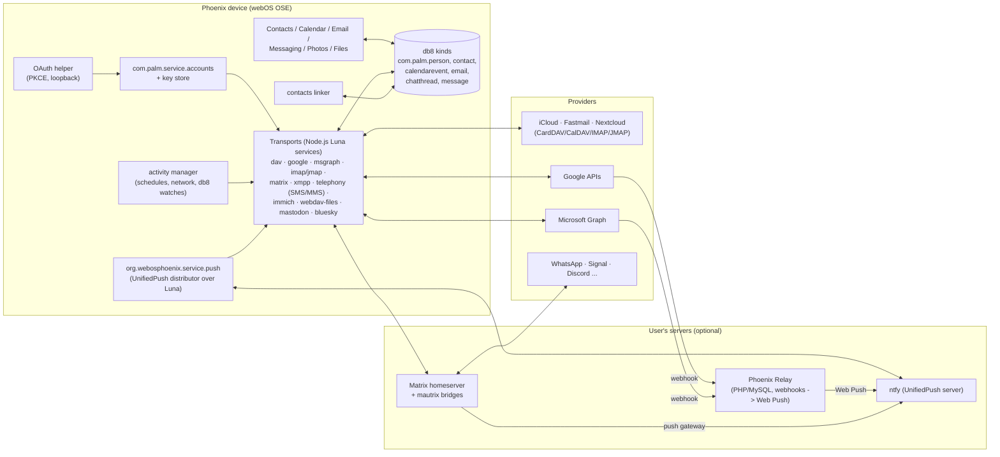

# Modern Synergy

[SYNERGY.md](SYNERGY.md) explains how webOS Synergy worked, plans one
transport per protocol (section 2), and documents the CardDAV and CalDAV
account that is built (section 3). This page takes the plan further:

1. [Where each provider stands today](#1-account-types-today), checked
   against the providers' own documentation in September 2026.
2. [Messaging Synergy](#2-messaging-synergy): one conversation per person
   across SMS, Matrix, XMPP and the closed networks, and the architecture we
   recommend for it.
3. [Social, photos and files](#3-social-photos-and-files), the account
   types webOS had beyond contacts, calendars and mail.
4. [Architecture on Phoenix](#4-architecture-on-phoenix): templates and
   capabilities, a shared sync layer, linking, OAuth, secrets, power, push,
   and the one optional server component.
5. [Roadmap](#5-roadmap) with effort, dependencies and risks,
   [legal and terms-of-service notes](#6-legal-and-terms-of-service), and
   [open questions](#7-open-questions) that need a decision.

It does not repeat SYNERGY.md: the account contract (templates, callbacks,
db8 kinds, sync state), the DAV engine, the OAuth helper's design (2.3), the
Google and Graph sync calls (2.4, 2.5), XOAUTH2 in mojomail (2.6), JMAP
(2.7) and the key store (2.9) are described there and referred to by section
number.

Sources are listed at the end as [S1], [M1], ... with the date each page
states or, where it states none, the date we read it (2026-09-28). Anything
marked *(unverified)* comes from third-party write-ups or our own reading and
should be checked before code depends on it.

## Summary

- **Standards first, on the device.** CardDAV, CalDAV, IMAP/SMTP, JMAP,
  Matrix and XMPP are spoken directly from the phone. They need no
  registration with anyone and no Phoenix server. This is also where
  iCloud, Fastmail, Nextcloud and every self-hosted server live.
- **Google and Microsoft through their REST APIs with OAuth**, as
  SYNERGY.md 2.4 and 2.5 plan. Both need a client registration in the
  project's name; Google's contacts and calendar scopes also need its app
  verification (free, but slow), and Gmail's scope needs a paid yearly
  security assessment. Until the project decides to pay for that, Gmail is
  IMAP with an app password.
- **Messaging: native where the network allows it, Matrix bridges where it
  does not.** SMS/MMS, Matrix and XMPP are Phoenix transports. WhatsApp,
  Signal, Discord and the rest reach Messaging as Matrix rooms, bridged by
  the user's own homeserver or a hosted service such as Beeper. Phoenix
  documents bridges but neither runs nor bundles them. Telegram is the one
  closed network that allows third-party clients, so it can later get a
  native TDLib transport.
- **One conversation per person** is already in the data model the apps
  use (`com.palm.chatthread:1` has `personId`, messages carry
  `serviceName`); the work is in linking bridged identities to people and in
  the reply-transport picker.
- **Push through one socket.** A Phoenix push service keeps a single
  connection to a UnifiedPush server (ntfy, self-hosted or public) and wakes
  the right transport. Providers that can only call an HTTPS webhook
  (Microsoft Graph, Google Calendar, Gmail) need a small relay: an
  optional, self-hostable PHP/MySQL app that turns their webhooks into Web
  Push messages and stores no mail, no tokens and no message content.
  Everything works without it, by polling.



## 1. Account types today

### 1.1 At a glance

| Account | Contacts | Calendar | Mail | Sign-in | Registration and cost | Verdict |
| --- | --- | --- | --- | --- | --- | --- |
| **iCloud** | CardDAV | CalDAV | IMAP/SMTP | App-specific password (needs two-factor on the Apple Account) [A1] | None | Ready: DAV engine plus a provider template with both hosts (SYNERGY.md 2.2). No photos, notes or reminders-beyond-VTODO API for third parties *(unverified for Reminders)* |
| **Fastmail** | CardDAV or JMAP Contacts (RFC 9610 [J1]) | CalDAV | JMAP or IMAP | App password or API token | None | Ready: DAV today, JMAP mail next (SYNERGY.md 2.7). JMAP Calendars is still an Internet-Draft in September 2026 [J2] |
| **Nextcloud / ownCloud / Radicale / Baikal / SOGo / Stalwart** | CardDAV | CalDAV | IMAP (or JMAP on Stalwart) | App password; Nextcloud Login Flow v2 creates one per device from a browser login [N1] | None | Ready. Add Login Flow v2 so users never type a password. Nextcloud also gives files (WebDAV), photos, notes, and CalDAV push (1.8) |
| **Google (personal and Workspace)** | People API | Calendar API | Gmail over IMAP/SMTP or Gmail API | OAuth 2.0 (loopback + PKCE [S7]); passwords refused since 14 March 2025 except app passwords [S1] | Google Cloud project, consent screen, verification for contacts and calendar (sensitive scopes, free); Gmail scope is restricted: yearly paid security assessment [S2][S3] | Contacts and calendar: yes, after verification. Gmail over OAuth: a funding decision (1.2). Gmail over IMAP with an app password: yes, now |
| **Microsoft 365 / Outlook.com** | Graph | Graph | Graph, or IMAP/SMTP with XOAUTH2 | OAuth 2.0 public client, `http://localhost` redirect [M7]; basic auth off for Outlook.com since 16 September 2024 [M3] | Entra app registration (free); work tenants may need admin consent | Yes (SYNERGY.md 2.5). EWS is being switched off (1.3); EAS is not an option (1.4) |
| **Yahoo / AOL** | CardDAV *(unverified)* | CalDAV *(unverified)* | IMAP/SMTP | OAuth for mail needs an application approved by Yahoo [Y1]; app passwords for IMAP | Application and policy review | IMAP with an app password now; apply for OAuth access only if users ask |
| **Generic IMAP/SMTP** | – | – | IMAP/SMTP, password or XOAUTH2 | Password, app password, or OAuth where the host supports it | None | mojomail or a Node IMAP transport (SYNERGY.md 2.6) |
| **Exchange on-premises** | EAS or EWS | EAS or EWS | EAS, EWS, IMAP | Password, NTLM, OAuth (hybrid) | EAS needs Microsoft's licence (1.4) | Out of scope except IMAP; revisit only on demand |

### 1.2 Google

- **Passwords are gone.** Since 14 March 2025 Google refuses "less secure
  apps", meaning basic authentication with the account password, for
  CalDAV, CardDAV, IMAP, SMTP and POP; app passwords are the stated
  exception [S1]. App passwords need 2-Step Verification and can be
  disabled by Workspace administrators *(unverified for the admin control)*.
  Whether Google's CalDAV and CardDAV endpoints accept an app password is
  *unverified*; IMAP does.
- **Installed-app OAuth.** Google supports only the loopback redirect
  (`http://127.0.0.1:<port>`) for desktop-class clients; custom URI
  schemes and the copy-paste "out of band" flow are no longer supported
  [S7]. That matches the helper in SYNERGY.md 2.3. Google issues a "client
  secret" to desktop clients that is not treated as secret; the helper
  sends it and relies on PKCE.
- **The device flow is useless here.** Google's device authorization flow
  allows only `openid`, `email`, `profile`, two Drive scopes (`drive.file`,
  `drive.appdata`) and YouTube [S6]. Calendar, Contacts and Gmail are all
  excluded, so on Phoenix sign-in always goes through the browser card.
- **Verification.** An app asking for sensitive scopes (Calendar, Contacts)
  without verification is capped at 100 new users over the project's whole
  lifetime [S5]. An app left in "Testing" can have 100 listed test users and
  its refresh tokens expire after 7 days [S5]. Verification needs a
  homepage, privacy policy, scope justifications and a demo video, and is
  free.
- **Gmail is restricted.** `https://mail.google.com/` (needed for IMAP
  XOAUTH2) and the Gmail API's read scopes are *restricted*: an app that can
  reach the data "from or through a third-party server" needs a CASA
  security assessment by an approved lab, repeated every 12 months [S2][S3].
  Third-party write-ups put the cost at roughly US$500 to US$4,500 a year
  depending on the assurance level *(unverified; lab price lists, not
  Google)* [S4]. Google's own wording ties the assessment to server access;
  whether an app that talks to Gmail only from the device is exempt is
  *unverified* and worth asking Google before paying.
- **Personal-use exemption.** Verification is not required when "you are
  the only user of your app" or its users are known personally to you [S2].
  So a user can create their own Google Cloud project, put their own client
  ID into Phoenix ("bring your own client ID"), and use Gmail over OAuth
  legally without any assessment. It is fiddly (about 15 minutes in the
  Cloud console), but it is the honest answer for power users until the
  project funds CASA.
- **Push** needs a server: Calendar `watch` channels deliver only to an
  HTTPS address on a domain verified in the same Cloud project, and expire
  (at most about a month) [S10]; Gmail push goes through Cloud Pub/Sub and
  the `watch` must be renewed at least every 7 days [S11]. See 4.8.
- **Photos**: see 3.2. **Drive**: see 3.3.

### 1.3 Microsoft 365, Outlook.com and the end of EWS

- **Graph is the only API.** Microsoft starts disabling Exchange Web
  Services in Exchange Online in October 2026 and shuts it off completely in
  April 2027; EWS in on-premises Exchange Server is not affected [M1].
- **IMAP/SMTP need OAuth.** Outlook.com refused basic authentication from
  16 September 2024 [M3]. For Exchange Online, SMTP AUTH with basic
  authentication stays as it is through December 2026, is disabled by
  default for existing tenants at the end of December 2026 (administrators
  can turn it back on), and a final removal date will be announced in the
  second half of 2027 [M2]. XOAUTH2 in mojomail (SYNERGY.md 2.6) therefore
  covers Outlook mail; Graph mail is the longer-term route.
- **Registration.** One multi-tenant Entra app registration as a public
  client with an `http://localhost` redirect [M7]. Work tenants may block
  user consent to third-party apps; then an administrator has to approve
  Phoenix once per tenant. Microsoft's "publisher verification" (a
  Microsoft Partner Network ID) removes the "unverified" label on the
  consent page *(unverified whether it is now required for multi-tenant
  apps)*.
- **Device code flow** is supported by the Microsoft identity platform and
  is a usable fallback for Graph (SYNERGY.md 2.3).
- **Push** is Graph change notifications to a public HTTPS endpoint, which
  Graph validates with a token echo, and subscriptions to Outlook resources
  live about 7 days before they must be renewed [M6] *(the exact maximum
  should be checked in the subscription resource docs)*. See 4.8.

### 1.4 Exchange ActiveSync: what is left

EAS still works against Exchange Online and on-premises Exchange. Exchange
Online refuses clients older than protocol 16.1 from 1 March 2026 [M4], and
it needs OAuth there (basic auth for EAS ended in 2022). Microsoft still
sells an EAS protocol licence to device makers [M5]. For Phoenix EAS brings
nothing Graph (for Microsoft 365) and IMAP/DAV (for everything else) do not,
costs a licence, and would be a large new protocol implementation; the
legacy `com.palm.eas` transport was never released. **Out of scope**, as
SYNERGY.md 2.12 says. The one real gap is on-premises Exchange servers
without IMAP enabled; that is a niche we accept.

### 1.5 Apple iCloud

CardDAV (`contacts.icloud.com`), CalDAV (`caldav.icloud.com`) and IMAP
(`imap.mail.me.com`) with an app-specific password, which requires two-factor
authentication on the Apple Account [A1]. Apple also lists "supported
third-party apps" that can sign in with the Apple Account instead of an app
password [A1]; that program is not open to arbitrary clients *(unverified:
Apple publishes no API or application process for it that we found)*. There
is no third-party API for iCloud Photos, iCloud Drive, Notes or iMessage.

### 1.6 Fastmail, Nextcloud and JMAP servers

Nothing to wait for. Worth adding:

- **Nextcloud Login Flow v2** [N1]: the account page opens the server's
  login page in the browser card, the user signs in (with their second
  factor), and the server hands back an app password for this device. No
  password typing, and the user can revoke the device in Nextcloud.
- **JMAP**: RFC 8620/8621 for mail, RFC 9610 for contacts [J1]. JMAP for
  Calendars is still a draft [J2], so calendars stay on CalDAV. JMAP's own
  push (EventSource, or Web Push via `PushSubscription` in RFC 8620 section
  7.2) fits the push design in 4.8 directly.
- **CalDAV/CardDAV push**: see 4.8 (WebDAV-Push).

### 1.7 Generic IMAP and SMTP

Covered by SYNERGY.md 2.6. Additions: autoconfiguration (Thunderbird's
autoconfig database and the provider's `/.well-known/autoconfig`, then
guessing `imap.<domain>`), XOAUTH2 or `OAUTHBEARER` (RFC 7628) where the
server advertises them, and the push notes in 4.8 (IDLE, NOTIFY, and the
IMAP WEBPUSH draft).

### 1.8 Yahoo and AOL

Yahoo's OAuth mail scopes are not self-service: a developer has to apply and
show compliance with Yahoo's policies [Y1]. IMAP with an app password works
without that. Yahoo's CardDAV and CalDAV endpoints exist *(unverified whether
they still accept app passwords)*. Plan: provider templates with IMAP + app
password (and DAV if it works), no OAuth application unless users ask.

## 2. Messaging Synergy

### 2.1 What webOS did, and what Phoenix already has

webOS Messaging showed one conversation per person, not per network: an SMS
from Anna's phone, a Google Talk message from her Gmail address and an AIM
message all landed in the same thread, and a picker at the bottom chose which
transport the reply went out on. The data model is already in Phoenix:

- `com.palm.chatthread:1` has `personId`, `normalizedAddress`,
  `replyAddress` and `replyService` (`apps/messaging/public/configuration/db/kinds/com.palm.chatthread`,
  `apps/shared/luna/src/messaging.ts`).
- Every `com.palm.message:1` carries `serviceName` (`"sms"`, or an IM
  transport) and `conversations[]`, the threads it belongs to.
- The legacy IM transports wrote their own sub-kinds, e.g.
  `com.palm.immessage.libpurple:1` and `com.palm.imcommand.libpurple:1`
  (the Google and AOL templates in the mock file SYNERGY.md section 1 cites),
  and declared `capabilitySubtype: "IM"` with a `serviceName` (`type_aim`,
  `type_gtalk`, `type_yahoo`, `type_skype`).

What is missing is transports, and the rules that put a Matrix or bridged
WhatsApp message into the right person's thread (2.5).

### 2.2 Transports

| Transport | How Phoenix would speak it | Runs where | End-to-end encryption | Terms and legality | Verdict |
| --- | --- | --- | --- | --- | --- |
| **SMS / MMS** | oFono or ModemManager, `mmsd-tng` for MMS (HARDWARE.md, APP-RUNTIME.md) | Device | No | The SIM is the account | Core. Arrives with M3 hardware |
| **RCS** | No open client exists. Carrier RCS needs GSMA accreditation per operator, and on most networks RCS is hosted by Google's Jibe, which offers no third-party client API [R1] | – | (Jibe: yes, to Google's clients) | Not available to us | No. Revisit only if an open RCS client or a Jibe API appears |
| **Matrix** | Client-server API, sliding sync where the server has it (native in Synapse since 1.114) [X1]; E2EE with the Rust crypto library through its Node or Wasm bindings [X2] | Device (homeserver is the user's) | Yes (Olm/Megolm) | Open standard | **Core**, and the bridge point for closed networks (2.3) |
| **XMPP** | Client protocol with stream management (XEP-0198), push (XEP-0357), OMEMO (XEP-0384); servers such as Prosody support all three [XM1] | Device | Yes (OMEMO) | Open standard | Yes, after Matrix. Smaller user base, but open and light on battery |
| **Telegram** | TDLib, Telegram's own client library [T2], with a Phoenix `api_id` | Device | Only in secret chats | Third-party clients are allowed: own `api_id`, no "Telegram" in the name unless "Unofficial ...", no official logo, must support sponsored messages in channels, no use of data for AI training [T1] | Optional native transport (TDLib is a large C++ build), or through a Matrix bridge |
| **Signal** | No third-party client API. `signal-cli` (GPL-3.0; a linked device, JSON-RPC and D-Bus interfaces [SG2]) or `mautrix-signal` on the server, both built on Signal's AGPL libraries | Server (bridge) or device (signal-cli, a JVM) | Yes to the bridge; the bridge decrypts | Signal's terms forbid "unauthorized" access and automated account creation [SG1]; they do not name third-party clients, and Signal has said forks should not use its servers *(reported, unverified)* | Only as a Matrix room, bridged by the user. Phoenix does not ship a Signal client |
| **WhatsApp** | (a) `mautrix-whatsapp`, a linked device on the reverse-engineered multi-device protocol; (b) the EU DMA interoperability route: a messaging *provider* signs Meta's reference offer, must match WhatsApp's E2EE, and interoperates with EU-registered users who opt in [W1][W2][W3] | Server | (a) re-encrypted at the bridge; (b) E2EE to the provider's clients | (a) against WhatsApp's terms, accounts can be banned; (b) legal, but per provider, EEA users only, no server-side buffering, client IPs shared with Meta [X5]. First partners live since November 2025 (BirdyChat, Haiket) [W1] | Only as a Matrix room. Route (b) becomes available to Phoenix users if their Matrix provider (e.g. Element) interconnects; Phoenix itself cannot sign up as a client |
| **Discord** | No client API; the bot API is for bots. User-account automation ("self-bots") is against Discord's terms and is banned [DC1]. `mautrix-discord` logs in as the user | Server | No | Against terms for user accounts | Only as a Matrix room, at the user's risk |
| **Email as a message** | Mail transports (IMAP/JMAP) | Device | – | – | Not merged into Messaging by default (2.6) |
| **Google Messages, iMessage, Instagram, Facebook Messenger, LinkedIn, X** | Only reverse-engineered bridges (mautrix-gmessages, -meta, -twitter, -linkedin) or none (iMessage, SYNERGY.md 2.12) | Server | Varies | Against the networks' terms | Only as Matrix rooms, at the user's risk |

### 2.3 Architecture options

**A. A native transport per network on the device.** What webOS did with
libpurple. Today it means shipping reverse-engineered clients for WhatsApp,
Signal and Discord inside Phoenix, keeping each alive through protocol
changes, and putting the project's name on each terms-of-service breach. Every
network also needs its own long-lived connection, which the battery cannot
afford (4.7). Rejected.

**B. Matrix as the only transport, with bridges for everything (the Beeper
model).** Phoenix speaks Matrix and nothing else; SMS goes through a bridge
too. One connection, one push path, one E2EE implementation, and Matrix
rooms already carry which network they bridge (`m.bridge` state events).
But SMS and MMS must never depend on a server, and a user without a
homeserver would get no messaging at all. Rejected as the only path.

**C. Hybrid (recommended).** Native on the device for what is open or
local: **SMS/MMS, Matrix, XMPP**, later **Telegram** through TDLib. Every
closed network through **Matrix bridges run by the user or their provider**:

```
                 +--------------------------- device ---------------------------+
 SIM  <-- oFono/MM --> telephony (SMS/MMS) --+                                  |
                                             |                                  |
 Matrix homeserver <-- sliding sync -------> matrix transport --+--> db8: com.palm.message:1
   |   (user's own, Element, Beeper, ...)    |                  |        com.palm.chatthread:1
   +-- mautrix-whatsapp / -signal / ...      |                  |              |
                                             |                  |      contacts linker (2.5)
 XMPP server <-- XEP-0198/0357 -----------> xmpp transport -----+              |
                                             |                          Messaging app:
 Telegram DCs <-- TDLib (optional) --------> telegram transport -+      one thread per person,
                                                                        reply picker
                 +--------------------------------------------------------------+
```

Trade-offs of C:

| For | Against |
| --- | --- |
| SMS works with no server at all | Bridged networks need a homeserver with bridges: self-hosting (Docker; not a LAMP job) or a paid service |
| The project never distributes reverse-engineered clients; bridging is the user's choice on the user's server | Bridges decrypt and re-encrypt: the homeserver operator can read bridged messages. With Beeper's cloud that is Beeper; Beeper also offers bridges on the user's own machine [X4] |
| One push path for all bridged networks (Matrix push) | Beeper's hosted bridges are tied to Beeper's homeserver: its bridge-manager cannot be used with other homeservers [X4]; whether Beeper's server accepts third-party Matrix clients such as Phoenix's is *unverified* |
| Bridges are maintained by an active project (mautrix, bridgev2 architecture; new releases in September 2026 [X3]) | A bridge can break when the network changes its protocol, and accounts can be banned. Phoenix can only show the error |
| The WhatsApp DMA route arrives for free if the user's Matrix provider interconnects | That route is EEA-only and per provider |

### 2.4 The Matrix transport in more detail

SYNERGY.md 2.8 sketches it. Additions:

- **Sync**: use simplified sliding sync (MSC4186), native in Synapse since
  1.114 [X1], to fetch only the visible room list and the top of each room.
  Fall back to `/sync` with a filter on servers without it.
- **Crypto**: `matrix-sdk-crypto` through `@matrix-org/matrix-sdk-crypto-nodejs`
  on the device or the Wasm build in the simulator [X2]; the legacy
  JavaScript Olm stack is no longer supported by matrix-js-sdk [X2]. Key
  backup and cross-signing need a "verify this device" screen in
  Messaging.
- **Bridges**: read `m.bridge` / `uk.half-shot.bridge` state to label a
  room with the network and pick the icon; show the bridge bot's messages
  (login QR codes, errors) as system messages; never automate bridge login.
- **Push**: register a pusher with the homeserver pointing at a push
  gateway. ntfy implements the Matrix push gateway endpoint, so the same
  ntfy server that serves UnifiedPush (4.8) serves Matrix *(check the ntfy
  version on the chosen server)*.

### 2.5 Merging: one thread per person

The linker already merges contacts by phone number, email and IM address
(SYNERGY.md 1.5). Messaging needs the same for the people it meets on the
wire:

1. **Address normalization.** Phone numbers to E.164 with the device's
   country (libphonenumber rules; the legacy `normalizedValue`), Matrix IDs
   lowercased, XMPP JIDs without resource, Telegram by user ID and phone
   number when shared.
2. **Bridged identities.** A bridged WhatsApp or Signal user appears as a
   Matrix "ghost" (`@whatsapp_<number>:server`, `@signal_<uuid>:server`) with
   a display name. The WhatsApp ghost carries the phone number in its ID;
   Signal's does not, but the bridge's room topic or profile often does
   *(varies by bridge version)*. The transport extracts what it can and
   stores it on the thread as `ims[]`/`phoneNumbers[]` candidates.
3. **Link only on strong evidence.** Same normalized phone number, same
   email, or same IM address links a thread to a person. **Never link on
   display name alone** for messaging (the contacts linker's "same name =
   100" rule is safe inside an address book, not across the internet, where
   anyone can call themselves "Mom").
4. **Manual link and unlink** from the thread's menu go through the
   linker's `manuallyLink` / `manuallyUnlink`, which are backed up
   (SYNERGY.md 1.5) and survive a re-sync.
5. **Unknown senders** get a thread without a person, as SMS from unknown
   numbers does today; "Add to contacts" writes the address into a contact
   and the linker does the rest.
6. **Reply transport**: `replyService` is the transport of the last
   message received, unless the user picked one; the picker lists every
   transport the person has an address on, as webOS did. Group chats are
   never merged across networks.

### 2.6 Email in Messaging

webOS did not put email into Messaging and neither should Phoenix by
default: mail threads are long, quoted and HTML, and a person's mailing-list
traffic would drown their texts. Instead the person's card in Contacts gets
"Recent email" from `com.palm.email:1` by address (a query, not a merge). A
chat-over-email transport in the style of Delta Chat (plain short messages
with Autocrypt) is possible later as its own `serviceName`, only for
messages marked as chat.

## 3. Social, photos and files

webOS had account types beyond PIM: Facebook, LinkedIn (contacts and status),
Photobucket, Snapfish and Facebook (PHOTO), YouTube (VIDEO.UPLOAD), Box,
Dropbox and Google Docs (DOCUMENTS), EAS global address lookup
(REMOTECONTACTS) (capabilities in the mock templates file).

### 3.1 Social: Mastodon and Bluesky

The 2011 Facebook contact sync is not coming back from anyone. What still
fits Synergy is **enrichment and notifications**, not a full social client:

| | Mastodon / ActivityPub | Bluesky / AT Protocol |
| --- | --- | --- |
| Sign-in | OAuth per instance: the app registers itself with each instance (`POST /api/v1/apps`, always a confidential client with its own secret [MA1]), then authorization code | OAuth for AT Protocol (since September 2024; public clients supported; granular scopes since June 2025) [B1]; the client ID is the URL of a client metadata JSON document the project must host. App passwords still work but are legacy [B1] |
| Contacts enrichment | Accounts the user follows, matched to persons by profile links and verified `rel=me` fields | Follows, matched by handle (which is often a domain) |
| Notifications | Web Push subscription per token (`/api/v1/push/subscription`) [MA1], which can point straight at a UnifiedPush endpoint | App-level polling of `listNotifications`; no third-party push *(unverified)* |
| Messages | Mentions with `direct` visibility (not private in a strict sense) | `chat.bsky.*` DMs through the user's PDS proxy *(unverified API details)* |
| Proposal | A `SOCIAL` capability: avatar and profile link on the person, notifications on the dashboard | Same; DMs as an IM transport later |

### 3.2 Photos

| Source | API | Verdict |
| --- | --- | --- |
| **Immich** (self-hosted) | REST with API keys, fine-grained key permissions since v1.135 (June 2025), first stable release v2.0.0 on 1 October 2025 [IM1] | **Yes**, first: albums into Photos, upload from Camera |
| **Nextcloud Photos / any WebDAV** | WebDAV folders (plus Nextcloud's photo endpoints) | Yes, with the files capability (3.3) |
| **Google Photos** | Since 31 March 2025 the Library API can only manage items the app itself uploaded; reading the user's library needs the Picker API, where the user picks items each time in Google's UI [S8] | Upload-only album and "pick photos" only. No library sync, for anyone |
| **OneDrive (camera roll)** | Graph Files | Yes, via the Microsoft account's FILES capability |
| **iCloud Photos** | None | No |

The legacy capability name is `PHOTO` (Facebook, Photobucket and Snapfish
templates); Phoenix's Photos app would list albums from every account with a
`PHOTO` provider, as it lists local albums today.

### 3.3 Files

| Service | API and sign-in | Notes |
| --- | --- | --- |
| **WebDAV / Nextcloud / ownCloud** | WebDAV, app password or Login Flow v2 [N1] | No registration. First target |
| **Dropbox** | HTTP API, OAuth with PKCE as a public client and offline refresh tokens *(not rechecked for this page)* | App registration in the Dropbox console; production approval above 50 users *(unverified)* |
| **OneDrive** | Microsoft Graph Files, same Entra registration as 1.3 | Free |
| **Google Drive** | `drive.file` is non-sensitive and needs no verification, but only sees files the user opened or created with the app; full `drive` access is restricted, with the same yearly assessment as Gmail [S9][S2] | `drive.file` with Google's picker only |

The legacy capability name is `DOCUMENTS`. The Files app would show each
enabled account as a root next to `/media/internal`, backed by the Files
service (`org.webosphoenix.filemanager`). A pragmatic backend for all of
these is **rclone** (MIT, one Go binary with a remote-control API), which
already speaks WebDAV, Dropbox, OneDrive and Drive; the cost is a ~50 MB
binary and the need to supply Phoenix's own client IDs rather than rclone's
shared ones *(size unverified for ARM builds)*. Files stay on demand (no full
sync) to spare storage and battery.

## 4. Architecture on Phoenix

### 4.1 Templates and capabilities

Keep the legacy capability names where one exists, so the original apps
work unchanged, and add only what is new:

| Capability | Legacy? | Providers |
| --- | --- | --- |
| `CONTACTS`, `CALENDAR`, `TASKS`, `MAIL`, `MEMOS` | yes | dav, google, msgraph, jmap, imap |
| `MESSAGING` + `capabilitySubtype: "SMS"` | yes | profile (telephony) |
| `MESSAGING` + `capabilitySubtype: "IM"`, `serviceName` | yes | matrix (`type_matrix`), xmpp (`type_jabber`, as the contacts framework already names it), telegram (`type_telegram`) |
| `PHOTO` | yes | immich, nextcloud, google (picker), msgraph |
| `DOCUMENTS` | yes | webdav, dropbox, msgraph (OneDrive), google (`drive.file`) |
| `REMOTECONTACTS` (directory lookup, `query` method) | yes | msgraph (`/users` in the tenant), LDAP/CardDAV directory later; feeds Just Type's remote contacts (ROADMAP M2) |
| `SOCIAL` | **new** | mastodon, bluesky |

Templates planned, all under `/usr/palm/public/accounts`:
`com.webosphoenix.dav` (built), provider presets `com.webosphoenix.icloud`,
`.fastmail`, `.nextcloud`, `.yahoo` (the same transports with fixed hosts and
help text), `com.webosphoenix.google`, `com.webosphoenix.microsoft`,
`com.webosphoenix.jmap`, `com.webosphoenix.matrix`, `com.webosphoenix.xmpp`,
`com.webosphoenix.telegram`, `com.webosphoenix.immich`,
`com.webosphoenix.dropbox`, `com.webosphoenix.mastodon`,
`com.webosphoenix.bluesky`. Provider presets make "Add account > iCloud" one
screen, as webOS had it.

### 4.2 A shared sync layer

The DAV engine (`apps/dav/service/lib/sync.js`) already has the parts every
transport needs. Extract them into a shared CommonJS package
(`apps/shared/synckit`, no dependencies, runs in Node and the simulator)
before the second transport is written:

| Piece | From | Used by |
| --- | --- | --- |
| Item records: remote ID, etag / change key, base copy, db8 `_rev` at last sync | `org.webosphoenix.dav.item:1` | every two-way transport |
| Pull, push, pull loop with sync tokens (`sync-token`, People `syncToken`, Graph `deltaLink`, JMAP `state`) | `sync.js` | dav, google, msgraph, jmap |
| Sync state records (`com.palm.account.syncstate:1`) and error codes | `davservice.js` | all |
| Backoff: per account, exponential, honouring `Retry-After` on 429/503 | new | all HTTP transports |
| Scheduler glue: one periodic activity per account, network requirement, "sync now" | `davservice.js` | all |
| Photo cache | DAV contact photos | contacts, photos, social avatars |

**Conflicts.** Keep "server wins" (SYNERGY.md 3.3) for contacts and
calendars, and add the improvement it suggests: the base copy in the item
record allows a three-way merge per field, so a device edit to a phone
number and a server edit to the address both survive; only a field changed
on both sides loses the device's value, which is then kept in the contact's
note or an event's description marker *(design choice; open question 7)*.
Messages are append-only, so they have no conflicts; read state and
deletions go "last writer wins" per message.

### 4.3 Linking across all account types

Section 2.5 for messaging. For contacts from Google, Graph and social
accounts, the existing linker rules apply unchanged; additions are the new
IM types (`type_matrix`, `type_telegram`, `type_signal` for display) and
profile URLs as a medium-weight rule (55, like "other phone numbers") so a
Mastodon profile link alone never merges two people.

### 4.4 OAuth on the device

The helper in SYNERGY.md 2.3 (PKCE, loopback listener, browser card) covers
Google and Microsoft. The rest of the list:

| Provider | Flow on Phoenix | Client registration | Server needed? |
| --- | --- | --- | --- |
| Google | Loopback + PKCE [S7]; no device flow for these scopes [S6] | Project's Cloud project, or the user's own (1.2) | No (yes for push) |
| Microsoft | Loopback + PKCE [M7]; device code as fallback | Project's Entra app | No (yes for push) |
| Nextcloud | Login Flow v2: poll endpoint, browser login, app password returned [N1] | None | No |
| Mastodon | Register an app on the instance from the device, then code flow with loopback; the per-device client secret goes into the key store [MA1] | None (per instance, per device) | No |
| Bluesky | atproto OAuth public client with PKCE and DPoP; the client ID is a metadata document at an HTTPS URL [B1] | A static JSON file on the project's website | A static file only |
| Dropbox | PKCE public client *(not rechecked)* | Project's Dropbox app | No |
| Yahoo mail | Only after Yahoo approves the project [Y1] | Application | Probably a confidential client *(unverified)* |
| Matrix | Password or SSO in the browser card; MSC3861 (OAuth 2.0 via Matrix Authentication Service) where the homeserver uses it | None | No |

Rules: the browser card is the only place a password is typed for OAuth
providers (never an embedded web view that the app could read); the redirect
listener binds to 127.0.0.1 only, accepts one request and closes; `state`
and PKCE verifier are checked; tokens go straight to the key store.
Confidential client secrets are never shipped in Phoenix images; a provider
that insists on one (Yahoo, possibly) goes through the relay's token
endpoint (4.9) or is not supported.

### 4.5 Secrets

SYNERGY.md 2.9 chooses the key store. Additional needs from this page:

- **Encrypted local state**, not just credentials: the Matrix crypto store
  (Olm/Megolm keys), TDLib's database, and later OMEMO keys. Each is
  encrypted with a per-account key held in the key store, and deleted with
  the account.
- **Backup**: credentials and E2EE stores are excluded from any Phoenix
  backup unless the backup itself is encrypted with a user secret; Matrix
  keys are recoverable through server-side key backup instead.
- **Per-account isolation**: transports read only their own accounts'
  credentials (`readCredentials` checks the caller against the template's
  `implementation`), as the legacy service did through `services.json`.

### 4.6 Privacy

- No Phoenix server sees content. The relay (4.9) sees only opaque channel
  IDs and "something changed" pings.
- No analytics in transports. Logs never contain tokens, message text or
  addresses (hash them for debugging).
- Every account shows what it syncs and where the data goes (the provider,
  and for bridged rooms the homeserver that decrypts them).
- Google's and Microsoft's API user-data policies (limited use, deletion on
  account removal) are met by design because data stays on the device;
  the privacy policy says so.

### 4.7 Background sync and the power budget

A phone that keeps five TCP connections open and wakes every few minutes for
each account has a bad battery life. Budget (targets, to be measured on M3
hardware):

| Mode | What runs | Wakes per hour (target) |
| --- | --- | --- |
| Screen off, on battery | One persistent connection: the push service's WebSocket to ntfy (or, without a push server, nothing). Periodic sync of contacts and calendars every 60 min, mail every 15-30 min, all batched into one wake by the activity manager | 4-6 |
| Screen off, charging or on Wi-Fi with >50% battery | Also IMAP IDLE for up to two accounts, Matrix and XMPP connections held open | as needed |
| An app card open | That app's transports sync live (Matrix sliding sync, IMAP IDLE on the open folder, JMAP EventSource) | as needed |
| Battery saver | Push only; periodic sync off; "sync now" still works | 1-2 |

Mechanisms: activity manager requirements (`internet`, battery level,
charging) on each periodic activity [O1]; a shared "sync window" so all
transports run in the same wake; exponential backoff on errors; no retry
loops while offline. XMPP with XEP-0198 and push (XEP-0357) can drop its
connection in the background and be woken by push, which is why it is a good
fit.

### 4.8 Push

| Source | Mechanism | Device-only? | Path on Phoenix |
| --- | --- | --- | --- |
| IMAP | IDLE (one folder per connection), NOTIFY (RFC 5465, many folders); the IMAP WEBPUSH extension is an individual draft (August 2025) [I1] | Yes | IDLE only in the "charging / Wi-Fi" mode; WEBPUSH when servers ship it |
| JMAP | EventSource, or Web Push `PushSubscription` (RFC 8620) | Yes, Web Push to UnifiedPush | Web Push to the device's ntfy endpoint |
| CalDAV / CardDAV | WebDAV-Push draft, Web Push based; server side only as a Nextcloud extension (`nc_ext_dav_push`), client side DAVx⁵ [D1] | Yes, Web Push to UnifiedPush | Implement the client side in the DAV engine; polling everywhere else |
| Matrix | Homeserver pusher to a push gateway (Sygnal, or ntfy's gateway) | Needs a gateway; ntfy doubles as one | Pusher at the user's ntfy |
| XMPP | XEP-0357 to an app server | Needs a push app server | Later; polling reconnect meanwhile |
| Mastodon | Web Push subscription [MA1] | Yes, Web Push to UnifiedPush | Direct |
| Microsoft Graph | Webhooks to a public HTTPS URL, validated by echo, renewed about weekly [M6] | **No** | Relay (4.9) |
| Google Calendar | `watch` channels to an HTTPS URL on a domain verified in the same Cloud project [S10] | **No** | Relay, on the domain of whoever owns the OAuth client |
| Gmail | Cloud Pub/Sub topic, `watch` renewed within 7 days [S11] | **No** | Relay subscribes to Pub/Sub push; or IMAP IDLE instead |

**UnifiedPush on Phoenix.** UnifiedPush is an open push protocol that is
now Web Push (RFC 8030/8291/8292) end to end, with a D-Bus interface on
Linux [U1]. OSE apps talk over Luna, not D-Bus, so Phoenix implements a
**distributor as a Luna service** (`org.webosphoenix.service.push`): it
holds one WebSocket to an ntfy server, gives each transport an endpoint URL
and Web Push keys, decrypts incoming messages (RFC 8291) and calls the
transport. The ntfy server is the user's choice: self-hosted, or a public
one (ntfy.sh) since the payloads are encrypted and contain only "sync
now" hints.

```
provider --(Web Push / webhook)--> [relay] --> ntfy --(1 WebSocket)--> push service --> transport.sync()
```

### 4.9 Server components: what needs one and what does not

| Need | On device | Server | Why |
| --- | --- | --- | --- |
| DAV, IMAP, JMAP, Matrix client, XMPP client, SMS | yes | – | Standards; the device talks to the user's providers |
| OAuth for Google, Microsoft, Nextcloud, Mastodon, Dropbox | yes | – | Public clients with PKCE |
| Bluesky OAuth client metadata | – | static file | atproto needs an HTTPS client ID URL [B1]; any web host |
| Push for JMAP, DAV, Mastodon, Matrix | – | ntfy | One socket instead of many |
| Push for Graph, Google Calendar, Gmail | – | **relay** | Providers deliver only to public HTTPS webhooks |
| Confidential OAuth clients (Yahoo, if ever) | – | relay token endpoint | The secret cannot ship in images |
| Bridges to WhatsApp, Signal, Discord | – | the user's Matrix homeserver | Out of Phoenix; documented only |

**The Phoenix Relay** (`server/relay/`, PHP 8 and MySQL/MariaDB, runs on
ordinary shared hosting; optional; self-hostable):

- `POST /graph/{channel}`: answers Graph's validation echo, checks the
  `clientState` secret, and sends a Web Push "sync mailbox/calendar X" to
  the channel's UnifiedPush endpoint. The device creates the Graph
  subscription itself with its own token and the relay URL as
  `notificationUrl`, so the relay never holds Microsoft tokens.
- `POST /google/calendar/{channel}`: same for Calendar `watch` channels
  (the device calls `watch` with the relay URL; the relay's domain must be
  verified in the Cloud project that owns the client ID, so the relay is
  run by whoever owns that project).
- `POST /google/pubsub`: Pub/Sub push endpoint for Gmail; maps the
  mailbox's history notification to a channel.
- `POST /token/{provider}` (only if needed): exchanges an authorization
  code or refresh token using a confidential client secret held in the
  relay's configuration; stores nothing.
- Tables: `channels (id, provider, ua_endpoint, ua_p256dh, ua_auth,
  client_state_hash, expires_at, created_at)`; channels expire unless the
  device renews them. No user names, no tokens, no content.
- Web Push signing with VAPID via an MIT-licensed PHP library
  (`minishlink/web-push`).

PHP suits it because every endpoint is a short request and response; there
is no long-lived connection on the server side (those live in ntfy). A
Python (FastAPI) version would be equally small; the doc assumes PHP per the
project's preference.

## 5. Roadmap

Effort: **S** up to a week, **M** two to four weeks, **L** more than a
month, for one developer who knows the code. Phases 0 to 4 are SYNERGY.md's;
their scope here only adds to what is written there.

| Phase | Work | Effort | Depends on | Risks |
| --- | --- | --- | --- | --- |
| **0. Framework on the device** (SYNERGY.md 2.11 phase 0) | Accounts service and contacts linker on OSE, key store, activity manager check | L | M1 (OSE image runs) | `mojoservice` port larger than expected; OSE activity manager differences |
| **1b. Provider presets for DAV** | iCloud, Fastmail, Nextcloud (Login Flow v2), Yahoo templates with both hosts; autoconfig | S | phase 1 (done) | Yahoo DAV behaviour unknown |
| **1c. Shared sync layer** (4.2) | Extract `synckit` from `apps/dav`; three-way field merge | M | – | Regressions in DAV: keep its tests |
| **2a. OAuth helper + Microsoft** | Helper (loopback, PKCE, device code), Entra registration, Graph contacts, calendar, To Do; XOAUTH2 for Outlook mail | L | 1c, key store | Tenant admin consent; Graph throttling |
| **2b. Google contacts and calendar** | People + Calendar API, Cloud project, consent screen, verification | M (+ weeks of Google review) | 2a helper | Verification delays; 100-user cap until verified |
| **2c. Gmail** | IMAP + app password now (S); OAuth with bring-your-own client ID (S); project-wide OAuth only if CASA is funded (open question 2) | S / S / M + money | mail transport (3a) | Google may withdraw app passwords |
| **3a. Mail transport** | Decide mojomail on OSE vs a Node IMAP/SMTP transport; then JMAP | L | 0 | mojomail's MojoDB dependencies |
| **3b. SMS/MMS on real telephony** | `webos-telephonyd` on oFono / ModemManager, `mmsd-tng` | L | M3 hardware | Modem quirks per device |
| **4a. Messaging Synergy core** | Thread-per-person rules (2.5), transport picker, IM `serviceName`s, Buddies view | M | 0 | Linking mistakes are privacy bugs: conservative rules |
| **4b. Matrix transport** | Sliding sync, Rust crypto, device verification UI, bridge labels | L | 4a, key store | Crypto bindings on ARM OSE (Node native addon vs Wasm) |
| **5. Push and power** | Push service (UnifiedPush over Luna), ntfy, JMAP / Mastodon / Matrix push, WebDAV-Push client, power modes (4.7) | M | 4b for Matrix | Needs M3 hardware to measure |
| **5b. Phoenix Relay** | PHP/MySQL relay for Graph and Google webhooks; hosting decision | M | 5, 2a, 2b | Operating a public service |
| **6a. XMPP** | Client with XEP-0198, XEP-0357, OMEMO | M | 4a | OMEMO library choice (libsignal-based ones are GPL/AGPL) |
| **6b. Telegram (optional)** | TDLib build for OSE, transport, `api_id` | L | 4a | Large C++ build; Telegram's client terms [T1] |
| **7a. Photos** | `PHOTO` in Photos: Immich, Nextcloud/WebDAV, OneDrive; Google Photos picker | M | 0 | Storage and bandwidth on phones |
| **7b. Files** | `DOCUMENTS` roots in Files: WebDAV, Dropbox, OneDrive, Drive `drive.file` (rclone or native) | M | 0 | rclone size on the image |
| **7c. Social** | `SOCIAL`: Mastodon and Bluesky enrichment and notifications | M | 5 for push | Bluesky OAuth still evolving |
| **7d. Directory** | `REMOTECONTACTS` for Graph, Just Type remote contacts | S | 2a | – |

Suggested order after phase 0: 1b, 1c, 2a, 3a, 2b, 4a, 4b, 5, then the
rest by demand. Microsoft before Google because it needs no paid review for
mail and has the device code fallback.

## 6. Legal and terms of service

| Topic | Position |
| --- | --- |
| Google API user data policy, verification, CASA | Apply for verification of contacts and calendar scopes in the project's name; no restricted scopes without a funded, repeated assessment [S2][S3]; bring-your-own client ID documented for personal use |
| Microsoft | Entra registration; comply with Microsoft APIs terms of use *(read before registering)* |
| Yahoo | No OAuth without approval [Y1] |
| Telegram | Allowed with our own `api_id`; name "Unofficial" if Telegram appears in it; no AI training on data; sponsored messages in channels [T1] |
| WhatsApp, Signal, Discord, Meta, Google Messages | Phoenix neither ships nor operates bridges or clients for them; the docs explain that bridges break these networks' terms and can get accounts banned [SG1][DC1]; the EU DMA route is the only sanctioned path to WhatsApp and is open to providers, not to Phoenix [W1][X5] |
| iMessage | Never (SYNERGY.md 2.12) |
| RCS | No legal client path today [R1] |
| EAS | Out of scope (licence) [M5] |
| AGPL / GPL | signal-cli (GPL-3.0), libsignal (AGPL-3.0), mautrix bridges (AGPL-3.0 *(unverified per bridge)*) run as separate programs on the user's server, never linked into Phoenix (Apache-2.0), as LEGAL.md does with Radicale |
| Trademarks | Provider names and logos in account templates: use names descriptively; logos only where the provider's brand guidelines allow (Google and Microsoft sign-in buttons have rules) |
| Privacy law | Data stays on the device; the relay stores no personal data beyond push endpoints (still personal data under GDPR: document retention) |

## 7. Open questions

1. **OAuth registrations.** Will the project register a Google Cloud
   project and an Entra app in its own name (needs an owner, a domain, a
   homepage and a privacy policy), or ship only "bring your own client ID"
   at first?
2. **Gmail.** Pay for a yearly CASA assessment (third-party estimates
   US$500-4,500 a year), or stay with IMAP + app password and BYO client ID?
   Should we first ask Google whether device-only access needs CASA?
3. **Public infrastructure.** Should the project run a public ntfy and a
   public relay for users of its OAuth clients (the Google Calendar webhook
   domain must belong to the client's project), or only publish them for
   self-hosting?
4. **Matrix provider.** Which homeserver setups do we document for bridges:
   a self-hosted Synapse with mautrix bridges (Docker), Beeper (if it
   accepts third-party clients), Element's hosted service? Do we document
   the WhatsApp and Signal bridges at all, given their terms?
5. **Telegram.** Native TDLib transport, or bridge-only?
6. **Mail transport.** Invest in running mojomail (C++, legacy
   dependencies) on OSE, or write a Node IMAP/SMTP transport against the
   same kinds?
7. **Conflicts.** Is a three-way field merge wanted, or keep "server wins"
   and store the losing copy?
8. **Email in conversations.** Keep email out of Messaging (recommended), or
   offer a per-person merged timeline?
9. **Relay language.** PHP/MySQL as proposed, or Python?
10. **Priorities.** Which accounts matter most to the people who will use
    Phoenix first (e.g. Google vs Microsoft vs Nextcloud; WhatsApp via
    bridge vs Signal)?

## Sources

Dates are the page's own "updated" or publication date where it has one;
otherwise the date we read it (2026-09-28).

- [S1] Google Workspace Admin Help, "Transition from less secure apps to OAuth", <https://support.google.com/a/answer/14114704> (read 2026-09-28); and Google Workspace Updates, 2023-09 announcement, <https://workspaceupdates.googleblog.com/2023/09/winding-down-google-sync-and-less-secure-apps-support.html>
- [S2] Google for Developers, "Restricted scope verification", <https://developers.google.com/identity/protocols/oauth2/production-readiness/restricted-scope-verification> (updated 2026-08-19)
- [S3] Google Cloud Help, "Security assessment" <https://support.google.com/cloud/answer/13465431> and "Annual recertification" <https://support.google.com/cloud/answer/13463816> (read 2026-09-28)
- [S4] Third-party CASA cost estimates: DeepStrike, "Google CASA security assessment" <https://deepstrike.io/blog/google-casa-security-assessment-2025>; Bright Softwares, "The $50,000 Gmail add-on myth" <https://bright-softwares.com/blog/en/google-workspace/the-50000-gmail-add-on-myth-what-google-s-casa-certification-really-costs> (read 2026-09-28) *(not Google sources)*
- [S5] Google Cloud Help, "Unverified apps" <https://support.google.com/cloud/answer/7454865> and "Manage app audience" <https://support.google.com/cloud/answer/15549945> (read 2026-09-28)
- [S6] Google for Developers, "OAuth 2.0 for TV and limited-input device applications", <https://developers.google.com/identity/protocols/oauth2/limited-input-device> (updated 2026-09-14)
- [S7] Google for Developers, "OAuth 2.0 for iOS & desktop apps", <https://developers.google.com/identity/protocols/oauth2/native-app> (updated 2026-09-14)
- [S8] Google for Developers, "Updates to the Google Photos APIs", <https://developers.google.com/photos/support/updates>; Google Developers Blog, "Picker API launch and Library API changes" (2024-09) <https://developers.googleblog.com/en/google-photos-picker-api-launch-and-library-api-updates/>
- [S9] Google for Developers, "Choose Google Drive API scopes", <https://developers.google.com/workspace/drive/api/guides/api-specific-auth> (read 2026-09-28)
- [S10] Google for Developers, Calendar API "Push notifications", <https://developers.google.com/workspace/calendar/api/guides/push> (read 2026-09-28)
- [S11] Google for Developers, Gmail API "Push notifications", <https://developers.google.com/workspace/gmail/api/guides/push> (read 2026-09-28)
- [M1] Microsoft Learn, "Deprecation of Exchange Web Services in Exchange Online", <https://learn.microsoft.com/en-us/exchange/clients-and-mobile-in-exchange-online/deprecation-of-ews-exchange-online> (updated 2026-09-04)
- [M2] Microsoft Exchange Team, "Updated Exchange Online SMTP AUTH Basic Authentication deprecation timeline" (2026-01), <https://techcommunity.microsoft.com/blog/exchange/updated-exchange-online-smtp-auth-basic-authentication-deprecation-timeline/4489835>
- [M3] Microsoft Support, "Modern authentication methods now needed to continue syncing Outlook email in non-Microsoft email apps", <https://support.microsoft.com/en-us/office/modern-authentication-methods-now-needed-to-continue-syncing-outlook-email-in-non-microsoft-email-apps-c5d65390-9676-4763-b41f-d7986499a90d> (read 2026-09-28)
- [M4] Office 365 for IT Pros, "Old versions of Exchange ActiveSync clients get the bullet" (2025-12-16), <https://office365itpros.com/2025/12/16/exchange-activesync-161/>
- [M5] Microsoft Premier Developer blog, "Introduction to Microsoft Exchange ActiveSync, its licensing, and Premier Support", <https://devblogs.microsoft.com/premier-developer/microsoft-exchange-activesync/> (older post; read 2026-09-28)
- [M6] Microsoft Learn, "Change notifications for Outlook resources in Microsoft Graph" <https://learn.microsoft.com/en-us/graph/outlook-change-notifications-overview> and "Receive change notifications through webhooks" <https://learn.microsoft.com/en-us/graph/change-notifications-delivery-webhooks> (read 2026-09-28)
- [M7] Microsoft Learn, "Client application configuration (MSAL)", <https://learn.microsoft.com/en-us/entra/identity-platform/msal-client-application-configuration> (read 2026-09-28)
- [A1] Apple Support, "Sign in to apps with your Apple Account using app-specific passwords", <https://support.apple.com/en-us/102654> (read 2026-09-28)
- [Y1] Yahoo Sender Hub, "Developer access" <https://senders.yahooinc.com/developer/developer-access/> and "IMAP/SMTP using OAuth2" <https://senders.yahooinc.com/developer/documentation/> (read 2026-09-28)
- [N1] Nextcloud Developer Manual, "Login Flow", <https://docs.nextcloud.com/server/stable/developer_manual/client_apis/LoginFlow/index.html> (read 2026-09-28)
- [J1] RFC 9610, "JMAP for Contacts" (2024), <https://www.rfc-editor.org/rfc/rfc9610.html>
- [J2] IETF, draft-ietf-jmap-calendars, <https://datatracker.ietf.org/doc/draft-ietf-jmap-calendars/> (still a draft, read 2026-09-28)
- [D1] bitfireAT, WebDAV-Push <https://github.com/bitfireAT/webdav-push>, Nextcloud extension <https://github.com/bitfireAT/nc_ext_dav_push>, DAVx⁵ manual <https://manual.davx5.com/webdav_push.html> (read 2026-09-28)
- [I1] IETF, draft-gougeon-imap-webpush-03 (2025-08), <https://datatracker.ietf.org/doc/draft-gougeon-imap-webpush/>
- [U1] UnifiedPush, "Introduction" <https://unifiedpush.org/developers/intro/> and "D-Bus" spec <https://unifiedpush.org/developers/spec/dbus/>; Volker Krause, "KUnifiedPush Web Push update" (2025-04-18) <https://www.volkerkrause.eu/2025/04/18/kde-kunifiedpush-webpush.html>
- [X1] Matrix.org, "Sunsetting the sliding sync proxy: moving to native support" (2024-11-14), <https://matrix.org/blog/2024/11/14/moving-to-native-sliding-sync/>; MSC4186 <https://github.com/matrix-org/matrix-spec-proposals/pull/4186>
- [X2] matrix-org, matrix-sdk-crypto-wasm <https://github.com/matrix-org/matrix-sdk-crypto-wasm> and matrix-rust-sdk-crypto-nodejs <https://github.com/matrix-org/matrix-rust-sdk-crypto-nodejs>; matrix-js-sdk <https://matrix-org.github.io/matrix-js-sdk/> (read 2026-09-28)
- [X3] mautrix bridges, <https://github.com/mautrix> and docs <https://docs.mau.fi/bridges/> (read 2026-09-28; release generation "v26.09" from a third-party guide, *unverified*)
- [X4] Beeper Developer Docs, "Bridges & self-hosting" <https://developers.beeper.com/bridges/>; beeper/bridge-manager README <https://github.com/beeper/bridge-manager> (read 2026-09-28)
- [X5] Matrix.org, "Update on native Matrix interoperability with WhatsApp" (2024-09), <https://matrix.org/blog/2024/09/whatsapp-dma/>
- [W1] Meta, "Messaging interoperability: WhatsApp enables third-party chats for users in Europe" (2025-11), <https://about.fb.com/news/2025/11/messaging-interoperability-whatsapp-enables-third-party-chats-for-users-in-europe/>
- [W2] Engineering at Meta, "Making messaging interoperability with third parties safe for users in Europe" (2024-03-06), <https://engineering.fb.com/2024/03/06/security/whatsapp-messenger-messaging-interoperability-eu/>
- [W3] BEREC, "Opinion on Meta's reference offers", BoR (25) 21 (2025-03-03), <https://www.berec.europa.eu/system/files/2025-03/BoR%20(25)%2021%20BEREC%20Opinion%20on%20Meta's%20reference%20offers.pdf>
- [SG1] Signal, "Terms of Service & Privacy Policy" (effective 2018-05-25), <https://signal.org/legal/>
- [SG2] signal-cli, <https://github.com/AsamK/signal-cli> (read 2026-09-28)
- [T1] Telegram, "API Terms of Service", <https://core.telegram.org/api/terms> (read 2026-09-28)
- [T2] Telegram, "TDLib", <https://core.telegram.org/tdlib> (read 2026-09-28)
- [DC1] Discord Support, "Automated user accounts (self-bots)", <https://support.discord.com/hc/en-us/articles/115002192352-Automated-User-Accounts-Self-Bots> (read 2026-09-28)
- [R1] UBports Forum, "RCS implementation" <https://forums.ubports.com/topic/12483/rcs-implementation.> and Wikipedia, "Rich Communication Services" (read 2026-09-28) *(community sources; no official statement found)*
- [B1] Bluesky, "OAuth for AT Protocol" (2024-09-25) <https://docs.bsky.app/blog/oauth-atproto> and "OAuth client implementation" <https://docs.bsky.app/docs/advanced-guides/oauth-client> (read 2026-09-28)
- [MA1] Mastodon documentation, "apps API methods" <https://docs.joinmastodon.org/methods/apps/> and "push API methods" <https://docs.joinmastodon.org/methods/push/> (read 2026-09-28)
- [IM1] Immich, "v2.0.0 – Stable release" (2025-10-01), <https://github.com/immich-app/immich/discussions/22546>; API docs <https://api.immich.app/>
- [XM1] XMPP Standards Foundation, "Software comparison", <https://xmpp.org/software/software-comparison/> (read 2026-09-28)
- [O1] webOS OSE, "com.webos.service.activitymanager" LS2 API, <https://www.webosose.org/docs/reference/ls2-api/com-webos-service-activitymanager/> (read 2026-09-28)
