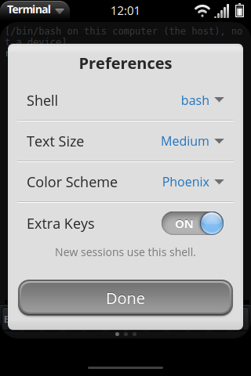

# Terminal

The terminal app that ships with Phoenix: a real Linux shell on the
device, in a card, that feels like a webOS app and is safe by default.

The first part of this page says what is **built** (29 September 2026) and
the decisions taken; the rest is the plan it followed, kept for the phases
still to come. Facts are as of 28 September 2026, with sources at the end;
*unverified* marks what we could not check.


## What is built

Phases T1, T2 and the code of T3 below. **Decisions:** the web route
(xterm.js on a C++ PTY service); **bash is the default shell**, **zsh** can
be chosen in Preferences (the image ships both), fish is offered wherever it
is installed but is not in the image (it needs a Rust toolchain since fish
4); shells run as the unprivileged device user; Developer Mode (sudo, SSH,
MCP's `exec`) is a follow-up.

| Part | Where | What it does |
| --- | --- | --- |
| **Terminal app** | `apps/terminal` (`org.webosphoenix.terminal`, React + TypeScript, xterm.js 6 with the fit and web-links addons, MIT) | One shell per card; the extras row; app menu; preferences; long-press selection; links; hardware keyboard shortcuts; the back gesture as Esc |
| **PTY core** | `services/pty/src/ptycore.{h,cpp}` (C++17, no dependencies) | `forkpty` a login shell with `TERM=xterm-256color`; output cut into chunks of up to 64 KB that never split a UTF-8 sequence (bytes that are not UTF-8 go as Latin-1 with `encoding: "latin1"`); flow control (stop reading above 256 KB unacknowledged, read again below 64 KB); resize (`TIOCSWINSZ`); SIGHUP to the shell's process group; a small JSON reader |
| **Luna service** | `services/pty/src/service.cpp`, `main.cpp` (luna-service2, GLib) | `org.webosphoenix.pty` on the device: the methods below, the caller's application id checked on every call, a session per `open` subscription (cancelling it hangs the shell up), sessions logged to the journal (start and end, never contents). Refuses to start as root |
| **Service files** | `services/pty/sysbus/`, `services/pty/systemd/phoenix-pty.service` | ACG role, API group `pty.operation` (and `pty.developer` for `exec`), hub service file (`Type=static`), a systemd unit with `User=user`, `NoNewPrivileges=yes` |
| **Simulator** | `shell/sim/simpty.{h,cpp}`, `SimWindowSource.qml` | phoenix-sim runs **your own shell on your computer** (bash by default) for the Terminal's cards, on the same PTY core, with a `QSocketNotifier` and a 16 ms flush timer. The page's runtime posts `pty` host messages; the replies come back as `__phoenixRuntime.ptyEvent(...)`. It checks the app id against the window the message came from, and hangs a card's shells up when the card is thrown away. `--no-host-shell` turns it off, `--host-shell PATH` runs another program. The first line of each session says the shell is the host's |
| **Browser dev server** | `tools/serve-rootfs.py --terminal` | A WebSocket per session at `/__phoenix/pty` over Python's `pty`, with a random token (from `/usr/share/phoenix/host.json`) and an `Origin` check; off unless asked for. `--terminal-shell PATH` for tests |
| **Simulated shell** | `runtime/phoenix-runtime.js`, block "Terminal" | Without a host shell: `echo`, `ls` and `cd` over the simulated filesystem, `pwd`, `clear`, `seq`, `printenv`, `history`, `exit`, with line editing and history. Deterministic, for tests and the Playwright runs |
| **Client** | `apps/shared/luna/src/pty.ts` (`pty.open`, `PtySession`, `pty.shells`, `PTY_ERRORS`) | Queues writes until the shell is up; acks what xterm.js has drawn |
| **Image** | `meta-phoenix`: `phoenix-pty` recipe (the service, the `user` account, uid 1000), `packagegroup-phoenix-terminal` (bash, zsh, coreutils, less, nano, vim-tiny, tmux, htop, procps, ssh, scp, curl, terminfo, DejaVu Sans Mono), both in `webos-phoenix-image`; the app itself comes with `phoenix-apps` | Written, **not built or booted yet** (no OSE build host here) |
| **Tests** | `services/pty/tests/pty_test.cpp` (52 checks: UTF-8, JSON, sessions, flow control, SIGHUP, and every service method over a luna-service2 stand-in in `tests/ls2stub`), `apps/shared/luna/src/pty.test.ts`, `apps/terminal/src/keys.test.ts`, `tools/test-terminal.cjs` (simulated shell and a real `/bin/sh` through the dev server's WebSocket) | In CI |

### The service's methods

| Method | Parameters | Replies |
| --- | --- | --- |
| `open` | `{cols, rows, shell?, cwd?, subscribe: true}`; `shell` is a name (`bash`, `zsh`, `fish`, `sh`), never a path | `{subscribed: true, sessionId, pid, shell, shellPath}`, then `{sessionId, output, encoding?, bytes}` as the shell writes (at most one reply per session per 16 ms), then `{sessionId, exited: true, exitCode, signal}` |
| `write` | `{sessionId, data}` | keystrokes and pastes |
| `resize` | `{sessionId, cols, rows}` | 1 to 999 each |
| `ack` | `{sessionId, bytes}` | flow control: the page drew this much |
| `close` | `{sessionId, signal?}` | `SIGHUP` (default), `SIGINT`, `SIGTERM`, `SIGKILL`; the exit reply follows on the subscription |
| `list` | `{}` | the caller's own sessions |
| `getShells` | `{}` | `{shells: [{name, path, installed}], default: "bash"}` |
| `exec` | anything | always error 6 (`DEVMODE_REQUIRED`): **the Developer Mode stub** |

Errors: -1 bad parameters, 1 not allowed (only `org.webosphoenix.terminal`
may open a shell; another app's session is as good as none), 2 no such
session, 3 spawn failed, 4 shell not installed, 5 too many sessions (16), 6
Developer Mode required. The app falls back to bash when the chosen shell is
not installed.

### The app

- **Cards.** App menu > **New Session** (or Ctrl+Shift+T) opens another card
  in the Terminal's stack with its own shell; **Close Session** (Ctrl+Shift+W)
  closes it; throwing the card away hangs the shell up. When the shell
  exits, the card says so with the status, and Enter starts a new one.
- **Extras row** (`keys.ts`), above whichever keyboard is up: Esc, Ctrl,
  Alt, Tab, the four arrows, `|` `~` `/` `-`. Ctrl and Alt are sticky: tap
  once for the next key (from the row or the keyboard), tap again quickly to
  lock, tap a locked one to release. Swipe the row (or tap its dots) for
  Home/End/PgUp/PgDn, braces, brackets, backslash and backtick, and for F1 to F12. Held arrows, Tab,
  PgUp/PgDn and `-` repeat after 350 ms, every 120 ms, as the keyboard does.
  Arrows follow the application cursor mode, so they work in vim and less.
  The row takes no focus, so the keyboard stays up. It can be turned off in
  Preferences.
- **The shell's virtual keyboard** works as for any web field: xterm.js's
  input element takes the focus, the keyboard comes up, and the card
  shrinks above it (screenshots above). On a device, OSE's keyboard does the
  same.
- **App menu:** New Session, Copy, Paste, Select All, Clear, Preferences,
  Keys Help, Close Session.
- **Preferences** (shared by all cards, kept in the app's storage): Shell
  (bash, zsh, fish, sh; the ones not installed are greyed out), Text Size
  (10, 12, 14, 17 px), Color Scheme (Phoenix, Paper, Classic, Solarized Dark
  and Light, High Contrast), Extra Keys.
- **Selection:** long press on the text selects the word; drag on to select
  more; lifting the finger shows Copy, Paste, Select All, Open Link (on a
  URL) and Search the Web. Copy and paste use the system clipboard where the
  runtime allows it and the Terminal's own otherwise, so they always work
  between its cards.
- **Links** in the output open on a tap, through the application manager's
  `open` (web pages in Web, `mailto:` in Email).
- **Hardware keyboard:** Ctrl+Shift+T/W/C/V/K (new, close, copy, paste,
  clear), Shift+Insert, Ctrl+= / Ctrl+- / Ctrl+0 (text size). Everything
  else, Ctrl-C and Ctrl-D included, goes to the shell.
- **Back gesture:** Esc to the shell, as the Preware Terminal did.
- **Bell:** a flash of the card and a short vibration where there is one.
- **Title:** the shell's title (`OSC 0`) becomes the page title.




### What came from the Preware terminal

WebOS Internals' **Terminal** (`org.webosinternals.terminal` with the
`termplugin` PDK plugin; <https://github.com/webos-internals/terminal>) was
the terminal in the Preware catalog: a Mojo app whose C/C++ plugin drew the
screen with bitmap fonts (4x6, 5x7, 6x10, 8x8) and ran the shell on a PTY.
Its app menu had **New Session** (another card), **Non-Obvious Keys...** and
**Preferences...** (font, foreground and background from the eight ANSI
colours). Because the Pre had a hardware keyboard, its "extra keys" were
combinations: Sym for Control, Orange+Space or the **back gesture for Esc**,
Gesture+1..8 for Home, arrows, PgUp and End, Gesture+Q/Y/U/H/J for `\ [ ] { }`,
Orange+. for `|`; its modifiers had Off, On and Locked states. Ryan Hope's
**wTerm** (<https://github.com/RyanHope/wTerm>) followed on webOS 2 and the
TouchPad with an on-screen keyboard, colour schemes, font sizes and custom
key bindings, and logged in as a non-root `wterm` user. SDLTerminal was a
third, lighter one for the Pre.

Both are **GPL** (Terminal GPL-2.0, wTerm GPL-3.0), so **none of their code
is in Phoenix**; they were a reference for the user experience only. What
Phoenix took from them: "New Session" as a new card and the app menu's
shape; a keys help page after "Non-Obvious Keys"; the back gesture as Esc;
sticky modifiers with a locked state; text size and colour choices in
Preferences; and, from wTerm, a shell that is not root by default.

### Not done yet

- **On a device:** the service and recipes are written but have not been
  built with bitbake or run on OSE. Unverified there: that WebAppMgr puts
  the app's id on the call as `LSMessageGetApplicationID` returns it (the
  service accepts "id" and legacy "id 1234"), the ACG group names, the
  `useradd` and `ttf-dejavu` package names in the OSE layers, and the
  Luna round trip per keystroke.
- **Developer Mode (T4):** the Settings page is done (Settings > Developer
  Mode: a warning, then the device PIN or password; it calls OSE's
  `com.webos.service.devmode` setDevMode, and the Marketplace already
  checks it, see [APP-RUNTIME.md](APP-RUNTIME.md#developer-mode)). `exec`
  still answers `DEVMODE_REQUIRED`; there is no sudo, no SSH server and no
  Konami code yet. The systemd
  unit's `NoNewPrivileges=yes` will have to go when sudo comes.
- **Keep running in the background** and the sessions dashboard, OSC 777
  notifications, Find, pinch to zoom, selection drag handles, the shell's
  card title under each card (the page title changes, the card view does
  not show it yet), per-card colour schemes, and hiding the extras row
  when a hardware keyboard is used.
- **The simulator's keys:** phoenix-sim keeps F1 to F7 and Ctrl+Left/Right
  for itself (gestures, demo events, turning the device); use the extras
  row's function keys there.
- **fish** is not in the image; zsh has no Phoenix default configuration.

## The plan

The rest of this page is the plan as approved, lightly updated.

## Summary

- **Recommendation: a web app with xterm.js** (`apps/terminal`, React +
  TypeScript, MIT-licensed terminal emulator) on **a small C++ PTY Luna
  service**, `org.webosphoenix.pty` (Apache-2.0, `forkpty` and
  luna-service2). It fits how every other Phoenix app is built, keeps the
  repository Apache-2.0, and runs in the simulator and a desktop browser.
- **Sessions are cards.** "New Card" in the app menu opens another shell in
  the app's stack, as the browser opens pages. No in-app tabs.
- **An extras row in the app** (Esc, Ctrl, Alt, Tab, arrows, `|`, `~`,
  `/`, `-`) above whatever keyboard is up, because on a device OSE's
  keyboard stays and the shell's ported keyboard has no Ctrl or Esc.
- **Unprivileged by default.** The shell runs as the device's user account,
  not root. `sudo`, an SSH server and MCP's shell tool need **Developer
  Mode**, turned on in Settings (or, for old times' sake, by typing the
  legacy webOS code into Just Type).
- **Shipped in the image** by `meta-phoenix` (`phoenix-terminal` and
  `phoenix-pty` recipes plus a package group of command-line tools).
- **Simulator**: phoenix-sim spawns a real local PTY on the host;
  `tools/serve-rootfs.py` does the same over a WebSocket for the browser.

## History

Palm never shipped a terminal. Developers used `novacom` over USB after
enabling Developer Mode, which on webOS 1.x and 2.x was turned on by typing
`upupdowndownleftrightleftrightbastart` into Just Type (the Konami code).
Homebrew filled the gap: WebOS Internals' Preware carried terminal apps:
their Terminal, wTerm and SDLTerminal (see "What came from the Preware
terminal" above). Today
Ubuntu Touch ships a Terminal app (GPL-3.0), and on Android, Termux is the
reference for a touch terminal with an extra-keys row.

## UX in the webOS idiom

| Element | Design |
| --- | --- |
| **Card** | One shell per card. The card's title is the shell's title (xterm.js's `onTitleChange`: the running program or the current folder), so card view shows "~/src — vim" under each card |
| **New session** | App menu > **New Card**, or Ctrl+Shift+T on a hardware keyboard. The new card joins the Terminal's stack. Throwing a card away sends the shell SIGHUP, as closing a terminal window does; a running `tmux` survives it |
| **App menu** (tap the app name in the status bar) | New Card, Copy, Paste, Select All, Clear, Find, Text Size (S / M / L / XL), Color Scheme, Keep Running in Background, Preferences, Help |
| **Keyboard** | The extras row (below) above the virtual keyboard; a hardware or Bluetooth keyboard hides the extras row unless pinned |
| **Font** | A monospace font the image ships. Candidates: JetBrains Mono or Noto Sans Mono (both SIL OFL 1.1). Open Sans, the shell's font, has no monospace cut. Text size also follows pinch-to-zoom |
| **Colour schemes** | "Phoenix" (default: light grey on the webOS charcoal, with the Enyo highlight colour for the cursor), "Paper" (dark on the Memos yellow), "Classic" (green on black), Solarized Dark and Light, and high contrast. Set per card or as a default |
| **Selection, copy, paste** | Long press selects a word and shows the two drag handles; a popup menu with Copy, Paste, Select All, Open Link (when on a URL), Search the Web (via Just Type's engines). Two-finger drag scrolls the scrollback; one-finger drag in a full-screen program (vim, htop) sends the drag as mouse events if the program asked for them |
| **URLs** | Detected in the output (`@xterm/addon-web-links`), underlined on tap; open in Web through the application manager's `open`, so `mailto:` and `tel:` go to Email and Phone as elsewhere |
| **Bell** | A short vibration and, when the card is not in front, a banner ("Terminal: bell in ~/src") |
| **Background** | With "Keep Running in Background" on, minimizing or throwing away the card leaves the shell running; a dashboard entry lists running sessions and reopens them. Off by default |
| **Notifications** | `printf '\e]777;notify;Build;Done\a'` (the OSC 777 convention some terminals use) posts a Phoenix notification: long commands can tell you they are done |
| **Back gesture** | Sends Esc when a full-screen program runs; otherwise it is the normal back (nothing to go back to, so it minimizes) |
| **Rotation** | Free; the terminal reflows to the new width (the app asks for `"free"` like Enyo apps do) |

### The keyboard

What the shell has today (`shell/qml/Phoenix/Shell/VirtualKeyboard.qml`,
`KeyboardKeymap.js`, a port of Open webOS's keyboard-efigs):

- a **Tab** key in the tablet layout (on the phone the plugin commits a
  tab character);
- code that forwards **Left and Right** on phones and also **Up, Down,
  Page Up, Page Down, Home and End** on tablets, although the ported
  layouts do not show arrow keys;
- keystrokes reach the focused client through `KeyInjector.sendImeKey(client,
  key, modifiers)`, which already carries modifiers;
- **no Ctrl, Esc or Alt key**, and no extras row. (The task brief assumed
  one exists; it does not yet.)
- On a device, **OSE's own keyboard** stays in use and Phoenix passes its
  height to the shell (`platformKeyboardHeight`).

So the extras row belongs **in the Terminal app**, where it works with
either keyboard and in a desktop browser:

```
+-----------------------------------------------------------+
| Esc | Ctrl | Alt | Tab |  <  |  v  |  ^  |  >  |  |  ~  / |   <- extras row (app)
+-----------------------------------------------------------+
|        the phone or tablet virtual keyboard               |   <- shell or OSE
+-----------------------------------------------------------+
```

- **Ctrl and Alt are sticky**: tap once for the next key (highlighted with
  the keyboard's shift art), double-tap to lock, as the keyboard's shift
  already behaves. Ctrl then a letter sends the control character.
- **Swipe on the row** left or right for a second page: Home, End, PgUp,
  PgDn, F1 to F12, `{ } [ ]`.
- **Long press** on a key repeats it, with the keyboard's timings (first
  repeat after 350 ms, then every 120 ms).
- Its height is added to the negative space, so the terminal shrinks above
  both.

Later, in the shell: a **terminal layout** for the phoenix keyboard that a
client asks for through the editor state (a new PalmIME field type), with
Ctrl and Esc in place of the emoticon and ".com" keys. Only worth doing
once the shell's keyboard is used on devices too.

**Hardware and Bluetooth keyboards** send real key events with modifiers;
xterm.js handles Ctrl, Alt, function keys and arrows itself. Terminal
shortcuts that the shell would otherwise take (Ctrl+Shift+T/W, Ctrl+Shift+C/V
for copy and paste) are handled by the app.

## Implementation options

### A. Native QML terminal (QMLTermWidget)

QMLTermWidget is a QML port of qtermwidget (itself from Konsole), used by
cool-retro-term. Its main branch is Qt 6.

| For | Against |
| --- | --- |
| Native rendering and input; low latency | **GPL-2.0-or-later**: the Terminal app would be a GPL program in an Apache-2.0 repository. Legal as a separate program, but it is the first GPL code Phoenix would write against, and LEGAL.md keeps GPL code out of the Apache-2.0 parts |
| PTY built in (no service needed) | A native Qt app on OSE is a different app type from every other Phoenix app; SAM and WebAppMgr paths we have tested do not cover it (*native app support on OSE exists, unverified for our shell*) |
| Proven in cool-retro-term and (*unverified*) Ubuntu Touch's Terminal | Konsole's emulation code is large and less maintained than xterm.js; no simulator-in-a-browser story |
| | The PTY runs inside the app process, so the app itself needs to be allowed to spawn shells, which is harder to confine than a separate service |

### B. Web app: xterm.js + a PTY service

xterm.js (MIT; `@xterm/xterm` 6.0 with addons for fit, web links, WebGL,
search, serialize) is the emulator in VS Code and most web terminals.

| Backend | For | Against |
| --- | --- | --- |
| **B1. node-pty in a Node.js Luna service** | Few lines of code; MIT; the Files and Voice Memos services are Node.js already | A native addon compiled with node-gyp against OSE's Node.js (20.12.2 in OSE 2.27; 2.28 *unverified*), cross-compiled in Yocto, and rebuilt whenever OSE's Node changes. `run-js-service` starts it on demand, which fits a long-lived session poorly |
| **B2. A small C++ service** (`forkpty`, a GLib main loop, luna-service2) | No native addon, no Node version coupling; a few hundred lines; the same PTY code can be compiled into phoenix-sim for the simulator; starts fast, uses little memory; Apache-2.0 | We write and maintain it |
| B3. Python (`pty` module) | The standard library does it all; Python is pleasant for this | No Luna bindings for Python in OSE that we know of (*unverified*); an interpreter per session. **Right for the desktop dev server**, not the device |
| B4. A WebSocket from a local server | Lowest latency for bulk output | A listener any local page could connect to; needs its own tokens; bypasses ACG. Rejected |

### Recommendation: B2

**xterm.js in `apps/terminal` on `org.webosphoenix.pty` in C++**, with
Python only in the desktop dev server. Reasons: licence (all Apache-2.0 and
MIT), one app model for all Phoenix apps, ACG controls who may open a shell,
the same PTY code in the device service and the simulator, and no native
Node addon to keep building.

```
 apps/terminal (web app, one page per card)
   xterm.js  <- extras row, app menu, selection UI
      |  @phoenix/luna  pty.open / write / resize / close
      v
 org.webosphoenix.pty  (C++, luna-service2, GLib)
   session table: id -> {pid, master fd, owner appId, card}
   open    {cols, rows, cwd?, shell?}      -> {sessionId}  (subscribe: output stream)
   write   {sessionId, data}                               (keystrokes, paste)
   resize  {sessionId, cols, rows}                          (TIOCSWINSZ)
   ack     {sessionId, bytes}                               (flow control)
   close   {sessionId, signal?}
   list    {}                                               (for the dashboard)
      |
      v
 forkpty() -> login shell as the device user (setuid before exec)
```

- **Output** arrives as replies on the `open` subscription: UTF-8 text in
  chunks of up to 64 KB, sent at most every 16 ms. The page acks what it
  has written into xterm.js; above 256 KB unacknowledged, the service
  stops reading the PTY until the page catches up (the flow-control scheme
  xterm.js's documentation recommends), so `cat bigfile` cannot flood the
  bus.
- **Input**: one `write` per keystroke or paste. A Luna round trip is well
  under the time between keystrokes (*to measure on a phone*).
- **Invalid UTF-8** from the PTY is passed as Latin-1-decoded code points
  with a flag, so binary output does not break the Luna JSON.
- **Lifetime**: the service is a long-running systemd unit, not on-demand,
  so sessions outlive a page reload. A session belongs to the app and card
  that opened it; if the card goes and "Keep Running" is off, the service
  sends SIGHUP.

## Security model

| Question | Answer |
| --- | --- |
| **Which user?** | A normal account, `user` (uid 1000, home `/home/user`, shell bash), created by the image. The PTY service runs as root only to `setuid` into that user before `exec`, or, simpler, runs as `user` itself under systemd (then it can only ever start shells as `user`); prefer the second |
| **Who may open a shell?** | ACG: the service's `pty.operation` group is granted to `org.webosphoenix.terminal` only. The MCP hub's `os.shell.exec` ([AI-AND-MCP.md](AI-AND-MCP.md#os-tools)) is a separate method, `pty/exec`, available only in Developer Mode and always confirmed by the user |
| **Root** | No root shell by default. In Developer Mode, `sudo` works for `user` after the device passcode (PAM against the Phoenix passcode service, which Screen & Lock needs anyway); the first `sudo` in a session shows a popup alert as well |
| **Developer Mode** | A Settings page (Settings > Developer Mode, a new launch point) with the switch, a warning, and the SSH settings. Typing the Konami code into Just Type opens that page, as a nod to webOS 1.x. OSE has `com.webos.service.devmode` (`getDevMode`, `setDevMode` with a reboot, `getPassphrase`); Phoenix calls it where present and keeps its own flag otherwise |
| **SSH server** | Developer Mode only. Dropbear or OpenSSH on port 22, **key-only** (add keys from Settings, a QR code, or by pasting); no passwords, no root login. A status bar icon and dashboard entry while a session is open. This is also the route for MCP clients on a Mac ([AI-AND-MCP.md](AI-AND-MCP.md#transports)) |
| **Jailing** | The normal shell is not jailed: a terminal is for using the device. A **restricted mode** for shared or kiosk devices runs the shell in bubblewrap with a read-only root and a writable home only (*bubblewrap's availability in OSE's layers unverified*). The Terminal app itself runs in WebAppMgr's sandbox like every web app and never gets a shell except through the service |
| **What `user` can reach** | Files under `/home/user` and `/media/internal` (group `media`), network tools, the Luna bus through `luna-send` limited by ACG to the groups a developer shell is given (a new `developer` role); not other apps' data, not the key store |
| **Audit** | Session start and end (time, owner, card) are logged to the journal; the contents are not |

OSE development images let you in as root over SSH on port 22 (the
`ares-setup-device` defaults are `root` and port 22 for OSE targets,
*password or key per build*). Phoenix release images must not: root SSH is
off, and only Developer Mode's key-only `user` login exists.

## Shipping it in the image

`meta-phoenix` gets:

| Recipe | Contents |
| --- | --- |
| `phoenix-pty` | The C++ service (`shell/pty/` or `services/pty/` in this repository, CMake), its systemd unit, and its luna-service2 role, API, group and service files (as `apps/files/service/sysbus`) |
| `phoenix-apps` (existing) | Adds `apps/terminal/dist`, like the other Phoenix apps |
| `packagegroup-phoenix-terminal` | `bash`, `coreutils`, `less`, `nano`, `vim-tiny`, `tmux`, `htop`, `openssh-client` (`ssh`, `scp`), `curl`, `git` (optional), `ncurses-terminfo-base`, the monospace font |
| `phoenix-devmode` | The `user` account, sudoers drop-in (Developer Mode only), PAM config, the SSH server unit (disabled until Developer Mode) |

`webos-phoenix-image` adds `phoenix-pty` and `packagegroup-phoenix-terminal`.
The terminfo entry is `xterm-256color`, which xterm.js implements.

## The simulator

- **phoenix-sim**: `shell/sim` gets a small `SimPty` class using the same
  C++ PTY code (`forkpty` and a `QSocketNotifier` on the master fd). The
  runtime's new block "PTY" answers `org.webosphoenix.pty` by posting to
  the host (`phoenixHost.postToHost`), and the host pushes output back into
  the page the way `pushSystemStatus` does. It spawns **your own shell on
  your Mac or Linux machine**, in your home directory, so it is marked
  clearly in the card title ("host: ~") and can be turned off with
  `--no-host-shell`.
- **A desktop browser** (`tools/serve-rootfs.py`): a WebSocket endpoint on
  127.0.0.1 using Python's `pty.fork()`, with a random token in the page URL
  and `Origin` checked, so other pages cannot open shells. Off unless
  started with `--terminal`.
- **Without either** (headless tests), the runtime simulates a tiny shell
  (`echo`, `ls` of the virtual filesystem, `clear`, `exit`) so the UI can be
  tested.
- **Tests**: `tools/test-terminal.cjs` types commands through the extras
  row, checks output, resize on rotation, copy and paste, link detection,
  Ctrl-C, and a second card; unit tests for the PTY service's flow control
  and UTF-8 handling.

## Phases

| Phase | What | Effort | Status |
| --- | --- | --- | --- |
| **T1** | `apps/terminal` with xterm.js, extras row, app menu, colour schemes, font; the runtime's simulated shell; `test-terminal.cjs` | M (2 to 3 weeks) | Done |
| **T2** | The C++ PTY core; `SimPty` in phoenix-sim and the WebSocket in `serve-rootfs.py`, so it is a real terminal on the desktop | S (1 to 2 weeks) | Done |
| **T3** | `org.webosphoenix.pty` on OSE, ACG files, `meta-phoenix` recipes and package group, tried in `qemux86-64` | M (2 to 3 weeks); needs M1's image to boot | Written (service, ACG files, recipes, the `user` account); not built or tried |
| **T4** | Developer Mode page, `user` account, `sudo` with the passcode, SSH server with key management, the Konami code in Just Type | M (2 to 3 weeks); needs the passcode service | Developer Mode page done (simulator); the rest not started (`exec` stub) |
| **T5** | Polish: selection handles, OSC 777 notifications, background sessions dashboard, restricted mode, the keyboard's terminal layout | S to M | Long-press selection done; the rest not started |

## Open questions for you

1. ~~**Web (xterm.js) or native (QMLTermWidget)?**~~ Decided: web.
2. ~~**Default shell**~~ Decided: bash by default, zsh in the image and
   selectable in Preferences; fish where installed.
3. **Root**: is `sudo` in Developer Mode enough, or do you want a root
   shell option in the app's menu (in Developer Mode, after the passcode)?
4. **SSH server**: Dropbear (small) or OpenSSH (familiar, supports more
   key types)?
5. **Tools in the image**: which beyond the list above (`git`, `python3`,
   `php-cli`, `rsync`, `mosh`)? You prefer PHP and Python; `python3` and
   `php-cli` would make the device usable for quick scripts.
6. **The Konami code**: keep the Easter egg for Developer Mode, or only
   the Settings switch?
7. **Background sessions**: should shells keep running when the card is
   thrown away by default, like tmux, or end, like closing a window?

## Sources

Accessed 28 September 2026.

- QMLTermWidget (GPL-2.0-or-later, Qt 6 on main): <https://github.com/Swordfish90/qmltermwidget>
- cool-retro-term: <https://github.com/Swordfish90/cool-retro-term>
- Ubuntu Touch Terminal (GPL-3.0): <https://gitlab.com/ubports/development/apps/lomiri-terminal-app>
- xterm.js releases (6.0.0, `@xterm/*` packages): <https://github.com/xtermjs/xterm.js/releases>; flow control guide: <https://xtermjs.org/docs/guides/flowcontrol/>
- node-pty (MIT, node-gyp native addon): <https://github.com/microsoft/node-pty>
- webOS OSE `com.webos.service.devmode`: <https://www.webosose.org/docs/reference/ls2-api/com-webos-service-devmode/>
- webOS OSE CLI user guide (`ares-setup-device`, root on port 22 for OSE targets): <https://www.webosose.org/docs/tools/sdk/cli/cli-user-guide/>
- webOS OSE 2.27.0 release notes (Node.js 20.12.2): <https://www.webosose.org/about/release-notes/webos-ose-2-27-0-release-notes/>
- The shell's keyboard: `shell/qml/Phoenix/Shell/VirtualKeyboard.qml`, `KeyboardKeymap.js`, `shell/native/keyinjector.h` in this repository
- WebOS Internals' Terminal (GPL-2.0; app menu, preferences and "Non-Obvious Keys" read in `app/controllers` and `app/views/keys/keys-scene.html`): <https://github.com/webos-internals/terminal>; Preware: <https://github.com/webos-internals/preware>
- wTerm (GPL-3.0): <https://github.com/RyanHope/wTerm>
- SDLTerminal: <https://www.webosnation.com/sdlterminal>
